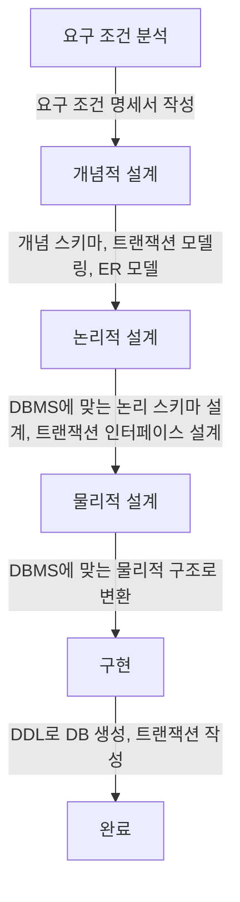
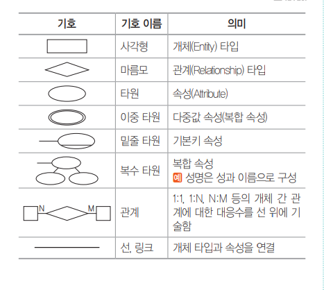
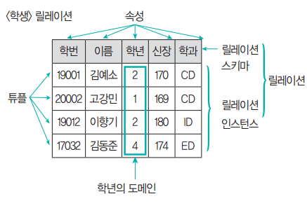
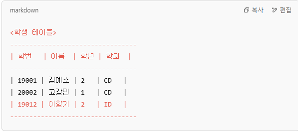
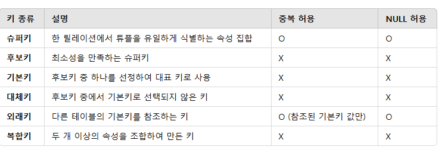
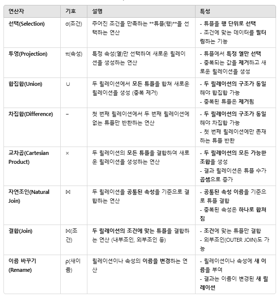
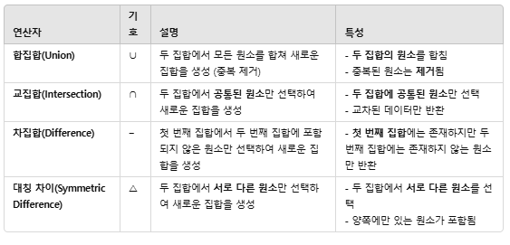
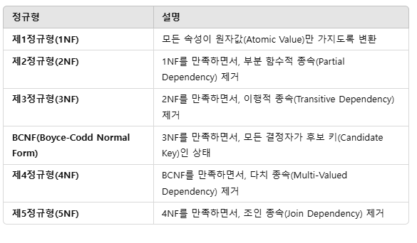

##  데이터베이스 구축
### 1. 데이터베이스 설계 순서
<div style={{marginLeft:'2.5rem'}}>

</div>

### 2. 개념적 설계(정보 모델링,개념화)
<div style={{marginLeft:'2.5rem'}}>
```bash
▣ 현실의 복잡한 정보를 데이터베이스에서 다룰 수 있도록 체계적으로 정리하는 과정
▣ 현실 세계의 정보를 데이터로 정리 -> 필요한 개념(객체)과 관계를 정의
▣ E-R 다이어그램 작성 -> 데이터를 시각적으로 표현하여 쉽게 이해
▣ DBMS에 종속되지 않는 설계 -> 어떤 데이터베이스에서도 적용 가능
```
</div>

### 3. 논리적 설계(데이터 모델링)
<div style={{marginLeft:'2.5rem'}}>
```bash
▣ 개념적 설계에서 도출한 엔터티와 속성들을 보다 구체적으로 정리하여 정규화된 관계형 데이터 모델로 변환하는 과정
▣ 실제 데이터베이스 관리 시스템(DBMS)에 독립적ㅇㄴ인 형태로, 어떤 테이블을 만들고, 테이블 간의 관계를 어떻게 설정할 지 설계
▣ 개념적 설게가 개념 스키마를 설계하는 단계라면 논리적 설계에서는 개념 스키마를 평가 및 정제하고 DBMS에 따라 서로 다른 논리적 스키마를 설계
```
</div>

### 4. 물리적 설계(데이터 구조화)
<div style={{marginLeft:'2.5rem'}}>
```bash
▣ 논리적 설계를 기반으로 실제 데이터베이스 구현에 적합한 형태로 변환
▣ DBMS의 특성을 고려하여 테이블을 최적화하고, 성능을 높이기 위해 인덱스, 파티셔닝, 저장 구조 등을 결정
```
</div>
<div style={{marginLeft:'2.5rem'}}>
```bash
▣ 개념적 설계 : 현실의 복잡한 정보를 데이터베이스에서 다룰 수 있도록 정리
▣ 논리적 설계 : 정규화된 관계형 모델 정의
▣ 물리적 설계 : 스토리지 엔진 선택, 인덱스 추가, ENUM 최적화
```
</div>

### 5. 데이터 모델
<div style={{marginLeft:'2.5rem'}}>
```bash
▣ 현실 세계의 정보들을 컴퓨터에 표현하기 위해서 ( 단순화, 추상화 )하여 체계적으로 표현한 개념적 모형
```
</div>
<div style={{marginLeft:'2.5rem'}}>데이터 모델의 기본 구성 요소</div>
<div style={{marginLeft:'2.5rem'}}>
```bash
▣ Entity(객체)       : 데이터베이스에 표현하려는 대상 (사람, 사물, 개념)
▣ Attribute(속성)    : 객체의 특성을 나타내는 데이터의 최소 단위
▣ Relationship(관계) : 객체 간의 논리적인 연결 및 연관성성
```
</div>
<div style={{marginLeft:'2.5rem'}}>데이터 모델에 표시할 추가 요소</div>
<div style={{marginLeft:'2.5rem'}}>
```bash
▣ Structure(구조)       : 객체 타입(Entity Type) 간의 관계를 논리적으로 표현
▣ Operation(연산)       : 데이터베이스에서 데이터를 저장, 수정, 삭제, 조회하는 작업
▣ Constraint(제약 조건) : 데이터의 무결성을 유지하기 위한 규칙
```
</div>

### 6. E-R 모델의 개요
<div style={{marginLeft:'2.5rem'}}>
```bash
▣ 현실 세계의 데이터를 객체, 속성, 관계 로 표현하는 개념적 데이터 모델
▣ 데이터베이스 설계 초기 단계에서 사용되며, ERD(Entity-Relationship Diagram, 개체-관계 다이어그램)을 통해 시각적으로 표현
```
</div>

### 7. E-R 다이어그램
<div style={{marginLeft:'2.5rem'}}></div>

### 8. 관계형 데이터 모델
<div style={{marginLeft:'2.5rem'}}>
```bash
▣ 가장 널리 사용되는 데이터 모델로, 2차원적인 표(Table)을 이용해서 데이터 상호 관계를 정의하는 DB 구조
▣ 파일 구조처럼 구성한 테이블들을 하나의 DB로 묶어서 테이블 내에 있는 속성들 간의 관계 설정
▣ 기본키(Primary Key)와 이를 참조하는 외래키(Foreign Key)로 데이터 간의 관계를 표현
```
</div>

### 9. 관계형 데이터베이스의 Relation 구조
<div style={{marginLeft:'2.5rem'}}>
```bash
▣ Relation은 데이터들을 표(Table) 형태로 표현한 것으로 구조를 나타내는 릴레이션 스키마와 실제 값들인 릴레이션 인스턴스로 구성
```
</div>
<div style={{marginLeft:'2.5rem'}}></div>
<div style={{marginLeft:'2.5rem'}}>
```bash
▣ 튜풀   : 릴레이션을 구성하는 각가의 행
▣ 속성   : 데이터베이스를 구성하는 가장 작은 논리적 단위, 데이터 항목 또는 데이터 필드
▣ 도메인 : 하나의 속성이이 취할 수 있는 같은 타입의 원자(Atomic)값들의 집합 (열)
```
</div>

### 10. 릴레이션의 특징
<div style={{marginLeft:'2.5rem'}}>
```bash
▣ 관계형 데이터베이스에서 표의 형태로 데이터를 저장하는 구조
▣ 여러개의 속성과 튜플로 구성
```
</div>

### 11. 키(Key)
<div style={{marginLeft:'2.5rem'}}>
```bash
▣ 관계형 데이터베이스에서 튜플(행)을 유일하게 식별하는 속성 또는 속성들의 집합
▣ 데이터의 무결성을 유지하고, 중복 방지를 위해 사용
```
</div>
<div style={{marginLeft:'2.5rem'}}></div>
<div style={{marginLeft:'2.5rem'}}>
```bash
▣ Super Key(슈퍼키)     : 한 릴레이션에서 튜플을 유일하게 식별할 수 있는 속성들의 집합, 중복 가능성이 없는 학번, (학번, 이름), (학번, 학과) 모두 슈퍼키 가능
▣ Candidate Key(후보키) : 슈퍼키 중에서 최소한의 속성만 포함한 키, 중복이 없고, 유일정을 만족하며 최소성을 가짐, 학번
▣ Primary Key(기본키)   : 테이블에서 반드시 유일해야 하며, NULL을 가질 수 없음, 하나의 테이블에는 오직 하나의 기본키만 존재
▣ Alternate Key(대체키) : 후보키 중에서 기본키로 선택되지 않은 나머지 키, 유일성을 보장하지만 기본키로 사용되지 않음
▣ Foreign Key(외래키)   : 다른 테이블의 기본키를 참조하는 속성, 테이블 관계를 설정하고 데이터 무결성을 유지
▣ Composite Key(복합키) : 두개 이상의 속성을 조합하여 만든 키, 개별 속성만으로 유일성을 보장할 수 없을 때 사용
```
</div>
<div style={{marginLeft:'2.5rem'}}></div>

### 12. 무결성(Integrity)
<div style={{marginLeft:'2.5rem'}}>
```bash
▣ 데이터의 정확성, 일관성, 신뢰성을 유지하는 제약 조건
▣ 데이터베이스에 저장된 정보가 변형되거나 손상되지 않도록 보장하는 원칙
```
</div>
<div style={{marginLeft:'2.5rem'}}>
```bash
▣ 객체 무결성        : 각 튜플(행)을 유일하게 식별할 수 있도록 기본키(PK)는 중복되거나 NULL 값을 가질 수 없음
▣ 참조 무결성        : 외래키(FK)는 반드시 참조하는 테이블의 기본키(PK) 값을 가져야 함
▣ 도메인 무결성      : 각 속성(열)에 저장되는 값이 미리 정의된 데이터 타입과 범위를 벗어나지 않도록 제한
▣ 사용자 정의 무결성 : 비즈니스 로직에 따라 특정 데이터를 제한하는 규칙
```
</div>

### 13. 관계대수의 개요
<div style={{marginLeft:'2.5rem'}}>
```bash
▣ 관계형 데이터베이스에서 데이터를 조회, 조작하는 데 사용되는 수학적 연산
▣ 데이터베이스의 질의(Query)를 표현하기 위한 기본적인 연산을 제공
```
</div>

### 14. 순수 집합 연산자
<div style={{marginLeft:'2.5rem'}}></div>

### 15. 일반 관계 연산자
<div style={{marginLeft:'2.5rem'}}></div>

### 16. 관계해석(Relational Calculus)
<div style={{marginLeft:'2.5rem'}}>
```bash
▣ 관계 대수와 함계 관계형 데이터베이스의 질의(Query) 표현 방식 중 하나
▣ 관계 대수가 연산 중심적 접근 방식이라면, 관계 해석은 명세 중시미적 접근 방식을 사용
▣ 관계 해석은 어떻게(How) 데이터를 검색할 것인가 가 아니라 무엇(What)을 검색할 것인가를 기술하는 방식
▣ 명세적 질의 방식으로, 원하는 데이터를 논리적으로 정의하는 방식
```
</div>
<div style={{marginLeft:'3.5rem'}}>주요 논리 기호</div>
<div style={{marginLeft:'3.5rem'}}>
```bash
▣ 전칭 정량자(∀) : 가능한 모든 튜플에 대하여 (For All)
▣ 존재 전량자(∃) : 하나라도 일치하는 튜플이 있음
```
</div>

<div style={{marginLeft:'3.5rem'}}>튜플 관계 해석(Tuple Relational Calculus, TRC)</div>
<div style={{marginLeft:'3.5rem'}}>
```bash
▣ 튜플 변수를 사용하여 원하는 데이터를 기술하는 방식
▣ 표현 방법 -> {t∣P(t)}
▣ t는 튭플 변수이고, P(t)는 참 또는 거짓이 될 수 있는 조건
▣ { t | t ∈ Student ∧ t.age > 20 } -> Student 테이블에서 나이가 20 초과인 튜플을 반환
```
</div>

<div style={{marginLeft:'3.5rem'}}>도메인 관계 해석(Domain Relational Calculus, DRC)</div>
<div style={{marginLeft:'3.5rem'}}>
```bash
▣ 도메인 변수를 사용하여 데이터를 기술하는 방식
▣ 표현 방법 -> {(X1, X2,.....Xn) | P(X1, X2, .....Xn)}
▣ X1, X2,...Xn 은 속성 값이고, P는 조건
▣ { (x, y) | ∃z ( (x, y, z) ∈ Student ∧ y > 20 ) } -> Student 테이블에서 나이가 20 초과인 학생의 (이름, 나이)를 반환
```
</div>

### 17. 정규화(Normalization) 개요
<div style={{marginLeft:'2.5rem'}}>
```bash
▣ 데이터베이스에서 중복을 줄이고 데이터 무결성을 보장 하기 위해 데이터를 구조화 하는 과정
```
</div>
<div style={{marginLeft:'3.5rem'}}>정규형</div>
<div style={{marginLeft:'3.5rem'}}></div>

<div style={{marginLeft:'3.5rem'}}>정규형 단계 (비정규형)</div>
<table style={{marginLeft:'3.5rem'}}>
    <tr>
        <th>학번</th>
        <th>학생명</th>
        <th>과목명</th>
    </tr>
    <tr>
        <td>101</td>
        <td>홍길동</td>
        <td>데이터베이스, 운영체제</td>
    </tr>
     <tr>
        <td>102</td>
        <td>김철수</td>
        <td>데이터베이스</td>
    </tr>
     <tr>
        <td>103</td>
        <td>이영희</td>
        <td>운영체제, 네트워크</td>
    </tr>
</table>
<div style={{marginLeft:'3.5rem'}}>
```bash
▣ 다중값(Multi-valued attributes)이 존재하여 원자성이 깨짐.
```
</div>

<div style={{marginLeft:'3.5rem'}}>정규형</div>
<div style={{marginLeft:'3.5rem'}}></div>

<div style={{marginLeft:'3.5rem'}}>정규형 단계 (비정규형)</div>
<table style={{marginLeft:'3.5rem'}}>
    <tr>
        <th>학번</th>
        <th>학생명</th>
        <th>과목명</th>
    </tr>
    <tr>
        <td>101</td>
        <td>홍길동</td>
        <td>데이터베이스, 운영체제</td>
    </tr>
     <tr>
        <td>102</td>
        <td>김철수</td>
        <td>데이터베이스</td>
    </tr>
     <tr>
        <td>103</td>
        <td>이영희</td>
        <td>운영체제, 네트워크</td>
    </tr>
</table>
<div style={{marginLeft:'3.5rem'}}>
```bash
▣ 다중값(Multi-valued attributes)이 존재하여 원자성이 깨짐.
```
</div>

<div style={{marginLeft:'3.5rem'}}>제1정규형(1NF) - 원자값 충족</div>
<div style={{marginLeft:'3.5rem'}}>
```bash
▣ 각 속성이 원자값(Atomic Value)만 가지도록 테이블을 수정
```
</div>
<table style={{marginLeft:'3.5rem'}}>
    <tr>
        <th>학번</th>
        <th>학생명</th>
        <th>과목명</th>
    </tr>
    <tr>
        <td>101</td>
        <td>홍길동</td>
        <td>데이터베이스</td>
    </tr>
     <tr>
        <td>101</td>
        <td>홍길동</td>
        <td>운영체제</td>
    </tr>
     <tr>
        <td>102</td>
        <td>김철수</td>
        <td>데이터베이스</td>
    </tr>
      <tr>
        <td>103</td>
        <td>이영희</td>
        <td>운영체제</td>
    </tr>
      <tr>
        <td>103</td>
        <td>이영희</td>
        <td>네트워크</td>
    </tr>
</table>
<div style={{marginLeft:'3.5rem'}}>
```bash
▣ 원자값은 만족하지만, 여전히 중복 발생 (학번과 학생명이 반복됨)
```
</div>

<div style={{marginLeft:'3.5rem'}}>제2정규형(2NF) - 부분 함수적 종속 제거</div>
<div style={{marginLeft:'3.5rem'}}>
```bash
▣ 기본 키(Primary Key) 후보: (학번, 과목명)
▣ 학생명이 학번에만 종속 → 부분 종속 제거를 위해 분리
```
</div>
<table style={{marginLeft:'3.5rem'}}>
    <tr>
        <th>학번</th>
        <th>학생명</th>
    </tr>
    <tr>
        <td>101</td>
        <td>홍길동</td>
    </tr>
     <tr>
        <td>102</td>
        <td>김철수</td>
    </tr>
      <tr>
        <td>103</td>
        <td>이영희</td>
    </tr>
</table>
<table style={{marginLeft:'3.5rem'}}>
    <tr>
        <th>학번</th>
        <th>과목명</th>
    </tr>
     <tr>
        <td>101</td>
        <td>데이터베이스</td>
    </tr>
      <tr>
        <td>101</td>
        <td>운영체제</td>
    </tr>
    <tr>
        <td>103</td>
        <td>운영체제</td>
    </tr>
    <tr>
        <td>103</td>
        <td>네트워크</td>
    </tr>
</table>
<div style={{marginLeft:'3.5rem'}}>
```bash
▣ 부분 종속 제거 되었지만 이행적 종속 존재 가능
```
</div>

<div style={{marginLeft:'3.5rem'}}>제3정규형(3NF) - 이행적 종속 제거</div>
<div style={{marginLeft:'3.5rem'}}>
```bash
▣ 과목명에 대해 교수명이 결정됨 → 새로운 테이블로 분리
```
</div>
<table style={{marginLeft:'3.5rem'}}>
    <tr>
        <th>학번</th>
        <th>학생명</th>
    </tr>
    <tr>
        <td>101</td>
        <td>홍길동</td>
    </tr>
     <tr>
        <td>102</td>
        <td>김철수</td>
    </tr>
      <tr>
        <td>103</td>
        <td>이영희</td>
    </tr>
</table>
<table style={{marginLeft:'3.5rem'}}>
    <tr>
        <th>학번</th>
        <th>과목명</th>
    </tr>
     <tr>
        <td>101</td>
        <td>데이터베이스</td>
    </tr>
      <tr>
        <td>101</td>
        <td>운영체제</td>
    </tr>
    <tr>
        <td>103</td>
        <td>운영체제</td>
    </tr>
    <tr>
        <td>103</td>
        <td>네트워크</td>
    </tr>
</table>
<table style={{marginLeft:'3.5rem'}}>
    <tr>
        <th>과목명</th>
        <th>교수명</th>
    </tr>
    <tr>
        <td>데이터베이스</td>
        <td>박교수</td>
    </tr>
     <tr>
        <td>운영체제</td>
        <td>이교수</td>
    </tr>
      <tr>
        <td>네트워크</td>
        <td>최교수</td>
    </tr>
</table>
<div style={{marginLeft:'3.5rem'}}>
```bash
▣ 이행적 종속 제거, 대부분의 실무에서 3정규화 까지 사용?
▣ 부분 함수적 종속 ->  키 일부에만 종속되는 경우, 학번이 학생명을 결정하지만, 기본 키(학번, 과목명) 전체에 종속되지 않음
▣ 이행적 종속      -> 기본 키가 아닌 속성이 또 다른 속성을 결정하는 경우, 과목명이 교수명을 결정하는 관계  
```
</div>

### 18. 이상(Anomaly)의 개념 및 종류
<div style={{marginLeft:'2.5rem'}}>
```bash
▣ 테이블 설계가 비정규화된 상태에서 발생하는 데이터 처리상의 문제
▣ 데이터 삽입, 삭제, 수정 과정에서 불필요한 데이터 중복과 일관성이 발생하는 현상
```
</div>

<div style={{marginLeft:'3.5rem'}}>삽입 이상 (Insertion Anomaly)</div>
<div style={{marginLeft:'3.5rem'}}>
```bash
▣ 새로운 데이터를 삽입할 때 불필요한 데이터 입력이 필요하거나, 일부 데이터를 입력하지 못하는 문제
```
</div>
<table style={{marginLeft:'3.5rem'}}>
    <tr>
        <th>학번</th>
        <th>학생명</th>
        <th>과목명</th>
        <th>교수명</th>
    </tr>
    <tr>
        <td>101</td>
        <td>홍길동</td>
        <td>데이터베이스</td>
        <td>박교수</td>
    </tr>
     <tr>
        <td>101</td>
        <td>홍길동</td>
        <td>운영체제</td>
        <td>이교수</td>
    </tr>
    <tr>
        <td>102</td>
        <td>김철수</td>
        <td>데이터베이스</td>
        <td>박교수</td>
    </tr>
</table>
<div style={{marginLeft:'3.5rem'}}>
```bash
▣ 새로운 과목을 개설하려면 기본적으로 학번도 입력해야 하는 문제
▣ 수강하는 학생이 없을 시 과목 정보를 삽입할 수 없는 문제
▣ 새로운 학생을 추가하려면 과목명도 입력
```
</div>

<div style={{marginLeft:'3.5rem'}}>삭제 이상 (Deletion Anomaly)</div>
<div style={{marginLeft:'3.5rem'}}>
```bash
▣ 특정 데이터를 삭제할 때, 필요한 다른 데이터까지 함께 삭제되는 문제
```
</div>
<table style={{marginLeft:'3.5rem'}}>
    <tr>
        <th>학번</th>
        <th>학생명</th>
        <th>과목명</th>
        <th>교수명</th>
    </tr>
    <tr>
        <td>101</td>
        <td>홍길동</td>
        <td>데이터베이스</td>
        <td>박교수</td>
    </tr>
     <tr>
        <td>101</td>
        <td>홍길동</td>
        <td>운영체제</td>
        <td>이교수</td>
    </tr>
    <tr>
        <td>102</td>
        <td>김철수</td>
        <td>데이터베이스</td>
        <td>박교수</td>
    </tr>
</table>
<div style={{marginLeft:'3.5rem'}}>
```bash
▣ 김철수가 데이터베이스 과목을 수강 취소하면, 학번 데이터도 사라지고, 과목과 교수정보도 사라짐
▣ 데이터의 정보가 손실
```
</div>

<div style={{marginLeft:'3.5rem'}}>갱신 이상 (Update Anomaly)</div>
<div style={{marginLeft:'3.5rem'}}>
```bash
▣ 중복된 데이터 중 일부만 수정되어 데이터의 불일치가 발생하는 문제
```
</div>
<table style={{marginLeft:'3.5rem'}}>
    <tr>
        <th>학번</th>
        <th>학생명</th>
        <th>과목명</th>
        <th>교수명</th>
    </tr>
    <tr>
        <td>101</td>
        <td>홍길동</td>
        <td>데이터베이스</td>
        <td>박교수</td>
    </tr>
     <tr>
        <td>101</td>
        <td>홍길동</td>
        <td>운영체제</td>
        <td>이교수</td>
    </tr>
    <tr>
        <td>102</td>
        <td>김철수</td>
        <td>데이터베이스</td>
        <td>박교수</td>
    </tr>
</table>
<div style={{marginLeft:'3.5rem'}}>
```bash
▣ 특정 데이터를 수정할 시 데이터 불일치 발생 확률이 매우 높음
```
</div>

### 19. 정규화 과정
<div style={{marginLeft:'2.5rem'}}>
```bash
▣ 비정규 릴레이션 : 도메인이 원자값이 아님(중복 데이터, 다중값 속성 포함)
▣ 제1정규형(1NF) : 도메인이 원자 값
▣ 제2정규형(2NF) : 부분적 함수 종속 제거
▣ 제3정규형(3NF) : 이행적 함수 종속 제거
▣ BCNF           : 결정자이면서 후보 키가 아닌 것 제거
▣ 제4정규형(4NF) : 다치 종속 제거
▣ 제5정규형(5NF) : 조인 종속성 제거
```
</div>

### 20. 이행적 종속 / 함수적 종속
<div style={{marginLeft:'3.5rem'}}>함수적 종속 (Functional Dependency, FD)</div>
<div style={{marginLeft:'3.5rem'}}>
```bash
▣ 어떤 속성 A의 값이 결정되면, 속성 B의 값이 오직 하나로 결정되는 관계
▣ A -> B (A 가 B를 결정한다)
▣ A : 결정자, B : 종속자
```
</div>
<table style={{marginLeft:'3.5rem'}}>
    <tr>
        <th>학번</th>
        <th>학생명</th>
        <th>과목명</th>
    </tr>
    <tr>
        <td>101</td>
        <td>홍길동</td>
        <td>데이터베이스</td>
    </tr>
     <tr>
        <td>101</td>
        <td>홍길동</td>
        <td>운영체제</td>
    </tr>
    <tr>
        <td>102</td>
        <td>김철수</td>
        <td>데이터베이스</td>
    </tr>
</table>
<div style={{marginLeft:'3.5rem'}}>
```bash
▣ 학번이 주어지면 학생명과 학과가 율이하게 결정됨 -> 함수적 종속 관계
```
</div>

<div style={{marginLeft:'3.5rem'}}>이행적 종속 (Transitive Dependency, TD)</div>
<div style={{marginLeft:'3.5rem'}}>
```bash
▣ A가 B를 결정하고, B가 C를 결정하면, A는 C를 이행적으로 결정하는 관계
```
</div>
<table style={{marginLeft:'3.5rem'}}>
    <tr>
        <th>학번</th>
        <th>학생명</th>
        <th>학과</th>
        <th>학과장</th>
    </tr>
    <tr>
        <td>101</td>
        <td>홍길동</td>
        <td>컴퓨터공학</td>
        <td>박교수</td>
    </tr>
     <tr>
        <td>102</td>
        <td>김철수</td>
        <td>전자공학</td>
        <td>이교수</td>
    </tr>
    <tr>
        <td>103</td>
        <td>이영희</td>
        <td>기계공학</td>
        <td>최교수</td>
    </tr>
</table>
<div style={{marginLeft:'3.5rem'}}>
```bash
▣ 학번 -> 학과, 학과 -> 학과장 (이행적 종속)
▣ 학번은 학과를 결정하과, 학과는 학과장을 결정하므로 학과장을 변경할 때 여러 곳을 수정해야 함
```
</div>


### 21. 반정규화 (Denormalization)
<div style={{marginLeft:'2.5rem'}}>
```bash
▣ 정규화를 통해 이상은 제거되지만, 조인 연산이 많아지거나 복잡한 쿼리가 수행될 때 성능 저하가 발생할 수 있음
▣ 정규화된 데이터베이스 모델에서 일부러 중복을 도입하거나, 여러 테이블을 결합하여 성능을 최적화 하는 과정
```
</div>

### 22. 시스템 카탈로그
<div style={{marginLeft:'2.5rem'}}>
```bash
▣ 데이터베이스 관리 시스템 내에서 데이터베이스의 구조와 메타데이터를 저장하고 관리하는 특수한 데이터베이스
▣ DBMS의 내부 관리 정보를 포함, DBMS가 데이터베이스 객체들 (테이블, 인덱스, 뷰, 사용자 등)을 어떻게 처리하고 관리할지를 결정
```
</div>
<div style={{marginLeft:'2.5rem'}}>
```bash
▣ 메타데이터 저장        : 메타데이터란 데이터에 대한 데이터로, 테이블 이름, 열 이름, 데이터 유형, 제약 조건 등과 같은 구조적 정보가 시스템 카탈로그에 저장
▣ 데이터베이스 구조 관리 : 테이블, 열, 인덱스, 뷰, 관계, 트리거 등 데이터베이스 객체들의 정의와 특성을 관리하고 저장
▣ 권한관리              : 사용자가 데이터베이스 객체에 대해 가지고 있는 권한(읽기, 쓰기, 삭제 등) 을 관리
▣ 쿼리 최적화           : 쿼리를 최적화할 때 쿼리 계획을 세우는데 필요한 정보를 제공, 인덱스 존재 여부나 테이블의 통계 정보 등
▣ 이터 무결성 보장      : 테이블 간의 관계, 제약 조건 (외래키 제약, 고유 제약 등), 트리거와 같은 데이터 무결성 관련 정보를 관리
```
</div>
<div style={{marginLeft:'2.5rem'}}>
```bash
▣ Tables Table              : 이블의 이름, 속성, 타입, 생성 날짜 등의 정보를 포함
▣ Columns Table             : 각 테이블의 컬럼(열) 정보에 대한 메타데이터를 저장
▣ Indexes Table             : 인덱스에 대한 정보를 저장하며, 인덱스 이름, 인덱스가 적용된 테이블, 컬럼 등이 포함
▣ Permissions Table         : 각 사용자가 각 데이터베이스 객체에 대해 가진 권한을 저장
▣ Relationships Table       : 테이블 간의 외래 키 관계에 대한 정보가 저장, 데이터베이스의 무결성을 보장
▣ Triggers and Views Tables : 와 트리거에 대한 정의 정보를 저장, 뷰의 쿼리 정의나 트리거가 어떤 동작을 수행하는지 파악
```
</div>

### 23. 트랜잭션
<div style={{marginLeft:'2.5rem'}}>
```bash
▣ 데이터베이스에서 하나의 논리적 잡업 단위를 의미이며, 여러 개의 SQL 연산을 하나의 묶음으로 처리하는 개념
▣ 트랜잭션이 수행되는 동안 모든 작업이 성공적으로 완료되면 Commit 되고, 중간에 오류가 발생하면 Rollback 되어 이전 상태로 되돌아감
```
</div>
<div style={{marginLeft:'3.5rem'}}>원자성(Atomicity)</div>
<div style={{marginLeft:'3.5rem'}}>
```bash
▣ 트랜잭션은 모두 성공하거나 전부 실패해야 한다는 원리.
▣ 중간에 오류가 발생해면 이전 상태로 복구(Rollback) 해야 한다는 원리.
▣ 은행 계좌 이체 시 , A 계좌에서 돈을 출금했는데 B 계좌에 입금이 실패하면 출금도 취소되어야 한다는 원리
```
</div>
<div style={{marginLeft:'3.5rem'}}>일관성(Consistency)</div>
<div style={{marginLeft:'3.5rem'}}>
```bash
▣ 트랜잭션이 시작되기 전과 후에 데이터의 무결성이 유지되어야 한다는 원리
▣ 은행 계좌의 총 금액이 트랜잭션 전후로 동일해야 한다는 원리
```
</div>
<div style={{marginLeft:'3.5rem'}}>고립성(Isolation)</div>
<div style={{marginLeft:'3.5rem'}}>
```bash
▣ 여러 트랜잭션이 동시에 실행되더라도 서로 간섭하지 않아야 한다는 원리
```
</div>
<div style={{marginLeft:'3.5rem'}}>지속성(Durability)</div>
<div style={{marginLeft:'3.5rem'}}>
```bash
▣ 여트랜잭션이 성공적으로 Commit 되면 그 변경 사항이 영구적으로 저장되어야 한다는 원리
▣ 시스템이 장애로 인해 재부팅되더라도 변경 사항이 유지되어야 한다는 원리
```
</div>

### 24. 트랜잭션 상태
<div style={{marginLeft:'2.5rem'}}>
```bash
▣ Active(활성)               : 트랜잭션이 시작되고 아직 종료되지 않은 상태, SQL 연산을 수행할 수 없음
▣ Partially Committed (부분) : 트랜잭션의 모든 연산이 실행되었지만, 아직 데이터베이스에 반영 되지 않은 상태
▣ Failed(실패)               : 실행 중 오류가 발생하거나, 사용자가 취소한 경우, 트랜잭션이 정상적으로 완료되지 못한 상태
▣ Aborted(철회)              : 트랜잭션이 실패하면 이전 상태로 되돌리는 중이거나 완료된 상태, 트랜잭션을 다시 시작하거나 중단할 수 있음
▣ Committed(완료)            : 트랜잭션이 성공적으로 완료되어 모든 변경 사항이 데이터베이스에 영구적으로 반영된 상태
```
</div>

### 24. 인덱스(Index)
<div style={{marginLeft:'2.5rem'}}>
```bash
▣ 데이터베이스에서 검색 속도를 향상시키기 위해 사용되는 자료 구조
▣ 책의 목차처럼 특정 컬럼을 기준으로 데이터의 위치를 빠르게 찾을 수 있도록 함
▣ 데이터를 정렬하여 별도의 자료구조(B-Tree, Hash 등)에 저장
▣ 검색 시 전체 테이블을 스캔하는 대신 인덱스를 통해 빠르게 접근
```
</div>
<div style={{marginLeft:'3.5rem'}}>기본 인덱스 (Primary Index)</div>
<div style={{marginLeft:'3.5rem'}}>
```bash
▣ 테이블의 기본 키(Primary Key)에 자동 생성되는 클러스터형 인덱스
▣ 기본 키 기준으로 정렬되어 저장
▣ 한 테이블당 한 개만 존재
```
</div>
<div style={{marginLeft:'3.5rem'}}>보조 인덱스 (Secondary Index)</div>
<div style={{marginLeft:'3.5rem'}}>
```bash
▣ 기본 키가 아닌 컬럼에 생성하는 인덱스
▣ 보조 인덱스를 사용하면 검색 속도가 빨라지지만, 추가적인 저장 공간이 필요
▣ 추가적인 저장 공간은 실제 데이터베이스와 별도로 인덱스 정보를 저장하는 공간, 테이블과는 별개로 인덱스 파일이 추가로 생성, 인덱싱 데이터가 저장, 디스크 공간이 추가로 필요
```
</div>
<div style={{marginLeft:'3.5rem'}}>고유 인덱스 (Unique Index)</div>
<div style={{marginLeft:'3.5rem'}}>
```bash
▣ 중복을 허용하지 않는 인덱스
▣ UNIQUE 제약 조건이 설정된 컬럼에 자동 생성
```
</div>
<div style={{marginLeft:'3.5rem'}}>복합 인덱스 (Composite Index)</div>
<div style={{marginLeft:'3.5rem'}}>
```bash
▣ 여러 개의 컬럼을 조합하여 생성하는 인덱스
▣ 검색할 때 여러 개의 컬럼이 동시에 자주 사용되는 경우 유용
```
</div>
<div style={{marginLeft:'3.5rem'}}>클러스터형 인덱스 (Clustered Index)</div>
<div style={{marginLeft:'3.5rem'}}>
```bash
▣ 실제 데이터가 인덱스의 순서대로 정렬되어 저장
▣ 테이블당 하나만 존재
▣ 기본 키(Primary Key)를 설정하면 자동으로 클러스터형 인덱스가 생성
```
</div>
<div style={{marginLeft:'3.5rem'}}>비클러스터형 인덱스 (Non-Clustered Index)</div>
<div style={{marginLeft:'3.5rem'}}>
```bash
▣ 데이터는 정렬되지 않고, 인덱스 테이블이 별도로 관리
▣ 한 테이블에 여러 개의 비클러스터형 인덱스 생성 가능
▣ 실제 데이터와는 별도로 인덱스 정보가 저장, 추가적인 저장 공간이 필요
```
</div>
 <div style={{marginLeft:'3.5rem'}}>전문 검색 인덱스 (Full-Text Index)</div>
<div style={{marginLeft:'3.5rem'}}>
```bash
▣ 긴 문자열(텍스트 검색)에 최적화된 인덱스
▣ LIKE 와 같은 패던 검색보다 훨씬 빠르게 키워드 검색 가능
▣ 모든 텍스트 데이터를 분석하여 별도의 Index 파일을 생성, 추가적인 저장공간이 많이 필요
```
</div>

### 25. 저장 방식에 따른 인덱스 유형
<div style={{marginLeft:'3.5rem'}}>트리 기반 인덱스 (Tree-Based Index)</div>
<div style={{marginLeft:'3.5rem'}}>
```bash
▣ 인덱스를 트리 구조로 저장하는 방식으로, B+ 트리 인덱스가 가장 널리 사용
▣ 균형 트리 구조로 유지되어 검색, 삽입, 삭제 성능이 일정
▣ 루트 노드 -> 내부 노드 -> 리프 노드로 구성, 리프 노드에 실제 데이터의 우치가 저장
```
</div>
<div style={{marginLeft:'3.5rem'}}>비트맵 인덱스 (Bitmap Index)</div>
<div style={{marginLeft:'3.5rem'}}>
```bash
▣ 인덱스 컬럼의 값을 0 또는 1의 Bit 값으로 변환하여 저장하는 방식
▣ 저장 값의 종류가 적은 컬럼에 적합
```
</div>
<div style={{marginLeft:'3.5rem'}}>함수 기반 인덱스 (Function-Based Index)</div>
<div style={{marginLeft:'3.5rem'}}>
```bash
▣ 컬럼 값 대신 특정 함수나 수식을 적용한 값을 저장하는 인덱스
▣ LOWER, EXTRACT 등 과 같은 함수 적용 가능
▣ 인덱스가 걸린 컬럼을 함수로 변형해야 할 때 유용
```
</div>
<div style={{marginLeft:'3.5rem'}}>비트맵 조인 인덱스 (Bitmap Join Index)</div>
<div style={{marginLeft:'3.5rem'}}>
```bash
▣ 다수의 테이블에 조인된 형태로 구성된 인덱스
▣ 일반적인 인덱스는 단일 테이블에 대한 것인데, 비트뱁 조인 인덱스는 여러 테이블을 동시에 다룸
▣ JOIN 연산을 줄이고 빠르게 검색 가능
```
</div>
<div style={{marginLeft:'3.5rem'}}>도메인 인덱스 (Domain Index)</div>
<div style={{marginLeft:'3.5rem'}}>
```bash
▣ 사용자가 직접 정의하는 확장형 인덱스
▣ 기본적인 B+ 트리, 비트맵 인덱스로 해결되지 않는 경우 직접 구현
```
</div>
 
 ### 26.  파티션(Partition)
<div style={{marginLeft:'2.5rem'}}>
```bash
▣ 대용량 테이블이나 인덱스를 여러 개의 작은 단위(파티션)로 나누어 저장하는 기술
▣ 테이블을 논리적으로 나누어 관리하여 성능을 최적화, 데이터를 효율적으로 처리
```
</div>

<div style={{marginLeft:'3.5rem'}}>범위 분할 (Range Partition)</div>
<div style={{marginLeft:'3.5rem'}}>
```bash
▣ 특정 범위를 기준으로 데이터를 분리해서 저장
▣ 날짜, 숫자 드으이 연속적인 값을 기준으로 사용
CREATE TABLE sales (
    id INT,
    amount DECIMAL(10,2),
    sale_date DATE
) PARTITION BY RANGE (YEAR(sale_date)) (
    PARTITION p2022 VALUES LESS THAN (2023),
    PARTITION p2023 VALUES LESS THAN (2024),
    PARTITION p2024 VALUES LESS THAN (2025)
);
2022년 데이터는 p2022에 저장
2023년 데이터는 p2023에 저장
2024년 데이터는 p2024에 저장
```
</div>
<div style={{marginLeft:'3.5rem'}}>리스트 분할 (List Partition)</div>
<div style={{marginLeft:'3.5rem'}}>
```bash
▣ 미리 정의된 특정(List)를 기준으로 데이터를 분활
▣ 예제 고객 국가별로 파티션 분활
CREATE TABLE customers (
    id INT,
    name VARCHAR(50),
    country VARCHAR(20)
) PARTITION BY LIST (country) (
    PARTITION p_usa VALUES IN ('USA'),
    PARTITION p_korea VALUES IN ('Korea'),
    PARTITION p_japan VALUES IN ('Japan')
);
USA 고객은 p_usa 파티션에 저장
Korea 고객은 p_korea 파티션에 저장
Japan 고객은 p_japan 파티션에 저장
```
</div>
<div style={{marginLeft:'3.5rem'}}>해시 분할 (Hash Partition)</div>
<div style={{marginLeft:'3.5rem'}}>
```bash
▣ 특정 컬럼 값을 해시(Hash) 함수로 변환하여 데이터를 분활
▣ 고르게 분배햐야하는 경우 사용
▣ 예제: user_id를 해시 값으로 변환하여 4개의 파티션에 저장
CREATE TABLE users (
    id INT,
    name VARCHAR(50)
) PARTITION BY HASH(id) PARTITIONS 4;
id % 4 = 0 → p0
id % 4 = 1 → p1
id % 4 = 2 → p2
id % 4 = 3 → p3
```
</div>
<div style={{marginLeft:'3.5rem'}}>키 분할 (Key Partition)</div>
<div style={{marginLeft:'3.5rem'}}>
```bash
▣ 해시 분할과 유사하지만, DBMS가 내부적으로 키 값을 기반으로 분할
▣ 특정 컬럼을 기준으로 자동으로 파티셔닝
▣ 예제: PRIMARY KEY를 기준으로 자동 분할
CREATE TABLE orders (
    order_id INT PRIMARY KEY,
    user_id INT,
    order_date DATE
) PARTITION BY KEY(order_id) PARTITIONS 4;
order_id를 기준으로 자동 분할
```
</div>
 <div style={{marginLeft:'3.5rem'}}>조합형 파티션 (Composite Partition)</div>
<div style={{marginLeft:'3.5rem'}}>
```bash
▣ 두 가지 이상의 파티션 방법을 결합하여 사용.
▣ 를 들어, RANGE + HASH 조합으로 연도별 + 해시 파티션을 만들 수 있음
▣ 예제: 연도별(RANGE) + 사용자 해시(HASH)
CREATE TABLE sales (
    id INT,
    user_id INT,
    sale_date DATE
) PARTITION BY RANGE(YEAR(sale_date)) 
SUBPARTITION BY HASH(user_id) SUBPARTITIONS 4 (
    PARTITION p2022 VALUES LESS THAN (2023),
    PARTITION p2023 VALUES LESS THAN (2024)
);
2022년 데이터 → 해시 기반으로 4개의 서브 파티션
2023년 데이터 → 해시 기반으로 4개의 서브 파티션
```
</div>
 
 