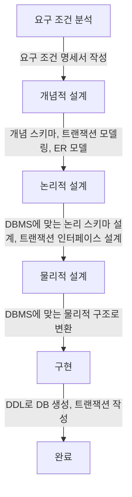

##  데이터베이스 구축
### 1. 데이터베이스 설계 순서
<div style={{marginLeft:'2.5rem'}}>

</div>

### 2. 개념적 설계(정보 모델링,개념화)
<div style={{marginLeft:'2.5rem'}}>
```bash
▣ 현실의 복잡한 정보를 데이터베이스에서 다룰 수 있도록 체계적으로 정리하는 과정
▣ 현실 세계의 정보를 데이터로 정리 -> 필요한 개념(객체)과 관계를 정의
▣ E-R 다이어그램 작성 -> 데이터를 시각적으로 표현하여 쉽게 이해
▣ DBMS에 종속되지 않는 설계 -> 어떤 데이터베이스에서도 적용 가능
```
</div>

### 3. 논리적 설계(데이터 모델링)
<div style={{marginLeft:'2.5rem'}}>
```bash
▣ 개념적 설계에서 도출한 엔터티와 속성들을 보다 구체적으로 정리하여 정규화된 관계형 데이터 모델로 변환하는 과정
▣ 실제 데이터베이스 관리 시스템(DBMS)에 독립적ㅇㄴ인 형태로, 어떤 테이블을 만들고, 테이블 간의 관계를 어떻게 설정할 지 설계
▣ 개념적 설게가 개념 스키마를 설계하는 단계라면 논리적 설계에서는 개념 스키마를 평가 및 정제하고 DBMS에 따라 서로 다른 논리적 스키마를 설계
```
</div>

### 4. 물리적 설계(데이터 구조화)
<div style={{marginLeft:'2.5rem'}}>
```bash
▣ 논리적 설계를 기반으로 실제 데이터베이스 구현에 적합한 형태로 변환
▣ DBMS의 특성을 고려하여 테이블을 최적화하고, 성능을 높이기 위해 인덱스, 파티셔닝, 저장 구조 등을 결정
```
</div>
<div style={{marginLeft:'2.5rem'}}>
```bash
▣ 개념적 설계 : 현실의 복잡한 정보를 데이터베이스에서 다룰 수 있도록 정리
▣ 논리적 설계 : 정규화된 관계형 모델 정의
▣ 물리적 설계 : 스토리지 엔진 선택, 인덱스 추가, ENUM 최적화
```
</div>

### 5. 데이터 모델
<div style={{marginLeft:'2.5rem'}}>
```bash
▣ 현실 세계의 정보들을 컴퓨터에 표현하기 위해서 ( 단순화, 추상화 )하여 체계적으로 표현한 개념적 모형
```
</div>
<div style={{marginLeft:'2.5rem'}}>데이터 모델의 기본 구성 요소</div>
<div style={{marginLeft:'2.5rem'}}>
```bash
▣ Entity(객체)       : 데이터베이스에 표현하려는 대상 (사람, 사물, 개념)
▣ Attribute(속성)    : 객체의 특성을 나타내는 데이터의 최소 단위
▣ Relationship(관계) : 객체 간의 논리적인 연결 및 연관성성
```
</div>
<div style={{marginLeft:'2.5rem'}}>데이터 모델에 표시할 추가 요소</div>
<div style={{marginLeft:'2.5rem'}}>
```bash
▣ Structure(구조)       : 객체 타입(Entity Type) 간의 관계를 논리적으로 표현
▣ Operation(연산)       : 데이터베이스에서 데이터를 저장, 수정, 삭제, 조회하는 작업
▣ Constraint(제약 조건) : 데이터의 무결성을 유지하기 위한 규칙
```
</div>

### 6. E-R 모델의 개요
<div style={{marginLeft:'2.5rem'}}>
```bash
▣ 현실 세계의 데이터를 객체, 속성, 관계 로 표현하는 개념적 데이터 모델
▣ 데이터베이스 설계 초기 단계에서 사용되며, ERD(Entity-Relationship Diagram, 개체-관계 다이어그램)을 통해 시각적으로 표현
```
</div>

### 7. E-R 다이어그램
<div style={{marginLeft:'2.5rem'}}></div>

### 8. 관계형 데이터 모델
<div style={{marginLeft:'2.5rem'}}>
```bash
▣ 가장 널리 사용되는 데이터 모델로, 2차원적인 표(Table)을 이용해서 데이터 상호 관계를 정의하는 DB 구조
▣ 파일 구조처럼 구성한 테이블들을 하나의 DB로 묶어서 테이블 내에 있는 속성들 간의 관계 설정
▣ 기본키(Primary Key)와 이를 참조하는 외래키(Foreign Key)로 데이터 간의 관계를 표현
```
</div>

### 9. 관계형 데이터베이스의 Relation 구조
<div style={{marginLeft:'2.5rem'}}>
```bash
▣ Relation은 데이터들을 표(Table) 형태로 표현한 것으로 구조를 나타내는 릴레이션 스키마와 실제 값들인 릴레이션 인스턴스로 구성
```
</div>
<div style={{marginLeft:'2.5rem'}}></div>
<div style={{marginLeft:'2.5rem'}}>
```bash
▣ 튜풀   : 릴레이션을 구성하는 각가의 행
▣ 속성   : 데이터베이스를 구성하는 가장 작은 논리적 단위, 데이터 항목 또는 데이터 필드
▣ 도메인 : 하나의 속성이이 취할 수 있는 같은 타입의 원자(Atomic)값들의 집합 (열)
```
</div>

### 10. 릴레이션의 특징
<div style={{marginLeft:'2.5rem'}}>
```bash
▣ 관계형 데이터베이스에서 표의 형태로 데이터를 저장하는 구조
▣ 여러개의 속성과 튜플로 구성
```
</div>

### 11. 키(Key)
<div style={{marginLeft:'2.5rem'}}>
```bash
▣ 관계형 데이터베이스에서 튜플(행)을 유일하게 식별하는 속성 또는 속성들의 집합
▣ 데이터의 무결성을 유지하고, 중복 방지를 위해 사용
```
</div>
<div style={{marginLeft:'2.5rem'}}></div>
<div style={{marginLeft:'2.5rem'}}>
```bash
▣ Super Key(슈퍼키)     : 한 릴레이션에서 튜플을 유일하게 식별할 수 있는 속성들의 집합, 중복 가능성이 없는 학번, (학번, 이름), (학번, 학과) 모두 슈퍼키 가능
▣ Candidate Key(후보키) : 슈퍼키 중에서 최소한의 속성만 포함한 키, 중복이 없고, 유일정을 만족하며 최소성을 가짐, 학번
▣ Primary Key(기본키)   : 테이블에서 반드시 유일해야 하며, NULL을 가질 수 없음, 하나의 테이블에는 오직 하나의 기본키만 존재
▣ Alternate Key(대체키) : 후보키 중에서 기본키로 선택되지 않은 나머지 키, 유일성을 보장하지만 기본키로 사용되지 않음
▣ Foreign Key(외래키)   : 다른 테이블의 기본키를 참조하는 속성, 테이블 관계를 설정하고 데이터 무결성을 유지
▣ Composite Key(복합키) : 두개 이상의 속성을 조합하여 만든 키, 개별 속성만으로 유일성을 보장할 수 없을 때 사용
```
</div>
<div style={{marginLeft:'2.5rem'}}></div>

### 12. 무결성(Integrity)
<div style={{marginLeft:'2.5rem'}}>
```bash
▣ 데이터의 정확성, 일관성, 신뢰성을 유지하는 제약 조건
▣ 데이터베이스에 저장된 정보가 변형되거나 손상되지 않도록 보장하는 원칙
```
</div>
<div style={{marginLeft:'2.5rem'}}>
```bash
▣ 객체 무결성        : 각 튜플(행)을 유일하게 식별할 수 있도록 기본키(PK)는 중복되거나 NULL 값을 가질 수 없음
▣ 참조 무결성        : 외래키(FK)는 반드시 참조하는 테이블의 기본키(PK) 값을 가져야 함
▣ 도메인 무결성      : 각 속성(열)에 저장되는 값이 미리 정의된 데이터 타입과 범위를 벗어나지 않도록 제한
▣ 사용자 정의 무결성 : 비즈니스 로직에 따라 특정 데이터를 제한하는 규칙
```
</div>

### 13. 관계대수의 개요
<div style={{marginLeft:'2.5rem'}}>
```bash
▣ 관계형 데이터베이스에서 데이터를 조회, 조작하는 데 사용되는 수학적 연산
▣ 데이터베이스의 질의(Query)를 표현하기 위한 기본적인 연산을 제공
```
</div>

### 14. 순수 집합 연산자
<div style={{marginLeft:'2.5rem'}}></div>

### 15. 일반 관계 연산자
<div style={{marginLeft:'2.5rem'}}></div>