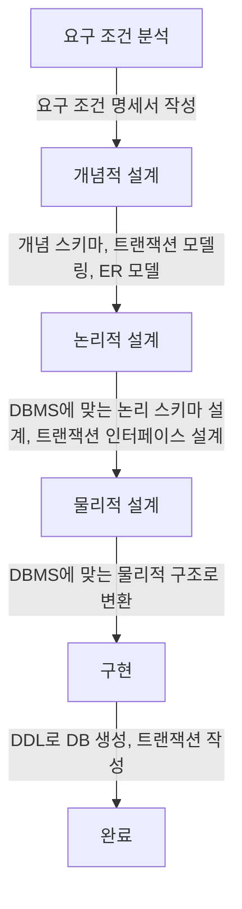

##  데이터베이스 구축
### 1. 데이터베이스 설계 순서
<div style={{marginLeft:'2.5rem'}}>

</div>

### 2. 개념적 설계(정보 모델링,개념화)
<div style={{marginLeft:'2.5rem'}}>
```bash
▣ 현실의 복잡한 정보를 데이터베이스에서 다룰 수 있도록 체계적으로 정리하는 과정
▣ 현실 세계의 정보를 데이터로 정리 -> 필요한 개념(객체)과 관계를 정의
▣ E-R 다이어그램 작성 -> 데이터를 시각적으로 표현하여 쉽게 이해
▣ DBMS에 종속되지 않는 설계 -> 어떤 데이터베이스에서도 적용 가능
```
</div>
