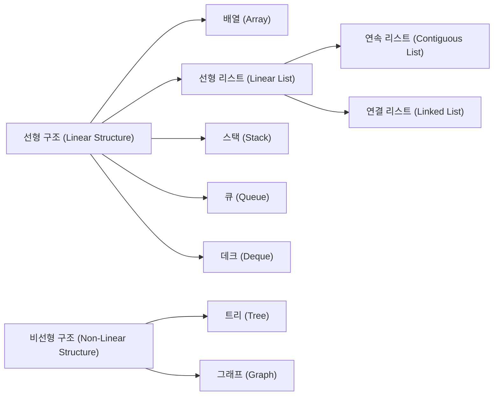
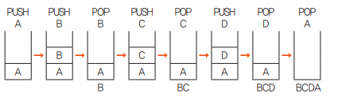
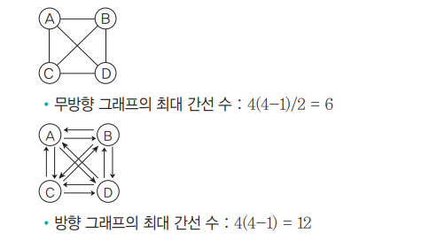
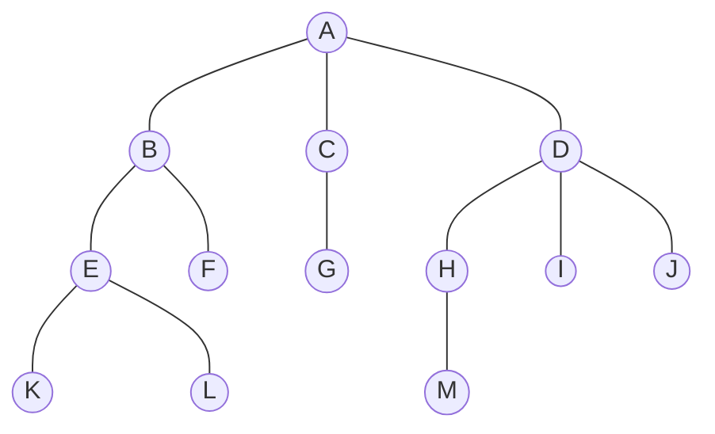
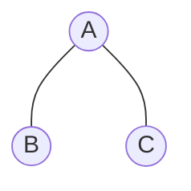
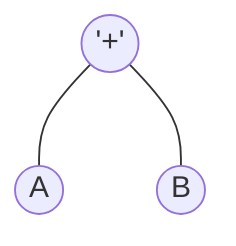
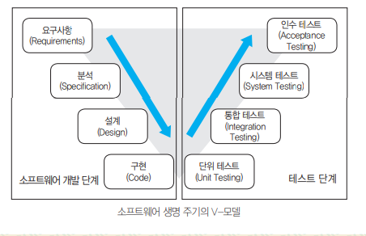
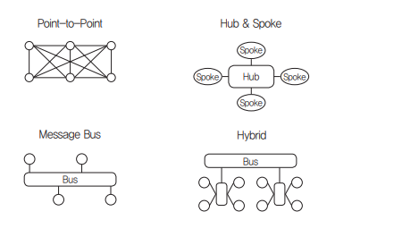
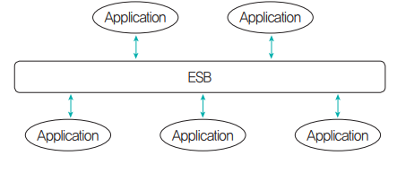

##  소프트웨어 개발
### 1. 자료 구조의 분류
<div style={{marginLeft:'2.5rem'}}>

</div>

### 2. 선형 리스트(Linear List)
<div style={{marginLeft:'2.5rem',fontWeight:'bold', marginBottom:'1rem'}}>Contiguous Lis - 연속 리스트</div>
<div style={{marginLeft:'2.5rem'}}>
```bash
▣ 배열과 같이 연속되는 기억장소에 저장되는 자료구조
▣ 기억저장소를 연속적으로 배정, 기억장소 이용효울 밀도가 1로서 가장 좋음
▣ 중간에 데이터를 삽입하기 위해서는 연속된 빈 공간 필요, (삽입, 삭제) 시자료의 이동이 필요
```
</div>
<div style={{marginLeft:'2.5rem',fontWeight:'bold', marginBottom:'1rem'}}>Linked List - 연결 리스트</div>
<div style={{marginLeft:'2.5rem'}}>
```bash
▣ 각각의 데이터(노드)가 다음 데이터의 위치를 기억하면서 연결되는 방식
▣ 각각의 데이터(노드)는 포인터로 연결
```
</div>
<div style={{marginLeft:'2.5rem'}}>
```bash
▣ 단일 연결 리스트 : 데이터(노드)가 한 방향으로만 연결
▣ 이중 연결 리스트 : 데이터(노드)가 양방향으로 연결
▣ 원형 연결 리스트 : 마지막 데이터(노드)가 첫 번째 데이터(노드)를 가리켜 원형으로 연결
```
</div>

### 3. 스택(Stack)
<div style={{marginLeft:'2.5rem'}}>
```bash
▣ 쌓아 올린다는 것을 의미, 책을 쌓는 것처럼 차곡차곡 쌓아 올린 행텨의 자료 구조
▣ 가장 나중에 삽입된 자료가 가장 먼저 삭제되는 후입선출 방식의 자료 구조
▣ 모든 기억 공간이 꽉 채워져 있는 상태에서 데이터를 삽입하면 오버플로(Overflow)가 발생
▣ 삭제할 데이터가 없을 때 삭제하면 언더플로(Underflow)가 발생
```
</div>
<div style={{marginLeft:'2.5rem',fontWeight:'bold', marginBottom:'1rem'}}>예제</div>
<div style={{marginLeft:'2.5rem'}}>
```bash
▣ 순서가 A, B, C, D로 정해진 입력 자료를 스택에 입력 하였다가 B, C, D, A 순서로 출력하는 과정을 나열
```
</div>
<div style={{marginLeft:'2.5rem'}}></div>

### 4. 큐(Queue)
<div style={{marginLeft:'2.5rem'}}>
```bash
▣ 줄을 서서 기다리는 것을 의미, 예를 들어 은행에서 먼저 온사람의 업무를 창구에서 처리하는 것과 같다고 볼 수 있다.
▣ 리스트의 한쪽에서는 삽입 작업이, 다른 쪽에서는 삭제 작업이 이루어지도록 구성한 자료 구조
▣ 선입선출 방식의 자료 구조
▣ 시작과 끝을 표시하는 두 개의 포틴터가 존재
```
</div>

### 5. 방향/무방향 그래프의 최대 간선 수
<div style={{marginLeft:'2.5rem'}}>
```bash
▣ n개의 정점으로 구성된 무방향 그래프에서 최대 간선 수는 n-(n-1)/2이고, 방향 그래프에서 최대 간선 수는 n(n-1) 이다
```
</div>
<div style={{marginLeft:'2.5rem',fontWeight:'bold', marginBottom:'1rem'}}>예제</div>
<div style={{marginLeft:'2.5rem'}}>
```bash
▣ 정점이 4개인 경우 무방향 그래프와 방향 그래프의 최대 간선 수는?
```
</div>
<div style={{marginLeft:'2.5rem'}}></div>

### 6. 트리의 개요
<div style={{marginLeft:'2.5rem'}}>
```bash
▣ Node와 Branch을 이용하여 사이클을 이루지 않도록 구성한 그래프의 특수한 형태
```
</div>
<div style={{marginLeft:'2.5rem'}}>

</div>
<div style={{marginLeft:'2.5rem'}}>
```bash
▣ Root Node     : Tree의 맨 위에 있는 노드
▣ Node          : Tree의 기본 요소로서 자료 항목과 다른 항목에 대한 Branch를 합친 것
▣ Degree        : 각 노드에서 뻗어 나온 가지의 수 (차수) 
▣ Terminal Node : 자식이 하나도 없는 노드, Leaf Node(입 노드) 라고도 함
▣ SOn Node      : 어떤 노드의 연결된 다음 레벨의 노드
▣ Parent Node   : 어떤 노드에 연결된 이전 레벨의 노드
▣ Brother Node  : 동일한 부모를 갖는 노드
▣ Tree Degree   : 노드들의 디그리 중에서 가장 많은 수 (노드 A 나 D가 3개의 디그리를 가지므로 앞 트리의 디그리는 3)
```
</div>

### 7. 트리의 운행법
<div style={{marginLeft:'2.5rem'}}>

</div>
<div style={{marginLeft:'2.5rem'}}>
```bash
▣ Preorder  운행 : Root -> Left -> Right 순으로 운행 (A, B, C)
▣ Inorder   운행 : Left -> Root -> Right 순으로 운행 (B, A, C)
▣ Postorder 운행 : Left -> Right -> Root 순으로 운행 (B, C, A)
```
</div>
<div style={{marginLeft:'3.5rem'}}>다음 트리를 Inorder, Preorder, Postorder 방법으로 은행 했을 때 각 노드를 방문한 순서는?</div>
<div style={{marginLeft:'3.5rem'}}>

</div>

### 8. 수식의 표기법
<div style={{marginLeft:'2.5rem'}}>

</div>
<div style={{marginLeft:'2.5rem'}}>
```bash
▣ PreFix(전위 표기법)  : 연산자 -> Left -> Right, +AB
▣ InFix(중위 표기법)   : Left -> 연산자 -> Right, A + B
▣ PostFix(후위 표기법) : Left -> Right -> 연산자 , AB+
```
</div>
<div style={{marginLeft:'3.5rem'}}>다음과 같이 InFix로 표기된 수식을 PreFix와 PostFix로 변환</div>
<div style={{marginLeft:'3.5rem'}}>
```bash
X = A / B * (C + D) + E
```
</div>
<div style={{marginLeft:'3.5rem'}}>InFix -> PreFix</div>
<div style={{marginLeft:'3.5rem'}}>
```bash
▣ 연산 우선순위에 따라 괄호로 묶는다.
▣ 연산자를 해당 괄호의 맨앞 왼쪽으로 이동
▣ 필요 없는 괄호를 제거
```
</div>

<div style={{marginLeft:'3.5rem'}}>InFix -> Postfix로</div>
<div style={{marginLeft:'3.5rem'}}>
```bash
▣ 연산 우선순위에 따라 괄호로 묶는다.
▣ 연산자를 해당 괄호의 맨뒤 오른쪽 이동
▣ 필요 없는 괄호를 제거
```
</div>
<div style={{marginLeft:'3.5rem'}}>Postfix나 Prefix로 표기된 수식을 Infix로 바꾸기</div>
<div style={{marginLeft:'3.5rem'}}>
```bash
A B C - / D E F + * +
```
</div>
<div style={{marginLeft:'3.5rem'}}>Postfix -> InFix </div>
<div style={{marginLeft:'3.5rem'}}>
```bash
▣ 먼저 인접한 피연산자 두 개와 오른쪽의 연산자를 괄호로 묶는다
▣ 연산자를 해당 피연산자의 가운데로 이동
▣ 필요 없는 괄호를 제거
```
</div>

<div style={{marginLeft:'3.5rem'}}>Postfix나 Prefix로 표기된 수식을 Infix로 바꾸기</div>
<div style={{marginLeft:'3.5rem'}}>
```bash
+ / A - B C * D + E F
```
</div>
<div style={{marginLeft:'3.5rem'}}>Prefix -> InFix </div>
<div style={{marginLeft:'3.5rem'}}>
```bash
▣ 먼저 인접한 피연산자 두 개와 왼쪽의 연산자를 괄호로 묶는다
▣ 연산자를 해당 피연산자 사이로 이동시킨다
▣ 필요 없는 괄호를 제거
```
</div>

### 9. 삽입 정렬(Insertion Sort)
<div style={{marginLeft:'2.5rem'}}>
```bash
▣ [8, 5, 6, 2, 4] 삽입 정렬
▣ 1회전 : 두 번째 값을 첫 번째 값과 비교하여 5를 첫번 째 자리에 삽입하고, 8을 한칸 뒤로 이동
▣ 2회전 : 세 번째 값을 첫 번째, 두 번째 값과 비교하여 6을 8자리에 삽입하고 8을 한 칸 뒤로 이동
▣ 3회전 : 네 번째 값 2를 처음부터 비교하여 맨 처음에 삽입하고 나머지를 한 칸씩 뒤로 이동
▣ 4회전 : 다섯 번째 값 4를 처음부터 비교하여 5자리에 삽입하고 나머지를 한 칸씩 뒤로 이동
```
</div>

### 10. 선택 정렬(Selection Sort)
<div style={{marginLeft:'2.5rem'}}>
```bash
▣ [8, 5, 6, 2, 4] 선택 정렬
▣ 1회전 : 배열에서 최소값을 찾아 첫 번째 자리로 이동
▣ 2회전 : 매 회전마다 "현재 범위에서 가장 작은 값"을 찾아 왼쪽으로 이동
```
</div>

### 11. 버블 정렬(Bubble Sort)
<div style={{marginLeft:'2.5rem'}}>
```bash
▣ [8, 5, 6, 2, 4] 버블 정렬
▣ 서로 인접한 두개의 요서를 비교하면서 큰 값을 오른쪽으로 이동
```
</div>

### 12. 퀵 정렬(Quick Sort)
<div style={{marginLeft:'2.5rem'}}>
```bash
▣ 배열에서 하나의 값을 기준으로 선택, 보통 첫 번째, 마지막, 중간값, 혹은 랜텀으로 선택
▣ Pivot을 기준으로 작은 값은 왼쪽, 큰 값은 오른쪽으로 이동, Pivot이 제자리를 찾도록 정렬
▣ Pivot을 제외한 왼쪽 부분과 오른쪽 부분을 다시 정렬, 이 과정을 배열 크기가 1이 될 때까지 반복
```
</div>

### 13. 힙 정렬(Heap Sort)
<div style={{marginLeft:'2.5rem'}}>
```bash
▣ 최대 힙과 최소 힙이 있으면, 보통 최대 힙을 사용하여 가장 큰 값을 루트로 이동한 후 정렬
```
</div>
<div style={{marginLeft:'2.5rem'}}>힙 정렬 동작 원리</div>
<div style={{marginLeft:'2.5rem'}}>
```bash
[5, 3, 8, 4, 2, 7, 1, 10]
▣ 최대 힙 으로 변환 -> [10, 5, 8, 4, 3, 7, 1, 2]
▣ 최댓값을 맨 뒤로 이동
▣ 남은 요소ㅔ 대해 다시 최대 힙유지 -> 반복하여 정렬
```
</div>

### 14. 합병 정렬 (Merge Sort)
<div style={{marginLeft:'2.5rem'}}>
```bash
[5, 2, 9, 1, 5, 6]
▣ 배열을 반으로 나눔 -> [5, 2, 9]   [1, 5, 6]
▣ 나누어진 배열을 재귀적으로 정렬 -> [5] [2, 9]  , [1] [5, 6]
▣ 다시 두 부분 배열로 나누기 -> [2, 9]  →  [2] [9]  , [5, 6]  →  [5] [6]
▣ 정렬된 배열들을 비교하면서 합병
```
</div>

### 15. 이분 탐색 (Binary Search)
<div style={{marginLeft:'2.5rem'}}>
```bash
▣ 정렬된 배열에서 원하는 값을 빠르게 찾는 알고리즘
▣ 반씩 나누는 방식으로 검색, 검색 범위가 절반으로 줄어 매우 빠른 속도로 결과 도출
▣ 정렬된 배열에서 특정 값을 찾을 때, 중간값과 비교하여 범위를 좀혀가는 방식
▣ 반듯이 정렬된 배열에서만 작동
```
</div>
<div style={{marginLeft:'2.5rem'}}>
```bash
[1, 3, 5, 7, 9, 11, 13, 15, 17, 19]
▣ 중간값 계산 -> middle = (left + right) / 2,( middle = (0 + 9) / 2 = 4 -> arr[4] = 9 )
▣ 찾고자 하는 값 7은 9보다 작으므로, 검색 범위를 왼쪽 절반으로 좁힙
▣ 새로운 오른쪽 인덱스는 middle - 1 = 3
▣ 위 절차를 반복
```
</div>

### 16. 해싱 함수(Hashing Function)
<div style={{marginLeft:'2.5rem'}}>
```bash
▣ 입의의 크기를 가진 입력 데이터를 고정된 크기의 해시값으로 변환하는 함수, 보안, 데이터 무결성 검증, 해시 테이블 등에 사용
▣ 제산법(Division), 제곱법(Mid-Square), 폴딩법(Folding), 기수 변환법(Radix), 대수적 코딩법(Algebraic Coding)
▣ 숫자 분석법(Digit Analysis, 계수 분석법), 무작위법(Random) 
```
</div>
<div style={{marginLeft:'3.5rem'}}>제산법 (Division Method)</div>
<div style={{marginLeft:'3.5rem'}}>
```bash
▣ 키 값을 특정 소수로 나눈 나머지를 해시값으로 사용
▣ h(K)=K mod Q
▣ Q는 해시테이블에서 가장 큰 소수
▣ 키 갑 : {25, 36, 48, 52, 66}
▣ 소수를 17로 선택
```
</div>
<div style={{marginLeft:'3.5rem'}}>
    <table>
        <tr>
            <td>키 값</td>
            <td>해시값 (K mod Q)</td>
        </tr>
          <tr>
            <td>25</td>
            <td>25 mod 17 = 8</td>
        </tr>
          <tr>
            <td>36</td>
            <td>36 mod 17 = 2</td>
        </tr>
          <tr>
            <td>48</td>
            <td>48 mod 17 = 14</td>
        </tr>
        <tr>
            <td>52</td>
            <td>52 mod 17 = 1</td>
        </tr>
        <tr>
            <td>66</td>
            <td>66 mod 17 = 15</td>
        </tr>
    </table>
</div>
<div style={{marginLeft:'3.5rem'}}>폴딩법 (Folding Method)</div>
<div style={{marginLeft:'3.5rem'}}>
```bash
▣ 키 값을 여러 부분으로 나누어 더하거나 XOR 연산을 수행
▣ 키 값의 모든 부분이 해시값에 반영
ex) 키값 : 567823
1. 567, 823
2. 567 + 823 = 1390
3. 해시 테이블 크기에 맞게 조정 -> 1390 mod 100 = 90
```
</div>

<div style={{marginLeft:'3.5rem'}}>제곱법 (Mid-Square Method)</div>
<div style={{marginLeft:'3.5rem'}}>
```bash
▣ 키 값을 제곱한 후, 중간 숫자를 해시값으로 사용
▣ 숫자가 너무 크면 계산량이 많아질 수 있음
ex) 키값 : 123
1. 키값 제곱 -> 15129
2. 중간 두자리 -> 12
```
</div>

<div style={{marginLeft:'3.5rem'}}>기수 변환법 (Radix Transformation)</div>
<div style={{marginLeft:'3.5rem'}}>
```bash
▣ 키 값을 다른 진수(예: 16진수, 8진수)로 변환하여 일부 값을 해시값으로 사용
ex) 키값 : 255 (10진수)
1. 16진수 변환: FF
2. 압자리 전단 후 F를 이용해 변환
3. 해시값 15 (F의 16진수는 15)
```
</div>

<div style={{marginLeft:'3.5rem'}}>대수적 코딩법 (Algebraic Coding)</div>
<div style={{marginLeft:'3.5rem'}}>
```bash
▣ 키 값을 다항식으로 변환한 후 특정 다항식으로 나눈 나머지를 해시값으로 사용
ex) 키값 : 345
1. 다항식 변환 : 3x* + 4x + 5
2. 특정 다항식으로 나눠 나머지를 사용 → 해시값 결정
```
</div>

<div style={{marginLeft:'3.5rem'}}>숫자 분석법 (Digit Analysis)</div>
<div style={{marginLeft:'3.5rem'}}>
```bash
▣ 키 값을 이루는 숫자의 패턴을 분석하여 해시값을 결정
ex) 키값 : 135792
1. 중간 숫자 57을 선택
2. 해시값: 57
```
</div>

<div style={{marginLeft:'3.5rem'}}>무작위법 (Random Method)</div>
<div style={{marginLeft:'3.5rem'}}>
```bash
▣ 난수를 발생시켜 키 값에 대한 해시값을 무작위로 결정
ex) 키값 : 50
1. 난수 생성기 사용 → hash(50) = 7
2. 해시값: 7
```
</div>

### 17. DBMS(DataBase Management System 데이터베이스 관리 시스템)
<div style={{marginLeft:'2.5rem'}}>
```bash
▣ DBMS란 사용자와 데이터베이스 사이에서 사용자의 요구에 따라 정보를 생성해주고, 데이터베이스를 관리해 주는소프트웨어
```
</div>
<div style={{marginLeft:'2.5rem'}}>
```bash
▣ 정의 기능 : 응용 프로그램들이 요구하는 데이터 구조를 지원하기 위해 데이터베이스에 저장될 데이터 구조에 대한 정의, 이용방식 등을 명시
▣ 조작 기능 : 데이터 검색, 갱신, 삽입, 삭제 등을 체계적으로 처리하기 위해 사용자와 데이터베이스 사이의 인터페이스 수단을 제공
▣ 제어 기능 : 데이터베이스 접근, 삽입, 삭제 작업이 정확하게 수행되어 데이터 무결성이 유지되도록 제어
```
</div>

### 18. 스키마
<div style={{marginLeft:'2.5rem'}}>
```bash
▣ 데이터베이스의 구조와 제약 조건에 관한 전반적인 명세를 기술한 메타데이터 집합
```
</div>
<div style={{marginLeft:'2.5rem'}}>
```bash
▣ 외부 스키마 : 사용자나 응용 프로그래머가 각 개인의 입장에서 필요로하는 데이터베이스의 논리적 구조를 정의
▣ 개념 스키마 : 데이터베이스의 전체적인 논리적 구조로서, 모든 응용프로그램이나 사용자들이 필요로 하는 데이터를 종합한 조직 전체의 데이터베이스 하나만 존재
▣ 내부 스키마 : 물리적 저장장치의 입장에서 본 데이터베이스 구조, 데이터베이스에 저장될 레코드의 형식을 정의, 저장 내부 레코드의 물리적 순서 등을 나타냄
```
</div>

### 19. 단위 모듈(Unit Module)의 개요
<div style={{marginLeft:'2.5rem'}}>
```bash
▣ 소프트웨어 개발 및 시스템 설계에서 사용되는 개념
▣ 하나의 독립적인 기능을 수행하는 모듈
▣ 각 모듈은 특정한 작업을 처리하는 기능을 가짐
▣ 모듈들이 결합되어 전체 시스템을 구성
▣ 모듈화된 설계와 재사용성을 강조
```
</div>

### 20. IPC(Inter-Process Communication)
<div style={{marginLeft:'2.5rem'}}>
```bash
▣ 모듈 간 통신 방식을 구현하기 위해 사용되는 대표적인 프로그래밍 인터페이스 집합
▣ 복수의 프로세스를 수행하며 이뤄지는 프로세스 간 통신까지 구현이 가능
```
</div>
<div style={{marginLeft:'3.5rem'}}>IPC의 주요 방법</div>
<div style={{marginLeft:'3.5rem'}}>
```bash
▣ Pipes         : 하나의 프로세스에서 다른 프로세스로 데이터를 전달, 단방향 통신, 프로세스 간 데이터 흐름을 관리, 비동기식으로 데이터를 전송
▣ Message Queue : 프로세스 간에 메시지를 큐에 넣고 꺼내는 방식으로 데이터를 교환, 비동기, 메시지의 우선순위 설정 가능, 프로세스 간 독립적인 데이터 전달
▣ Shared Memory : 공통의 메모리 공간을 사용하여 데이터를 교환, 가장 빠른 IPC 방식, 동기화, 대량 데이터 효율적 처리
▣ Socket        : 네트워크를 통해 프로세스 간 통신을 지원, TCP/IP, UDP
▣ Semaphore     : 동기화 기법으로 여러 프로세스가 동시에 공유 자원에 접근하는 것을 제어, 동기화와 상호 배제 제공, 여러 프로세스 간의 자원 경쟁 해결
```
</div>

### 21. 릴리즈 노트(Release Note)
<div style={{marginLeft:'2.5rem'}}>
```bash
▣ 개발 과정에서 정리된 릴리즈 정보를 소프트웨어의 최종 사용자인 고객과 공유하기 위한 문서
▣ 데스트 진행 방법에 대한 결과, 소프트웨어 사양에 대한 개발팀의 정확한 준수 여부 확인
▣ 소프트웨어에 포함된 전체 기능, 서비스 내용, 개선 사항 등을 사용자와 공유
▣ 소프트웨어의 버전 관리나 릴리즈 정보를 체계적으로 관리
▣ 소프트웨어의 초기 배포 시 또는 출시 후 개선 사항을 적용한 후 추가 배포시 공유
```
</div>

### 22. Subversion(서브버전, SVN)
<div style={{marginLeft:'2.5rem'}}>
```bash
▣ 중앙 서버에 모든 파일과 폴더의 버전 정보를 저장, 각 클라이언트는 이 서버와 상호작용하여 파일을 수정, 커밋 진행
▣ 각 커밋은 고유한 버전 번호를 가지며, 파일의 변경사항이 기록되어 추적이 용이
▣ 특정 시점에 Branch를 생성 독립적인 작업이 가능, 작업 후 merge하여 하나의 버전으로 통합합
▣ 여러 사람이 동시에 같은 파일을 수정할 때 충돌을 처리, 적절히 해결할 수 있도록 기능 제공
```
</div>

### 23. Jenkins
<div style={{marginLeft:'2.5rem'}}>
```bash
▣ JAVA 기반의 오픈 소스 형태, 가장 많이 사용
▣ 서플릿 컨테이너에서 실행되는 서버 기반 도구
▣ SVN, Git 등 대부분의 형상 관리 도구와 연동
▣ 친숙한 Web GUI 제공으로 사용이 편리
▣ 여러 대의 컴퓨터를 이용한 분산 빌드나 테스트가 가능
```
</div>

### 24. 애플리케이션 테스트 관련 용어
<div style={{marginLeft:'2.5rem'}}>
```bash
▣ 결함 집중(Defect Clustering)                : 대부분의 결함이 소수의 특정 모듈에 집중해서 발생
▣ 파레토 법칙(Pareto Principle)               : 테스트로 발견된 80%의 오류는 20%의 모듈에서 발견되 므로 20%의 모듈을 집중적으로 테스트하여 효율적으로 오류를 찾자는 것
▣ 오류-부재의 궤변(Absence of Errors Fallacy) : 소프트웨어의 결함을 모두 제거해도 사용자의 요구사항을 만족시키지 못하면 해당 소프트웨어는 품질이 높다고 말할 수 없다는 것을 의미
```
</div>

### 25. 테스트 기반(Test Bases)에 따른 테스트
<div style={{marginLeft:'2.5rem'}}>
```bash
▣ 명세 기반 테스트 : 사용자의 요구사항에 대한 명세를 빠짐없이 테스트 케이스를 만들어 구현하고 있는 지 확인 하는 테스트
▣ 구조 기반 테스트 : 소프트웨어 내부의 논리 흐름에 따라 테스트 케이스를 작성하고 확인하는 테스트
▣ 경험 기반 테스트 : 유사 소프트웨어나 기술 등에 대한 테스터의 경험을 기반으로 수행하는 테스트
```
</div>

### 26. 시각에 따른 테스트
<div style={{marginLeft:'2.5rem'}}>
```bash
▣ 검증 테스트 : 개발자의 시각에서 제품의 생산 과정을 테스트
▣ 확인 테스트 : 사용자의 시각에서 생산된 제품의 결과를 테스트
```
</div>

### 27. 목적에 따른 테스트
<div style={{marginLeft:'2.5rem'}}>
```bash
▣ 회복 테스트(Recovery)    : 시스템에 여러 가지 결함을 주어 실패하도록 한 후 올바르게 복구되는지를 확인
▣ 안전 테스트(Security)    : 시스템에 설치된 시스템 보호 도구에 불법적인 침입으로부터 시스템을 보호할 수 있는지 확인
▣ 강도 테스트(Stress)      : 시스템에 과도한 정보량이나 빈도 등을 부과하여 과부하 시에도 소프트웨어가 정상적으로 실행되는지 확인
▣ 성능 테스트(Performance) : 소프트웨어의 실시간 성능이나 전체적인 효율정을 진단
▣ 구조 테스트(Structure)   : 소프트웨어 내부의 논리적인 경로, 소스 코드의 복잡도 등을 평가
▣ 회귀 테스트(Regression)  : 소프트웨어의 변경 또는 수정된 코드에 새로운 결함이 없음을 확인
▣ 병행 테스트(Parallel)    : 변경된 소프트웨어와 기존 소프트웨어에 동일한 데이터를 입력하여 결과를 비교
```
</div>


### 28. 화이트박스 테스트(White Box Test)
<div style={{marginLeft:'2.5rem'}}>
```bash
▣ 모듈의 원시 코드를 오픈시킨 상태에서 원시 코드의 논리적인 모든 경로를 테스트
▣ 모듈 안의 작동을 직접 관찰
▣ 원시 코드(모듈)의 모든 문장을 한 번 이상 실행
▣ 프로그램의 제어 구조에 따라 선택, 반복 등의 분기점 부분들을 수행 논리적 경로를 제어
```
</div>

### 29. 화이트박스 테스트의 종류
<div style={{marginLeft:'2.5rem'}}>
```bash
▣ 기초 경로 검사(Base Path Testing)         : 테스트 케이스 설계자가 절차적 설계의 논리적 복잡성을 측정할 수 있게 해주는 테스트 기법
▣ 제어 구조 검사(Control Structure Testing) : 모듈내의 논리적 조건을 검사, 반복 구조에 처점을 맞춰 검사, 변수의 정의와 변수 사용의 위치에 초점을 맞춰 검사
```
</div>

### 29. 화이트박스 테스트의 검증 기준
<div style={{marginLeft:'2.5rem'}}>
```bash
▣ 문장 검중 기준(Statement Coverage)        : 소스 코드의 모든 구분이 한번 이상 수행하도록 설계
▣ 분기 검증 기준(Branch Coverage)           : 소스 코드의 모든 조건문에 대해 조건이 True 경우와 False인 경우가 한 번 이상 수행하도록 설계
▣ 조건 검증 기준(Condition Coverage)        : 소스 코드의 조건문에 포함된 개별 조건식의 결과가 True인 경우와 False인 경우가 한 번 이상 수행하도록 설계
▣ 분기 조건 기준(Branch Condition Coverage) : 분기 검증 기준과 조건 검증 기준을 모두 만족하는 설계
```
</div>

### 30. 블랙박스 테스트(Black Box Test)
<div style={{marginLeft:'2.5rem'}}>
```bash
▣ 소프트웨어가 수행할 특정 기능을 알기 위해서 각 기능이 완전히 작동되는 것을 입증하는 테스트, 기능 테스트
▣ 프로그램의 구조를 고려하지 않기 때문에, 테스트 케이스는 프로그램 또는 모듈의 요구나 명세를 기초로 결정
▣ 소프트웨어 인터페이스에서 실시되는 테스트
▣ 부정확하거나 누락된 기능, 인터페이스 오류, 행위나 성능 오류 등을 발견하기 위해 사용되며, 테스터 과정의 후반부에 적용
```
</div>

### 31. 블랙박스 테스트의 종류
<div style={{marginLeft:'2.5rem'}}>
```bash
▣ 기능 테스트(Functional Testing)                  : 요구사항 명세에 따라 소프트웨어가 기대하는 기능을 수행하는 지검증, 입력값과 예상 츨력값을 비교하여 테스트
▣ 동등 분할 테스트(Equivalence Partitioning)       : 입력값을 유사한 그룹으로 나누고, 각 그룹에서 대푝값을 선택하여 테스트, 불필요한 테스트 케이스를 줄이고 효율적인 테스트 가능
▣ 경계값 분석 테스트(Boundary Value Analysis, BVA) : 입력값의 경계(최소, 최대, 경계 직전 및 직후 등)에서 발생할 수 있는 오류를 찾는 방법
▣ 결정 테이블 테스트(Decision Table Testing)       : 다양한 입력 조합에 따른 출력 결과를 표로 정리하여 테스트
▣ 상태 전이 테스트(State Transition Testing)       : 시스템의 상태 변화에 따라 동작을 검증하는 테스트 기법
▣ 유스케이스 테스트(Use Case Testing)              : 실제 사용자의 시나리오를 기반트로 테스트
▣ 에러 추정 테스트(Error Guessing)                 : 테스트 경험과 직관을 바탕으로 오류가 발생할 가능성이 높은 영역을 테스트
```
</div>

### 31. 개발 단계에 따른 애플리케이션 테스트
<div style={{marginLeft:'2.5rem'}}>
```bash
▣ 소프트웨어의 개발 단계에 따라 단위테스트, 통합 테스트, 시스템 테스트, 인수 테스트로 분류
▣ 애플리케이션 테스트와 소프트웨어 개발 단계를 연결하여 표현한 것을 V-모델
```
</div>
<div style={{marginLeft:'2.5rem'}}></div>

### 32. 단위 테스트(Unit Test)
<div style={{marginLeft:'2.5rem'}}>
```bash
▣ 코딩 직후 소프트웨어의 설계의 최소 단위인 모듈이나 컴포넌트에 초점을 맞춰 테스트
▣ 인터페이스, 자료 구조, 독립적 기초 경로, 오류 처리 경로 등을 검사
▣ 사용자의 요구사항을 기반으로 한 기능성 테스트를 최우선
▣ 구조 기반 테스트와 명세 기반 테스트로 나뉘지만 주로 구조 기반 테스트를 시행
```
</div>

### 33. 통합 테스트(Integration Test)
<div style={{marginLeft:'2.5rem'}}>
```bash
▣ 단위 테스트가 완료된 모듈들을 통합하여 하나의 시스템을 완성시키는 과정에서의 테스트
```
</div>
<div style={{marginLeft:'3.5rem'}}>비점진적 통합 </div>
<div style={{marginLeft:'3.5rem'}}>
```bash
▣ 단계적으로 통합하는 절차 없이 모든 모듈이 미리 결합되어 있는 프로그램 전체를 테스트, 빅뱅 통합 테스트
▣ 규모가 작은 소프트웨어에 유리, 단시간 내에 테스트 가능
▣ 전체 프로그램을 대상으로 하기 때문에 오류 발견 및 장애 위치 파악 및 수정이 어려움
```
</div>
<div style={{marginLeft:'3.5rem'}}>점진적 통합 </div>
<div style={{marginLeft:'3.5rem'}}>
```bash
▣ 모듈 단위로 단계적으로 통합하면서 테스트하는 방법으로 하향식, 상향식, 혼합식 통합 방식이 있음
▣ 오류 수정이 용이, 인터페이스와 관련된 오류를 완전히 테스트할 가능성이 높음
```
</div>

### 34. 인수 테스트(Acceptance Test)
<div style={{marginLeft:'2.5rem'}}>
```bash
▣ 개발한 소프트웨어가 사용자의 요구사항을 충족하는지에 중점을 두고 테스트
▣ 소프트웨어 사용자가 직접 테스트
▣ 테스트에 문제가 없을 시 소프트웨어를 인수하게 되고, 프로젝트 종료
```
</div>
<div style={{marginLeft:'3.5rem'}}>알파 테스트 </div>
<div style={{marginLeft:'3.5rem'}}>
```bash
▣ 개발자의 장소에서 사용자가 개발자 앞에서 행하는 테스트
▣ 통제된 환경에서 행하며, 오류와 사용상의 문제점을 사용자와 개발자가 함께 확인하면서 기록
```
</div>
<div style={{marginLeft:'3.5rem'}}>베타 테스트 </div>
<div style={{marginLeft:'3.5rem'}}>
```bash
▣ 선정된 최초 사용자가 여러 명의 사용자 앞에서 행하는 테스트
▣ 실업무를 가지고 사용자가 직접 테스트
▣ 개발자에 의해 제어되지 않은 상태에서 테스트 진행, 발견된 오류와 사용상의 문제점을 기록 개발자에게 주기적으로 통보
```
</div>

### 35. 하향식 통합 테스트(Top Down Integration Test)
<div style={{marginLeft:'2.5rem'}}>
```bash
▣ 프로그램의 상우 모듈에서 하위 모듈 방향을 통합하면서 테스트 하는 기법법
▣ 주요 제어 모듈을 기준으로 하여 하위 단계로 이동하면서 통합
```
</div>

### 36. 상향식 통합 테스트(Bottom Up Integration Test)
<div style={{marginLeft:'2.5rem'}}>
```bash
▣ 프로그램의 하위 모듈에서 상위 모듈 방향으로 통합하면서 테스트 진행
▣ 가장 하위 단계의 모듈부터 통합 및 테스트 수행
```
</div>

### 37. 회귀 테스팅(Regression Testing)
<div style={{marginLeft:'2.5rem'}}>
```bash
▣ 이미 테스트된 프로그램의 테스팅을 반복하는 것으로, 통합 테스트로 인해 변경된 모듈이나 컴포넌트에 새로운 오류가 있는지 확인
▣ 수정된 모듈이나 컴포넌트가 다른 부분에 영향을 미치는지, 오류가 생기자 않았느지 테스트 하여 새로운 오류가 발생하지 않음을 검중
```
</div>

### 38. 애플리케이션 테스트 프로세스
<div style={{marginLeft:'2.5rem'}}>
```bash
▣ 개발된 소프트웨어가 사용자의 요구대로 만들어졌는지, 결함은 없는지 등을 테스트
```
</div>
<div style={{marginLeft:'2.5rem'}}>

</div>

### 39. 테스트 오라클(Test Oracle)
<div style={{marginLeft:'2.5rem'}}>
```bash
▣ 테스트 결과가 올바른지 판단하기 위해 서전에 정의된 참 값으 ㄹ대입하여 비교하느 ㄴ기법
▣ 결과 판단을 위해 테스트 케이스에 대한 예상 결과를 계산 및 확인
```
</div>

### 40. 테스트 오라클의 종류
<div style={{marginLeft:'2.5rem'}}>
```bash
▣ 참 오라클        : 모든 테스트 케이스의 입력 값에 대해 기대하는 결과를 제공하는 오라클로, 발생된 모든 오류를 검출
▣ 샘플링 오라클    : 특정한 몇몇 테스트 케이스의 입력 값들에 대해서만 기대하는 결과를 제공하는 오라클
▣ 추정 오라클      : 샘플링 오라클을 개선한 오라클로, 특정 테스트 케이스의 입력 값에 대해 기대하는 결과를 제공
▣ 일관성 오라클    : 애플리케이션 변경이 있을 때, 테스트 케이스의 수행 전과 후의 결과 값이 동일한지 확인
```
</div>

### 41. 순환 복잡도
<div style={{marginLeft:'2.5rem'}}>
```bash
▣ 한 프로그램의 논리적인 복잡도를 측정하기 위한 소프트웨어의 척도
▣ 맥케이브 순환도 또는 맥케이브 복잡도 메트릭 이라고도 하며, 제어 흐름도 이론에 기초를 둔다
▣ 순환 복잡도를 이용하여 계산된 값은 프로그램의 독립적인 경로의 수를 정의, 모든 경로가 한 번 이상 수행 되었음을 보장하기 위해 행해지는 테스트의 상한선을 제공
```
</div>

### 42. EAI(Enterprise Application Integration)
<div style={{marginLeft:'2.5rem'}}>
```bash
▣ 기업 내 각종 애플리케이션 및 플랫폼 간의 정보 전달, 연계, 통합 등 상호 연동이 가능하게 해주는 솔류션
▣ 비즈니스 간 통합 및 연계성을 중대시켜 효율성 및 각 시스템 간의 확정성을 높임
```
</div>
<div style={{marginLeft:'2.5rem'}}>
```bash
▣ Point-to-Point : 기본적인 애플리케이션 통합방식, 애플리케이션을 1:1로 연결
▣ Hub & Spoke    : 단일 접점인 허브 시스템을 통해 데이터를 전송하는 중앙 집중형
▣ Message bus    : 애플리케이션 사이에 미들웨어를 두어 처리하는 방식
▣ Hybrid         : Hub & Spoke 와 Message bus의 혼합 방식, 그룹 내에서는 Hub & Spoke 방식, 그룹 간에는 Message Bus 방식을 사용
```
</div>
<div style={{marginLeft:'2.5rem'}}></div>

### 43. ESB(Enterprise Service Bus)
<div style={{marginLeft:'2.5rem'}}>
```bash
▣ 애플리케이션 간 연계, 데이터 변환, 웹 서비스 지원 등 표준 기반의 인터페이스를 제공하는 솔류션
▣ 서비스 중심의 통합을 지향
▣ 관리 및 보안 유지가 쉽고, 높은 수준의 품질 지원이 가능
```
</div>
<div style={{marginLeft:'2.5rem'}}></div>

### 44. 인터페이스 보안 기능 적용
<div style={{marginLeft:'2.5rem'}}>
```bash
▣ 인터페이스 보안 기능은 일반적으로 네트워크, 애플리케이션, 데이터베이스 영역에 적용
```
</div>
<div style={{marginLeft:'3.5rem'}}>네트워크 영역</div>
<div style={{marginLeft:'3.5rem'}}>
```bash
▣ 인터페이스 송.수신 간 스니핑 등을 이용한 데이터 탈취 및 변조 위협을 방지하기 위해 네트워크 트랙픽에 대한 암호화를 설정
▣ 암호화는 인터페이스 아키텍처에 따라 IPSec.SSL, S-HTTP 등의 다양한 방식 적용
```
</div>
<div style={{marginLeft:'3.5rem'}}>애플리케이션 영역</div>
<div style={{marginLeft:'3.5rem'}}>
```bash
▣ 소프트웨어 개발 보안 가이드를 참조, 애플리케이션 코드 상의 보안 취약점을 보완 하는 방향으로 보안 기능 적용
```
</div>
<div style={{marginLeft:'3.5rem'}}>데이터베이스 영역</div>
<div style={{marginLeft:'3.5rem'}}>
```bash
▣ 데이터베이스, 스키마, 엔티티의 접근 권한과 프로시저, 트리거 등 데이터베이스 동작 객체의 보안 위약점에 보안 기능을 적용
```
</div>
<div style={{marginLeft:'3.5rem'}}>
```bash
▣ IPsec(IP Security) : 네트워크 계층에서 IP 패킷 단위의 데이터 변조 방지 및 은닉 기능을 제공하는 프로토콜
로, 암호화 수행시 양방향 암호화를 지원함
```
</div>

### 44. APM(Application Performance Management/Monitoring)
<div style={{marginLeft:'2.5rem'}}>
```bash
▣ 애플리케이션의 성능 관리를 위해 접속자, 자원 현황, 트랜잭션 수행 내역, 장애 진단 등 다양한 모니터링 기능을 제공하는 도구
▣ 리소스 방식과 엔드투엔드 두가지 방식 
▣ 리소스 방식 : Nagios, Zabbix, Cacti 등
▣ 엔드투엔드 방식 : VisualVM, 제니퍼, 스카우터 등
```
</div>


