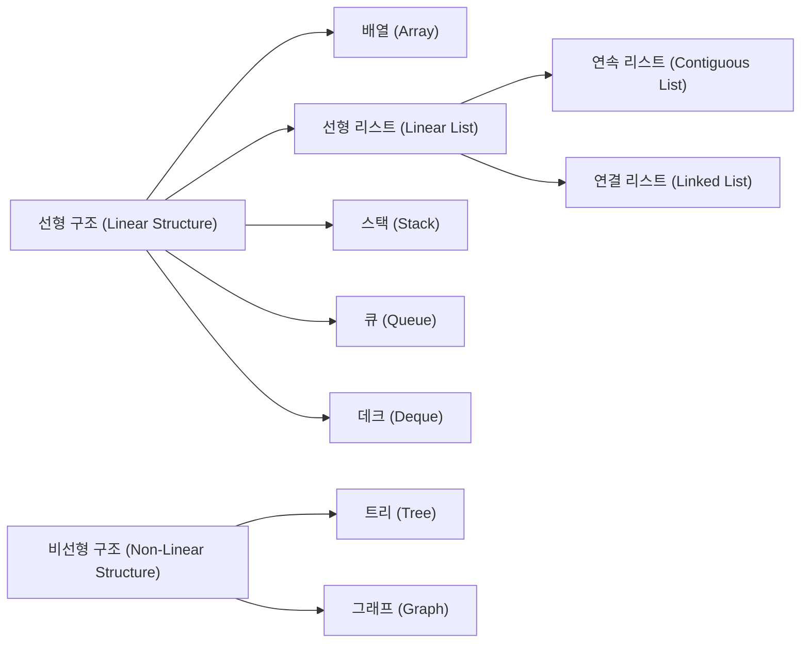
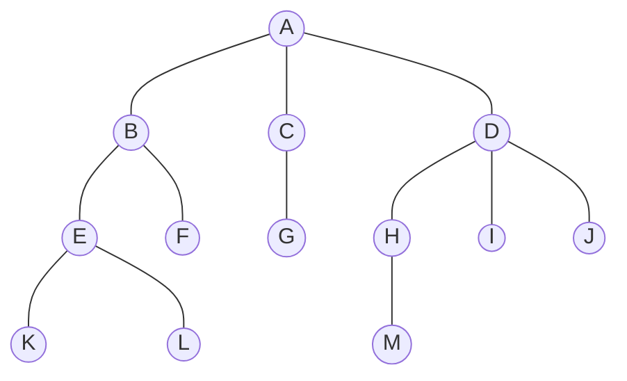
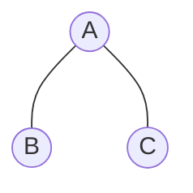
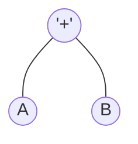

##  소프트웨어 개발
### 1. 자료 구조의 분류
<div style={{marginLeft:'2.5rem'}}>

</div>

### 2. 선형 리스트(Linear List)
<div style={{marginLeft:'2.5rem',fontWeight:'bold', marginBottom:'1rem'}}>Contiguous Lis - 연속 리스트</div>
<div style={{marginLeft:'2.5rem'}}>
```bash
▣ 배열과 같이 연속되는 기억장소에 저장되는 자료구조
▣ 기억저장소를 연속적으로 배정, 기억장소 이용효울 밀도가 1로서 가장 좋음
▣ 중간에 데이터를 삽입하기 위해서는 연속된 빈 공간 필요, (삽입, 삭제) 시자료의 이동이 필요
```
</div>
<div style={{marginLeft:'2.5rem',fontWeight:'bold', marginBottom:'1rem'}}>Linked List - 연결 리스트</div>
<div style={{marginLeft:'2.5rem'}}>
```bash
▣ 각각의 데이터(노드)가 다음 데이터의 위치를 기억하면서 연결되는 방식
▣ 각각의 데이터(노드)는 포인터로 연결
```
</div>
<div style={{marginLeft:'2.5rem'}}>
```bash
▣ 단일 연결 리스트 : 데이터(노드)가 한 방향으로만 연결
▣ 이중 연결 리스트 : 데이터(노드)가 양방향으로 연결
▣ 원형 연결 리스트 : 마지막 데이터(노드)가 첫 번째 데이터(노드)를 가리켜 원형으로 연결
```
</div>

### 3. 스택(Stack)
<div style={{marginLeft:'2.5rem'}}>
```bash
▣ 쌓아 올린다는 것을 의미, 책을 쌓는 것처럼 차곡차곡 쌓아 올린 행텨의 자료 구조
▣ 가장 나중에 삽입된 자료가 가장 먼저 삭제되는 후입선출 방식의 자료 구조
▣ 모든 기억 공간이 꽉 채워져 있는 상태에서 데이터를 삽입하면 오버플로(Overflow)가 발생
▣ 삭제할 데이터가 없을 때 삭제하면 언더플로(Underflow)가 발생
```
</div>
<div style={{marginLeft:'2.5rem',fontWeight:'bold', marginBottom:'1rem'}}>예제</div>
<div style={{marginLeft:'2.5rem'}}>
```bash
▣ 순서가 A, B, C, D로 정해진 입력 자료를 스택에 입력 하였다가 B, C, D, A 순서로 출력하는 과정을 나열
```
</div>
<div style={{marginLeft:'2.5rem'}}></div>

### 4. 큐(Queue)
<div style={{marginLeft:'2.5rem'}}>
```bash
▣ 줄을 서서 기다리는 것을 의미, 예를 들어 은행에서 먼저 온사람의 업무를 창구에서 처리하는 것과 같다고 볼 수 있다.
▣ 리스트의 한쪽에서는 삽입 작업이, 다른 쪽에서는 삭제 작업이 이루어지도록 구성한 자료 구조
▣ 선입선출 방식의 자료 구조
▣ 시작과 끝을 표시하는 두 개의 포틴터가 존재
```
</div>

### 5. 방향/무방향 그래프의 최대 간선 수
<div style={{marginLeft:'2.5rem'}}>
```bash
▣ n개의 정점으로 구성된 무방향 그래프에서 최대 간선 수는 n-(n-1)/2이고, 방향 그래프에서 최대 간선 수는 n(n-1) 이다
```
</div>
<div style={{marginLeft:'2.5rem',fontWeight:'bold', marginBottom:'1rem'}}>예제</div>
<div style={{marginLeft:'2.5rem'}}>
```bash
▣ 정점이 4개인 경우 무방향 그래프와 방향 그래프의 최대 간선 수는?
```
</div>
<div style={{marginLeft:'2.5rem'}}></div>

### 6. 트리의 개요
<div style={{marginLeft:'2.5rem'}}>
```bash
▣ Node와 Branch을 이용하여 사이클을 이루지 않도록 구성한 그래프의 특수한 형태
```
</div>
<div style={{marginLeft:'2.5rem'}}>

</div>
<div style={{marginLeft:'2.5rem'}}>
```bash
▣ Root Node     : Tree의 맨 위에 있는 노드
▣ Node          : Tree의 기본 요소로서 자료 항목과 다른 항목에 대한 Branch를 합친 것
▣ Degree        : 각 노드에서 뻗어 나온 가지의 수 (차수) 
▣ Terminal Node : 자식이 하나도 없는 노드, Leaf Node(입 노드) 라고도 함
▣ SOn Node      : 어떤 노드의 연결된 다음 레벨의 노드
▣ Parent Node   : 어떤 노드에 연결된 이전 레벨의 노드
▣ Brother Node  : 동일한 부모를 갖는 노드
▣ Tree Degree   : 노드들의 디그리 중에서 가장 많은 수 (노드 A 나 D가 3개의 디그리를 가지므로 앞 트리의 디그리는 3)
```
</div>

### 7. 트리의 운행법
<div style={{marginLeft:'2.5rem'}}>

</div>
<div style={{marginLeft:'2.5rem'}}>
```bash
▣ Preorder  운행 : Root -> Left -> Right 순으로 운행 (A, B, C)
▣ Inorder   운행 : Left -> Root -> Right 순으로 운행 (B, A, C)
▣ Postorder 운행 : Left -> Right -> Root 순으로 운행 (B, C, A)
```
</div>
<div style={{marginLeft:'3.5rem'}}>다음 트리를 Inorder, Preorder, Postorder 방법으로 은행 했을 때 각 노드를 방문한 순서는?</div>
<div style={{marginLeft:'3.5rem'}}>

</div>

### 8. 수식의 표기법
<div style={{marginLeft:'2.5rem'}}>

</div>
<div style={{marginLeft:'2.5rem'}}>
```bash
▣ PreFix(전위 표기법)  : 연산자 -> Left -> Right, +AB
▣ InFix(중위 표기법)   : Left -> 연산자 -> Right, A + B
▣ PostFix(후위 표기법) : Left -> Right -> 연산자 , AB+
```
</div>
<div style={{marginLeft:'3.5rem'}}>다음과 같이 InFix로 표기된 수식을 PreFix와 PostFix로 변환</div>
<div style={{marginLeft:'3.5rem'}}>
```bash
X = A / B * (C + D) + E
```
</div>
<div style={{marginLeft:'3.5rem'}}>InFix -> PreFix</div>
<div style={{marginLeft:'3.5rem'}}>
```bash
▣ 연산 우선순위에 따라 괄호로 묶는다.
▣ 연산자를 해당 괄호의 맨앞 왼쪽으로 이동
▣ 필요 없는 괄호를 제거
```
</div>

<div style={{marginLeft:'3.5rem'}}>InFix -> Postfix로</div>
<div style={{marginLeft:'3.5rem'}}>
```bash
▣ 연산 우선순위에 따라 괄호로 묶는다.
▣ 연산자를 해당 괄호의 맨뒤 오른쪽 이동
▣ 필요 없는 괄호를 제거
```
</div>
<div style={{marginLeft:'3.5rem'}}>Postfix나 Prefix로 표기된 수식을 Infix로 바꾸기</div>
<div style={{marginLeft:'3.5rem'}}>
```bash
A B C - / D E F + * +
```
</div>
<div style={{marginLeft:'3.5rem'}}>Postfix -> InFix </div>
<div style={{marginLeft:'3.5rem'}}>
```bash
▣ 먼저 인접한 피연산자 두 개와 오른쪽의 연산자를 괄호로 묶는다
▣ 연산자를 해당 피연산자의 가운데로 이동
▣ 필요 없는 괄호를 제거
```
</div>

<div style={{marginLeft:'3.5rem'}}>Postfix나 Prefix로 표기된 수식을 Infix로 바꾸기</div>
<div style={{marginLeft:'3.5rem'}}>
```bash
+ / A - B C * D + E F
```
</div>
<div style={{marginLeft:'3.5rem'}}>Prefix -> InFix </div>
<div style={{marginLeft:'3.5rem'}}>
```bash
▣ 먼저 인접한 피연산자 두 개와 왼쪽의 연산자를 괄호로 묶는다
▣ 연산자를 해당 피연산자 사이로 이동시킨다
▣ 필요 없는 괄호를 제거
```
</div>

### 9. 삽입 정렬(Insertion Sort)
<div style={{marginLeft:'2.5rem'}}>
```bash
▣ [8, 5, 6, 2, 4] 삽입 정렬
▣ 1회전 : 두 번째 값을 첫 번째 값과 비교하여 5를 첫번 째 자리에 삽입하고, 8을 한칸 뒤로 이동
▣ 2회전 : 세 번째 값을 첫 번째, 두 번째 값과 비교하여 6을 8자리에 삽입하고 8을 한 칸 뒤로 이동
▣ 3회전 : 네 번째 값 2를 처음부터 비교하여 맨 처음에 삽입하고 나머지를 한 칸씩 뒤로 이동
▣ 4회전 : 다섯 번째 값 4를 처음부터 비교하여 5자리에 삽입하고 나머지를 한 칸씩 뒤로 이동
```
</div>

### 10. 선택 정렬(Selection Sort)
<div style={{marginLeft:'2.5rem'}}>
```bash
▣ [8, 5, 6, 2, 4] 선택 정렬
▣ 1회전 : 배열에서 최소값을 찾아 첫 번째 자리로 이동
▣ 2회전 : 매 회전마다 "현재 범위에서 가장 작은 값"을 찾아 왼쪽으로 이동
```
</div>

### 11. 버블 정렬(Bubble Sort)
<div style={{marginLeft:'2.5rem'}}>
```bash
▣ [8, 5, 6, 2, 4] 버블 정렬
▣ 서로 인접한 두개의 요서를 비교하면서 큰 값을 오른쪽으로 이동
```
</div>

### 12. 퀵 정렬(Quick Sort)
<div style={{marginLeft:'2.5rem'}}>
```bash
▣ [8, 5, 6, 2, 4] 버블 정렬
▣ 서로 인접한 두개의 요서를 비교하면서 큰 값을 오른쪽으로 이동
```
</div>