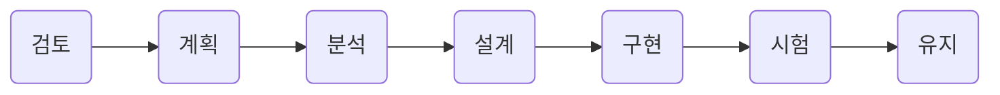
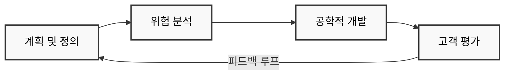

##  소프트웨어 설계
### 1. 소프트웨어 생명주기
<div style={{marginLeft:'2.5rem'}}>
```bash
시스템 엔지니어링, 정보 시스템 , 또는 소프트웨어 공학에서 정보 시스템을 계획, 개발, 시험, 채용하는 
과정을 뜻하는 용어이다. 하드웨어부터 소프트웨어까지 넓은 범위에서 적용할 수 있으며, 
요구사항 분석 -> 설계 -> 개발 -> 테스트 -> 운영 단계로 구성 되어 있다.
```
</div>

### 2. 소프트웨어 공학
<div style={{marginLeft:'2.5rem'}}>
```bash
소프트웨어의 위기를 극복하기 위한 방안으로 연구된 학문이며, 여러가지 방법론과 도구, 관리 기법들을 
통하여 소프트웨어의 품질과 생산성 향상을 목적으로 한다.
```
<div style={{fontWeight:'bold'}}>소프트웨어 공학의 기본 원칙</div>
```bash
▣ 현대적인 프로그래밍 기술을 지속적으로 적용해야 한다는 원칙
▣ 개발된 소프트웨어의 품질이 유지되도록 지속적으로 검증해야 한다는 원칙
▣ 소프트웨어 개발 관련 사항 및 결과에 대한 명확한 기록을 유지해야 한다는 원칙
```
</div>

### 3. 폭포수 모형
<div style={{marginLeft:'2.5rem'}}>
```bash
순차적인 소프트웨어 개발 프로세스로, 개발의 흐름이 마치 폭포수처럼 지속적으로 아래로 향하는 것처럼 보이는
데서 이름이 붙여졌다.
소프트웨어 요구사항 분석 단계에서 시작하여, 설계, 구현, 시험, 통합 단계 등을 거쳐 소프트웨어 유지보스
단계에까지 이른다.
```
</div>
<div style={{marginLeft:'2.5rem'}}>
<svg xmlns="http://www.w3.org/2000/svg" viewBox="0 0 850 650">
  <!-- Requirements -->
  <g>
    <rect x="20" y="50" width="200" height="100" fill="#ff9999" stroke="#000000" stroke-width="2" />
    <text x="40" y="110" font-family="Arial" font-size="25" font-weight="bold">Requirements</text>
    <text x="310" y="110" font-family="Arial" font-size="24" fill="#ff0000" font-style="italic">Product requirements document</text>
  </g>
  
  <!-- Arrow from Requirements to Design -->
  <path d="M140,150 Q 140,180 180,180" stroke="#000000" stroke-width="2" fill="none" />
  
  <!-- Design -->
  <g>
    <rect x="180" y="180" width="200" height="100" fill="#99ccff" stroke="#000000" stroke-width="2" />
    <text x="200" y="240" font-family="Arial" font-size="25" font-weight="bold">Design</text>
    <text x="470" y="240" font-family="Arial" font-size="24" fill="#0066ff" font-style="italic">Software architecture</text>
  </g>
  
  <!-- Arrow from Design to Implementation -->
  <path d="M300,280 Q 300,310 340,310" stroke="#000000" stroke-width="2" fill="none" />
  
  <!-- Implementation -->
  <g>
    <rect x="340" y="310" width="250" height="100" fill="#99ff99" stroke="#000000" stroke-width="2" />
    <text x="355" y="370" font-family="Arial" font-size="25" font-weight="bold">Implementation</text>
    <text x="630" y="370" font-family="Arial" font-size="24" fill="#00cc00" font-style="italic">Software</text>
  </g>
  
  <!-- Arrow from Implementation to Verification -->
  <path d="M460,410 Q 460,440 500,440" stroke="#000000" stroke-width="2" fill="none" />
  
  <!-- Verification -->
  <g>
    <rect x="500" y="440" width="250" height="100" fill="#ffff99" stroke="#000000" stroke-width="2" />
    <text x="530" y="500" font-family="Arial" font-size="25" font-weight="bold">Verification</text>
  </g>
  
  <!-- Arrow from Verification to Maintenance -->
  <path d="M620,540 Q 620,570 660,570" stroke="#000000" stroke-width="2" fill="none" />
  
  <!-- Maintenance -->
  <g>
    <rect x="660" y="570" width="250" height="100" fill="#ffcc99" stroke="#000000" stroke-width="2" />
    <text x="680" y="630" font-family="Arial" font-size="25" font-weight="bold">Maintenance</text>
  </g>
  
  <!-- Download icon -->
  <rect x="870" y="630" width="40" height="40" fill="#cccccc" stroke="#999999" />
  <path d="M880,640 L900,660 L920,640 M900,640 L900,670 M880,675 L920,675" stroke="#666666" stroke-width="2" fill="none" />
</svg>
</div>

<div style={{marginLeft:'2.5rem'}}>
```bash
▣ 소프트웨어 공학에서 가장 오래되고 가장 폭넓게 사용된 전통적인 소프트웨어 생명쥐기 모형
▣ 각 단계별 개발과정을 모두 완료 후 다음 단계로 넘어가는 선형 순차적 모형
▣ 다음 단계를 수행하기 위한 결과물이 명확하게 산출
```
</div>
<div style={{marginLeft:'2.5rem'}}>

</div>

### 4. 나선형 모형
<div style={{marginLeft:'2.5rem'}}>
```bash
보헴이 제안한 것으로, 폭포수 모형과 프로토타입 모형의 장점에 위험분석 기능을 추가한 모형
시스템 개발 위험을 최소화하기 위해 나선으로 돌면서 계획, 위험분석, 개발, 평가의 단계를 
반복하면서 점진적으로 소프트웨어를 완성하는 모형
```
</div>
<div style={{marginLeft:'2.5rem'}}>
```bash
▣ 위험 최소화   : 위험식별 및 대응계획 수립을 통한 위험 최소화
▣ 점진적 구체화 : 반복, 진화적, 프로토타입 개선으로 시스템 구체화
▣ 고수준 품질   : 고객평가에 따른 진화적 라이프 사이클
```
</div>

<div style={{marginLeft:'2.5rem'}}>

</div>

### 5. 애자일 모형
<div style={{marginLeft:'2.5rem'}}>
```bash
애자일 개발 방법은 반복적인 개발을 통한 찾은 출시를 목표로 하며, 실행 가능한 프로토타입을 만들어 
사용자에게 확인 받고, 좀더 빠른 시간 안에 일부이지만 소프트웨어를 사용할 수 있게 하는 것을 중요
하게 여긴다
```
</div>
<div style={{marginLeft:'2.5rem'}}>
```bash
▣ 프로세스와 도구보다는 개인과 상호작용에 더 가치를 둔다
▣ 방대한 문서보다는 실행되는 SW에 더 가치를 둔다.
▣ 계약 협상보다는 고객과 협업에 더 가치를 둔다
▣ 계획을 따르기 보다는 변화에 반응하는 것에 더 가치를 둔다
```
</div>

### 6. 스크럼의 개요
<div style={{marginLeft:'2.5rem'}}>
```bash
프로젝트 관리를 위한 상호, 점진적 개발방법론이며, 애자일 소프트웨어 개발 중의 하나이다.
소프트웨어 개발 프로젝트를 위하여 고안되었지만, 소프트웨어 유지보수 팀이나, 일반적인 프로젝트/프로그램
관리에서도 적용될 수 있다.
```
</div>
<div style={{marginLeft:'2.5rem'}}>
```bash
▣ 확약 : 약속한 것을 확실히 실현하는 것
▣ 전념 : 확약한 것의 실현에 전념하는 것
▣ 정직 : 어떤 것이 자신에게 불리해도 심기지 않는 것 
▣ 존중 : 자신과 다른 사람에게 경의를 표하는 것
▣ 용기 : 자팀 구성원 은 자신이 옳은 일을 할 수 있도록 팀원간 갈등과 도전을 통해 작업할 수 있는 용기
```
</div>

### 7. 스크럼 진행 방식
<div style={{marginLeft:'2.5rem'}}>
```bash
30일간의 주기로 실제 동작하는 제품을 만들면서 개발을 진행하지만, 스크럼 적응도 및 진행 상황에 따라
1주 ~ 4주주의 유연성을 가진다
```
</div>
<div style={{marginLeft:'2.5rem'}}>
```bash
▣ 제품 백로그(Product Backlog) :                개발할 제품에 대한 요구 사항 목록
▣ 스프린트(Sprint) :                            반복적인 개발 주기
▣ 스프린트 계획 회의(Sprint Planning Meeting) : 스프린트 목표와 스프린트 백로그를 계획하는 회의
▣ 스프린트 백로그(Sprint Backlog) :             각각의 스프린트 목표에 도달하기 위해 필요한 작업 목록
▣ 일일 스크럼 회의(Daily Scrum Meeting) :       마다 진행되는 미팅 (어제 한일, 오늘 할일, 장애 현상 등을 공유)
▣ 실행 가능한 제품(shippable product) 개발 :    스프린트의 결과로써 나오는 실행 가능한 제품

```
</div>


