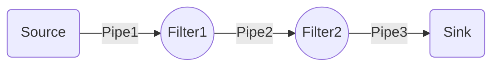

##  소프트웨어 설계
### 1. 소프트웨어 생명주기
<div style={{marginLeft:'2.5rem'}}>
```bash
시스템 엔지니어링, 정보 시스템 , 또는 소프트웨어 공학에서 정보 시스템을 계획, 개발, 시험, 채용하는 
과정을 뜻하는 용어이다. 하드웨어부터 소프트웨어까지 넓은 범위에서 적용할 수 있으며, 
요구사항 분석 -> 설계 -> 개발 -> 테스트 -> 운영 단계로 구성 되어 있다.
```
</div>

### 2. 소프트웨어 공학
<div style={{marginLeft:'2.5rem'}}>
```bash
소프트웨어의 위기를 극복하기 위한 방안으로 연구된 학문이며, 여러가지 방법론과 도구, 관리 기법들을 
통하여 소프트웨어의 품질과 생산성 향상을 목적으로 한다.
```
<div style={{fontWeight:'bold'}}>소프트웨어 공학의 기본 원칙</div>
```bash
▣ 현대적인 프로그래밍 기술을 지속적으로 적용해야 한다는 원칙
▣ 개발된 소프트웨어의 품질이 유지되도록 지속적으로 검증해야 한다는 원칙
▣ 소프트웨어 개발 관련 사항 및 결과에 대한 명확한 기록을 유지해야 한다는 원칙
```
</div>

### 3. 폭포수 모형
<div style={{marginLeft:'2.5rem'}}>
```bash
순차적인 소프트웨어 개발 프로세스로, 개발의 흐름이 마치 폭포수처럼 지속적으로 아래로 향하는 것처럼 보이는
데서 이름이 붙여졌다.
소프트웨어 요구사항 분석 단계에서 시작하여, 설계, 구현, 시험, 통합 단계 등을 거쳐 소프트웨어 유지보스
단계에까지 이른다.
```
</div>
<div style={{marginLeft:'2.5rem'}}>
<svg xmlns="http://www.w3.org/2000/svg" viewBox="0 0 850 650">
  <!-- Requirements -->
  <g>
    <rect x="20" y="50" width="200" height="100" fill="#ff9999" stroke="#000000" stroke-width="2" />
    <text x="40" y="110" font-family="Arial" font-size="25" font-weight="bold">Requirements</text>
    <text x="310" y="110" font-family="Arial" font-size="24" fill="#ff0000" font-style="italic">Product requirements document</text>
  </g>
  
  <!-- Arrow from Requirements to Design -->
  <path d="M140,150 Q 140,180 180,180" stroke="#000000" stroke-width="2" fill="none" />
  
  <!-- Design -->
  <g>
    <rect x="180" y="180" width="200" height="100" fill="#99ccff" stroke="#000000" stroke-width="2" />
    <text x="200" y="240" font-family="Arial" font-size="25" font-weight="bold">Design</text>
    <text x="470" y="240" font-family="Arial" font-size="24" fill="#0066ff" font-style="italic">Software architecture</text>
  </g>
  
  <!-- Arrow from Design to Implementation -->
  <path d="M300,280 Q 300,310 340,310" stroke="#000000" stroke-width="2" fill="none" />
  
  <!-- Implementation -->
  <g>
    <rect x="340" y="310" width="250" height="100" fill="#99ff99" stroke="#000000" stroke-width="2" />
    <text x="355" y="370" font-family="Arial" font-size="25" font-weight="bold">Implementation</text>
    <text x="630" y="370" font-family="Arial" font-size="24" fill="#00cc00" font-style="italic">Software</text>
  </g>
  
  <!-- Arrow from Implementation to Verification -->
  <path d="M460,410 Q 460,440 500,440" stroke="#000000" stroke-width="2" fill="none" />
  
  <!-- Verification -->
  <g>
    <rect x="500" y="440" width="250" height="100" fill="#ffff99" stroke="#000000" stroke-width="2" />
    <text x="530" y="500" font-family="Arial" font-size="25" font-weight="bold">Verification</text>
  </g>
  
  <!-- Arrow from Verification to Maintenance -->
  <path d="M620,540 Q 620,570 660,570" stroke="#000000" stroke-width="2" fill="none" />
  
  <!-- Maintenance -->
  <g>
    <rect x="660" y="570" width="250" height="100" fill="#ffcc99" stroke="#000000" stroke-width="2" />
    <text x="680" y="630" font-family="Arial" font-size="25" font-weight="bold">Maintenance</text>
  </g>
  
  <!-- Download icon -->
  <rect x="870" y="630" width="40" height="40" fill="#cccccc" stroke="#999999" />
  <path d="M880,640 L900,660 L920,640 M900,640 L900,670 M880,675 L920,675" stroke="#666666" stroke-width="2" fill="none" />
</svg>
</div>

<div style={{marginLeft:'2.5rem'}}>
```bash
▣ 소프트웨어 공학에서 가장 오래되고 가장 폭넓게 사용된 전통적인 소프트웨어 생명쥐기 모형
▣ 각 단계별 개발과정을 모두 완료 후 다음 단계로 넘어가는 선형 순차적 모형
▣ 다음 단계를 수행하기 위한 결과물이 명확하게 산출
```
</div>
<div style={{marginLeft:'2.5rem'}}>

</div>

### 4. 나선형 모형
<div style={{marginLeft:'2.5rem'}}>
```bash
보헴이 제안한 것으로, 폭포수 모형과 프로토타입 모형의 장점에 위험분석 기능을 추가한 모형
시스템 개발 위험을 최소화하기 위해 나선으로 돌면서 계획, 위험분석, 개발, 평가의 단계를 
반복하면서 점진적으로 소프트웨어를 완성하는 모형
```
</div>
<div style={{marginLeft:'2.5rem'}}>
```bash
▣ 위험 최소화   : 위험식별 및 대응계획 수립을 통한 위험 최소화
▣ 점진적 구체화 : 반복, 진화적, 프로토타입 개선으로 시스템 구체화
▣ 고수준 품질   : 고객평가에 따른 진화적 라이프 사이클
```
</div>

<div style={{marginLeft:'2.5rem'}}>

</div>

### 5. 애자일 모형
<div style={{marginLeft:'2.5rem'}}>
```bash
애자일 개발 방법은 반복적인 개발을 통한 찾은 출시를 목표로 하며, 실행 가능한 프로토타입을 만들어 
사용자에게 확인 받고, 좀더 빠른 시간 안에 일부이지만 소프트웨어를 사용할 수 있게 하는 것을 중요
하게 여긴다
```
</div>
<div style={{marginLeft:'2.5rem'}}>
```bash
▣ 프로세스와 도구보다는 개인과 상호작용에 더 가치를 둔다
▣ 방대한 문서보다는 실행되는 SW에 더 가치를 둔다.
▣ 계약 협상보다는 고객과 협업에 더 가치를 둔다
▣ 계획을 따르기 보다는 변화에 반응하는 것에 더 가치를 둔다
```
</div>

### 6. 스크럼의 개요
<div style={{marginLeft:'2.5rem'}}>
```bash
프로젝트 관리를 위한 상호, 점진적 개발방법론이며, 애자일 소프트웨어 개발 중의 하나이다.
소프트웨어 개발 프로젝트를 위하여 고안되었지만, 소프트웨어 유지보수 팀이나, 일반적인 프로젝트/프로그램
관리에서도 적용될 수 있다.
```
</div>
<div style={{marginLeft:'2.5rem'}}>
```bash
▣ 확약 : 약속한 것을 확실히 실현하는 것
▣ 전념 : 확약한 것의 실현에 전념하는 것
▣ 정직 : 어떤 것이 자신에게 불리해도 심기지 않는 것 
▣ 존중 : 자신과 다른 사람에게 경의를 표하는 것
▣ 용기 : 자팀 구성원 은 자신이 옳은 일을 할 수 있도록 팀원간 갈등과 도전을 통해 작업할 수 있는 용기
```
</div>

### 7. 스크럼 진행 방식
<div style={{marginLeft:'2.5rem'}}>
```bash
30일간의 주기로 실제 동작하는 제품을 만들면서 개발을 진행하지만, 스크럼 적응도 및 진행 상황에 따라
1주 ~ 4주주의 유연성을 가진다
```
</div>
<div style={{marginLeft:'2.5rem'}}>
```bash
▣ 제품 백로그(Product Backlog) :                개발할 제품에 대한 요구 사항 목록
▣ 스프린트(Sprint) :                            반복적인 개발 주기
▣ 스프린트 계획 회의(Sprint Planning Meeting) : 스프린트 목표와 스프린트 백로그를 계획하는 회의
▣ 스프린트 백로그(Sprint Backlog) :             각각의 스프린트 목표에 도달하기 위해 필요한 작업 목록
▣ 일일 스크럼 회의(Daily Scrum Meeting) :       마다 진행되는 미팅 (어제 한일, 오늘 할일, 장애 현상 등을 공유)
▣ 실행 가능한 제품(shippable product) 개발 :    스프린트의 결과로써 나오는 실행 가능한 제품
```
</div>

### 8. XP(eXtreme Programming)
<div style={{marginLeft:'2.5rem'}}>
```bash
수시로 발생하는 고객의 요구사항에 유연하게 대응하기 위해 고객의 참여와 개발 과정의 반복을 극대화하여
개발 생산성을 향상하는 방법
```
</div>
<div style={{marginLeft:'2.5rem'}}>
```bash
▣ 짧고 반복적인 개발주기, 단순한 설계 고객의 적극적인 참여를 통해 소프트웨어를 빠르게 개발하는 것을 목적
▣ 릴리즈의 기간을 짧게 반복하면서 고객의 요구사항 반영에 대한 가시성을 높음
▣ 릴리즈 테스트마다 고객을 직접 참여시켜 요구한 기능이 제대로 구현되는지 고객이 직접 확인 가능
▣ 소규모 인원의 개발 프로젝트에 효과적
```
</div>
<div style={{marginLeft:'2.5rem'}}>
```bash
▣ 사용자 스토리    : 고객의 요구사항을 간단한 시나리오로 표현
▣ 릴리즈 계획 수립 : 몇 개의 스토리가 적용되어 부분적으로 기능이 완료된 제품을 제공하는 것
▣ 스파이크        : 요구사항의 신뢰성을 높이고 기술 문제에 대한 위험을 감소시키기 위해 별도로 만드는 간단한 프로그램
▣ 이터레이션      : 하나의 릴리즈를 더 세분화  한 단위
▣ 승인 검사       : 하나의 이터레이션 안에서 계획된 릴리즈 단위의 부분 완료된 제품이 구현되면 수행하는 테스트
▣ 소규모 릴리즈   : 고객의 반응을 기능별로 확인, 고객의 요구사항에 좀더 유연하게 대응 
```
</div>
<div style={{fontWeight:'bold',marginLeft:'2.5rem'}}>XP의 주요 실천 방법</div>
<div style={{marginLeft:'2.5rem'}}>
```bash
▣ Pair Programming        : 개발에 대한 책을을 공동으로 갖는 환경을 조성
▣ Collective Ownership    : 개발 코드에 대한 권한과 책임을 공동으로 소유
▣ Test-Driven Development : 테스트 케이스를 작성 개발 목표를 정확히 파악
▣ Whole Team              : 개발에 참여하는 모든 구성원들은 각자의 역할에 대한 책임
▣ Continuous Integration  : 모듈 단위로 개발이 개발이 완료될 때마다 지속적인 통합
▣ Design Improvement      : 프로그램의 기능 변경 없이 시스템을 재구성
▣ Small Releases          : 릴리즈 기간을 짧게 반복
```
</div>

### 9. 요구사항 정의
<div style={{marginLeft:'2.5rem'}}>
```bash
IT 프로젝트의 성공을 좌우하는 중요한 문서로서, 프로젝트의 목표, 기능, 제약사항 등을 명확하게 정의하여 프로젝트의 전체적인
방향을 제시, 다양한 부서의 사람들과의 협업에서 의사소통을 원활하게 할 수 있다
```
</div>
<div style={{fontWeight:'bold',marginLeft:'2.5rem'}}>기능 요구사항</div>
<div style={{marginLeft:'2.5rem'}}>
```bash
▣ 기능      : 사용자 로그인, 데이터 검색, 주문 처리 등
▣ 자료      : 입력, 출력 및 데이터의 보관 주기 등
▣ 입출력    : 데이터의 특정한 형태, 다른 시스템에서 유입, 배출 등
▣ 사용자    : 쇼피이몰 고객, 운영자, 개발자 등
```
</div>
<div style={{fontWeight:'bold',marginLeft:'2.5rem'}}>비 기능 요구사항</div>
<div style={{marginLeft:'2.5rem'}}>
```bash
▣ 성능   : 시스템에 의하여 처리되는 자료의 크기
▣ 품질   : 신뢰성, 가용성, 유지보수성 등
▣ 보안   : 사용자들 사이에 타인의 데이터 또는 프로그램 접근 방비 방법, 비밀번호 보관 등
▣ 사용성 : 사용자 인터페이스 방법, 메뉴의 언어 등
```
</div>

### 10. 요구사항 개발 프로세스
<div style={{marginLeft:'2.5rem'}}>
```bash
개발 프로세스 대상에 대한 요구사항을 체계적으로 도출하고 이를 분석한 후 분석 
결과를 명세화 한후 이를 확인 및 검증하는 일련의 구조화된 활동
```
</div>
<div style={{marginLeft:'2.0rem'}}>

</div>
<div style={{marginLeft:'2.5rem'}}>
```bash
▣ 도출      : 청취와 인터뷰 등을 통해 시스템 개발에 관련된 사람들이 서로 의견을 교환하는 과정
▣ 분석      : 개발 다생에 대한 요구사항 중 명확하지 않거나 모호한 부분들을 걸러내는 과정
▣ 명세      : 요구사항을 바탕으로 모델 작성 및 문서화
▣ 확인      : 명세가 정확하고 완전하게 작성되었는지 검토
```
</div>

### 11. 자료 흐름도(DFD)
<div style={{marginLeft:'2.5rem'}}>
```bash
요구수항 분석에서 자료의 흐름 및 변환 과정과 기능을 도형 중심으로 기술하는 방법으로,
자료 흐름 그래프, 버블 차트라고도 함
```
</div>

<div style={{marginLeft:'2.5rem'}}>
```bash
▣ Process         : 자료를 변환시키는 시스템의 한 부분을 나타내며, 원이나 둥근 사각형으로 표시 그 안에 프로세스명을 기입
▣ Data Flow       : 자료의 이동(흐름)이나 연관관계를 나타내며, 화살표 위에 자료의 이름을 기입
▣ Data Store      : 시스템에서의 자료 저장소를 나타내며, 도형 안에 자료 저장소 이름을 기입
▣ Terminator      : 시스템과 교신하는 외부 객체로, 입력 데이터가 만들어지고 출력 데이터를 받음, 도형안에 이름을 기입
```
</div>

### 12. 자료 사전(DD)
<div style={{marginLeft:'2.5rem'}}>
```bash
자료 흐름도에 있는 자료를 더 자세히 정의하고 기술하고, 자료의 흐름, 자료 저장소와 그것들의 관계를 명시
```
</div>

<div style={{marginLeft:'2.5rem'}}>
```bash
▣ =       : 자료의 정의 ~ 로 구성되어 있다.
▣ +       : 자료의 연결  
▣ {}      : 자료의 반복
▣ []      : 자료의 선택
▣ ()      : 자료의 생략
▣ **      : 자료의 설명 주석
```
</div>

### 13. HIPO
<div style={{marginLeft:'2.5rem'}}>
```bash
시스템의 분석및 설계나 문서화할 때 사용되는 기법으로, 시스템 실행 과정인 입력, 처리, 출력의 기능을 나타낸다.
```
</div>
<div style={{marginLeft:'2.5rem'}}>
```bash
▣ 입력, 처리, 출력으로 구성되며, 하향식 개발을 위한 문서화 도구
▣ 체계적인 문서관리가 가능 
▣ 기호, 도표 등을 사용 보기 쉽고 이해도 쉽다.
▣ 기능과 자료의 의존 관계를 동시에 표현
▣ 변경 유지보수가 용이
▣ 시스템의 기능을 여러개의 고유 모듈로 분활 이들간의 인터페이스를 계층 구조로 표현한것을 HIPO Chart 라고 함
```
</div>

### 14. 다이어그램(Diagram)
<div style={{marginLeft:'2.5rem'}}>
```bash
사물과 관계를 도형으로 표현한 것
```
</div>
<div style={{marginLeft:'2.5rem'}}>
```bash
▣ 시스템을 가시화한 뷰를 제공, 원활한 의사소통 가능
▣ 정적 모델링에서는 고저적 다이어그램, 동적 모델링에서는 행위 다이어그램 사용
```
</div>
<div style={{fontWeight:'bold',marginLeft:'2.5rem'}}>구조적 다이어그램 종류</div>
<div style={{marginLeft:'2.5rem'}}>
```bash
▣ Class Diagram               : 클래스와 클래스가 가지는 속성, 클래스 사이의 관계를 표현
▣ Object Diagram              : 클래스에 속한 사물(객체)들, 즉 인스턴스를, 특정 시점의 객체 사이의 관계를 표현
▣ Component Diagram           : 컴포넌트 관계나 컴포넌트 간의 인터페이스를 표현
▣ Deployment Diagram          : 결과물, 프로세스, 컴포넌트 등 물리적 요소들의 위치를 표현
▣ Composite Structure Diagram : 클래스나 컴포넌트가 복합 구조를 갖는 경우 그 내부 구조를 표현
▣ Package Diagram             : 유스케이스나 클래스 등의 모델 요소들을 그룹화한 패키지들의 관계를 표현
```
</div>
<div style={{fontWeight:'bold',marginLeft:'2.5rem'}}>행위 다이어그램 종류</div>
<div style={{marginLeft:'2.5rem'}}>
```bash
▣ Use Case Diagram             : 사용자의 요구를 분석, 기능 모델링 작업에 사용, 사용자와 사례로 구성
▣ Sequence Diagram             : 상호 작용하는 시스템이나 객체들이 주고받는 메시지를 표현
▣ Communication Diagram        : 동작에 참여하는 객체들의 메시지, 객체들 간의 연관 관계 표현
▣ State Diagram                : 상태 변화 혹은 객체와의 상호 작용에 따라 상태가 어떻게 변화는지 표현 (럼바우 -> 동적 모델링)
▣ Activity Diagram             : 객체의 처리 로직이나 조건에 따른 처리의 흐름을 순서에 따라 표현
▣ Interaction Overview Diagram : 상호작용 다이어그램 간의 제어 흐름을 표현
▣ Timing Diagram               : 객체 상태 변화와 시간 제약을 명시적으로 표현
```
</div>

### 15. 스테리오 타입(Stereotype)
<div style={{marginLeft:'2.5rem'}}>
```bash
UML에서 표현하는 기본 기능 외에 추가적인 기능을 표현하기 위해 사용
```
</div>
<div style={{marginLeft:'2.5rem'}}>
```bash
▣ 길러멧이라고 부르는 결화삽괄호 <<>> 사이에 표현할 현태를 기술
```
</div>
<div style={{fontWeight:'bold',marginLeft:'2.5rem'}}>주요 형태</div>
<div style={{marginLeft:'2.5rem'}}>
```bash
▣ <<include>>     : 연결된 다른 UML 요소에 대해 포함 관계에 있는 경우
▣ <<extend>>      : 연결된 UML 요소에 대해 확장 관계에 있는 경우
▣ <<interface>>   : 인터페이스를 정의하는 경우
▣ <<exception>>   : 예외를 정의하는 경우
▣ <<constructor>> : 생성자 역할을 수행하는 경우
```
</div>


### 16. 상위 설계와 하위 설계    
<div style={{fontWeight:'bold',marginLeft:'2.5rem'}}>상위 설계</div>
<div style={{marginLeft:'2.5rem'}}>
```bash
하위 설계를 위한 도면으로 예비 설계라고도 하며, 시스템의 전체적인 골조(뼈대)를 설계
```
</div>
<div style={{marginLeft:'2.0rem'}}>

</div>
<div style={{marginLeft:'2.5rem'}}>
```bash
▣ Architecture 설계   : 전체 시스템의 구조와 구성 요소간의 상호작용을 정의
▣ Data 설계           : 시스템에서 사용될 데이터의 종류와 구조를 설계
▣ Interface 정의      : 외부 시스템과의 상호작용을 정의
▣ User Interface 설계 : 사용자가 시스템과 상호작용할 때 사용할 인터페이스 설계
```
</div>
<div style={{fontWeight:'bold',marginLeft:'2.5rem'}}>하위 설계</div>
<div style={{marginLeft:'2.5rem'}}>
```bash
하위 설계를 위한 도면으로 예비 설계라고도 하며, 시스템의 전체적인 골조(뼈대)를 설계
```
</div>
<div style={{marginLeft:'2.0rem'}}>

</div>
<div style={{marginLeft:'2.5rem'}}>
```bash
▣ Module 설계         : 상위 설계에서 정의된 구성 요소를 개별 모듈로 분해
▣ Data Structure 설계 : 각 모듈에서 사용될 데이터의 구조와 저장 방식 설계
▣ Algorithm 설계      : 각 모듈에서 수행하는 작업의 알고리즘을 설계
```
</div>


### 17. 소프트웨어 아키텍처 설계의 기본 원리
<div style={{marginLeft:'2.5rem'}}>
```bash
▣ Modularity( 모듈화 )               : 시스템의 기능들을 모듈 단위로 분해
▣ Abstraction( 추상화 )              : 전체적이고 포괄적인 개념을 설계한 후 구체화시켜 나가는 것.
▣ Stepwise Refinement( 단계적 분해 ) : 상위의 중여 개념으로부터 하위의 개념으로 구체화 (하향식 설계)
▣ Information Hiding( 정보 은닉 )    : 다른 객체에 자신의 정보를 은닉 자신의 연산만을 통하여 접근 허용
```
</div>

### 18. 소프트웨어 아키텍처 설계 과정
<div style={{marginLeft:'2.0rem'}}>

</div>
<div style={{marginLeft:'2.5rem'}}>
```bash
▣ 설계목표 설정      : 우선순위 등의 요구사항을 분석하여 전체 시스템의 설계 목표를 설정
▣ 시스템 타입 결정   : 시스템과 서브시스템의 타입 결정하고, 아키택처 패턴을 선택
▣ 아키텍처 패턴 적용 : 시스템의 표준 아키텍처를 설계
▣ 서브시스템 구체화  : 서브시스템과의 상호작용을 위한 동작과 인터페이스를 정의
▣ 검토              : 설계의 기본 원리를 만족하는지 검토
```
</div>

### 19. 파이프-필터 패턴
<div style={{marginLeft:'2.5rem'}}>
```bash
데이터 스트림 절차의 각 단계를 필터 컴포넌트로 캡슐화하여 파이프를 통해 데이터를 전송하는 패턴
```
</div>
<div style={{marginLeft:'2.0rem'}}>

</div>
<div style={{marginLeft:'2.5rem'}}>
```bash
▣ 재사용성이 좋고, 추가가 쉬워 확장이 용이
▣ 필터 컴포넌트들을 재배치하여 다양한 파이프라인을 구축
▣ 데이터 변환, 버퍼링, 동기화 등에 사용
▣ 대표적으로 UNIX의 Shell
```
</div>

### 20. 객체지향 분석의 방법론

<div style={{fontWeight:'bold',marginLeft:'2.5rem'}}>Rumbaugh(럼바우) 방법</div>
<div style={{marginLeft:'2.5rem'}}>
```bash
▣ Object Modeling(객체 모델링)     : 시스템에서 요구하는 객체를 갖고 객체들간의 관계를 정의, 가장 중요하며 선행되어야 함
▣ Dynamic Modeling(동적 모델링)    : 시간의 흐름에 따라 객체들 사이의 제어 흐름, 동작 순서 등의 동적인 행위를 표현
▣ Functional Modeling(기능 모델링) : 자료 흐름도(DFD), 프로세스들의 자료 흐름을 중심으로 처리 과정 표현
```
</div>
<div style={{fontWeight:'bold',marginLeft:'2.5rem'}}>Rumbaugh(럼바우) 분석 절차</div>
<div style={{marginLeft:'2.0rem'}}>

</div>

<div style={{fontWeight:'bold',marginLeft:'2.5rem', marginTop:'1rem'}}>Booch(부치) 방법</div>
<div style={{marginLeft:'2.5rem'}}>
```bash
미시적 개발 프로세스 : 개발자가 코드 단위에서 수행하는 세부적인 작업
거시적 개발 프로세스 : 소프트웨어 개발 전체의 큰 흐름(분석, 설계, 구현, 테스트, 유지보스 등)을 의미
.
미시적 개발 프로세스와 거시적 개발 프로세스를 모두 사용, 클래스와 객체들을 분석 및 식별하고 클래스의 속성과 연산을 정의
```
</div>

<div style={{fontWeight:'bold',marginLeft:'2.5rem', marginTop:'1rem'}}>Jacobson 방법</div>
<div style={{marginLeft:'2.5rem'}}>
```bash
Use Case를 기반으로 시스템을 분석하고 설계하는 방식, 소프트웨어 개발을 구조적으로 진행 가능
Use Case : 사용자의 요구사항을 분석하고 정리, 시스템과 사용자의 상호작용을 기술, Use Case 다이어그램으로 표현
```
</div>


<div style={{fontWeight:'bold',marginLeft:'2.5rem', marginTop:'1rem'}}>Coad와 Yourdon 방법</div>
<div style={{marginLeft:'2.5rem'}}>
```bash
E-R 다이어그램을 사용 객체의 행위를 모델링, 객체 식별, 구조 식별, 주제 정의, 속성과 인스턴스 연결 정의,
연산과 메시지 연결 정의 등의 과정으로 구성하는 기법
```
</div>

<div style={{fontWeight:'bold',marginLeft:'2.5rem', marginTop:'1rem'}}>Wirfs-Brock 방법</div>
<div style={{marginLeft:'2.5rem'}}>
```bash
분석과 설계 간의 구분이 없고, 고객 명세서를 평가 후, 설계 작업까지 연속적으로 수행하는 기법
```
</div>

### 21. 객체지향 설계 원칙
<div style={{fontWeight:'bold',marginLeft:'2.5rem', marginTop:'1rem'}}>단일 책임 원칙 (SRP, Single Responsibility)</div>
<div style={{marginLeft:'2.5rem'}}>
```bash
객체는 단 하나의 책임만 가져야 한다는 원칙
```
</div>
<div style={{fontWeight:'bold',marginLeft:'2.5rem', marginTop:'1rem'}}>개방-폐쇄 원칙(OCP, OpenClosed Principle)</div>
<div style={{marginLeft:'2.5rem'}}>
```bash
기존의 코드를 변경하지 않고 기능을 추가할 수 있도록 설계해야 한다는 원칙
```
</div>
<div style={{fontWeight:'bold',marginLeft:'2.5rem', marginTop:'1rem'}}>리스코프 치환 원칙 (LSP, Liskov Substitution Principle)</div>
<div style={{marginLeft:'2.5rem'}}>
```bash
자식 클래스는 최소한 자신의 부모 클래스에서 가능한 행위는 수행할 수 있어야 한다는 설계 원칙
```
</div>
<div style={{fontWeight:'bold',marginLeft:'2.5rem', marginTop:'1rem'}}>인터페이스 분리 원칙 (ISP, Interface Segregation Principle)</div>
<div style={{marginLeft:'2.5rem'}}>
```bash
자신이 사용하지 않는 인터페이스와 의존 관계를 맺거나 영향을 받지 않아야 한다는
```
</div>
<div style={{fontWeight:'bold',marginLeft:'2.5rem', marginTop:'1rem'}}>의존 역전 원칙 (DIP, Dependency Inversion Principle)</div>
<div style={{marginLeft:'2.5rem'}}>
```bash
각 객체들 간의 의존 관계를 성립될 때 추상성이 낮은 클래스보다 추상성이 높은 클래스와 의존 관계를 맺어야 한다는 원칙
```
</div>

### 21. 결합도
<div style={{marginLeft:'2.5rem'}}>
```bash
모듈 간에 상호 의존하는 정도 또는 두 모듈 사이의 연관 관계를 의미하며, 결합도가 약할수록 품질이높고, 강할수록 품질이 낮다.
```
</div>
<div style={{marginLeft:'2.5rem'}}>
```bash
▣ Data Coupling     : 모듈 간의 인터페이스가 자료 요소로만 구성
▣ Stamp Coupling    : 모듈 간의 인터페이스로 배열이나 레코드 등의 자료 구조가 전달
▣ Control Coupling  : 어떤 모듈이 다른 모듈 내부의 논리적인 흐름을 제어하거나, 제어요소를 전달
▣ External Coupling : 어떤 모듈에서 선언한 변수를 외부의 다른 모듈에서 참조
▣ Common Coupling   : 공유되는 공통 데이터 영역을 여러 모듈이 사용
▣ Content Coupling  : 한 모듈이 다른 모듈의 내부 기능 및 그 내부 자료를 직접 참조하거나 수정
```
</div>

### 22. 응집도
<div style={{marginLeft:'2.5rem'}}>
```bash
모듈의 내부 요소들이 서러 관련되어 있는 정도, 모듈의 독립적인 기능으로 정의되어 있는 정도를 의미하며, 
응집도가 강할수록 품질이 높고 약할수록 품질이 낮다.
```
</div>
<div style={{marginLeft:'2.5rem'}}>
```bash
▣ Functional Cohesion     : 모듈 내부의 모든 기능 요소들이 단일 문제와 연관되어 수행
▣ Sequential Cohesion     : 모듈 내 하나의 활동으로부터 나온 출력 데이터를 그 다음 활동의 입력 되이터로 사용
▣ Communication Cohesion  : 동일한 입력과 출력을 사용하여 서로 다른 기능을 수행하는 구성 요소들의 모임
▣ Procedural Cohesion     : 모둘이 다수의 관련 기능을 가질 때 모듈 안의 구성 요소들이 그 기능을 순차적으로 수행
▣ Temporal Cohesion       : 특정 시간에 처리되는 몇 개의 기능을 모아 하나의 모듈로 작성
▣ Logical Cohesion        : 유사한 성격을 갖거나 특정 형태로 분류되는 처리 요소들로 하나의 모듈로 형성
▣ Coincidental Cohesion   : 모듈 내부의 각 구성 요소들이 서러 관련 없는 요소로만 구성
```
</div>

### 24. N-S 차트(Nassi-Schneiderman Chart)
<div style={{marginLeft:'2.5rem'}}>
```bash
논리적 기술에 중점을 둔 도형을 이용한 표현 방법으로 박스 다이어그램, Chapin Chart 라고도 함
```
</div>
<div style={{marginLeft:'2.5rem'}}>
```bash
▣ 연속, 선택 및 다중 선택, 반복 등의 제어 논리 구조를 표현
▣ GOTO나 화살표를 사용하지 않음
▣ 조건이 복합되어 있는 곳의 처리를 시각적으로 명확히 식별 하는데 적합
▣ 선택과 반복 구조를 시각적으로 표현
▣ 이해가 쉽고, 코드 변환이 용이
▣ 작성이 어려우며, 임의로 제어를 전이하는 것이 불가능
▣ 총체적인 구조 및 인터페이스 표현이 어렵다.
▣ 단일 입구와 단일 출구로 표현
```
</div>

### 25. 공통 모듈의 개요
<div style={{marginLeft:'2.5rem'}}>
```bash
여러 프로그램에서 공통적으로 사용할 수 있는 모듈을 의미, 모듈의 재사용성 확보와 중복 개발 회피를 위해 설계 과정에서
공통 부분을 식별하고 명세화 해야 한다.
```
</div>
<div style={{marginLeft:'2.5rem'}}>
```bash
▣ Correctness(정확성)  : 시스템 구현 시 해당 기능이 필요하다는 것을 알 수 있도록 정확히 작성
▣ Clarity(명확성)      : 해당 기능을 이해할 때 중의적으로 해석되지 않도록 명확히 작성
▣ Completeness(완전성) : 시스템 구현을 위해 필요한 모든 것을 기술
▣ Consistency(일관성)  : 공통 기능들 간 상호 충돌이 발생하지 않도록 작성
▣ Traceability(추적성) : 기능에 대한 요구사항의 출처, 관련 시스템 등의 관계를 파악할 수 있도록 작성
```
</div>


