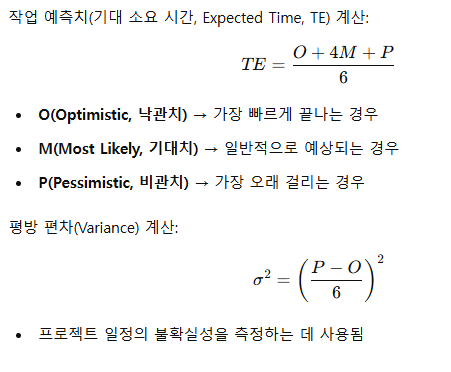
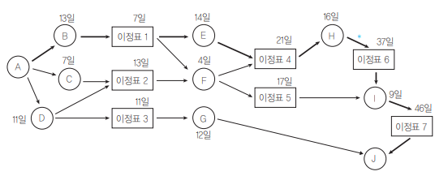
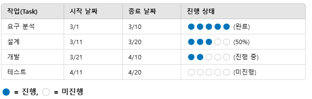
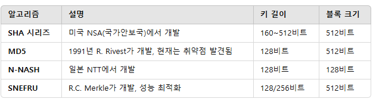

### 1. 구조적 방법론 (Structured Methodology)
<div style={{marginLeft:'2.5rem'}}>
```bash
▣ 방법론은 소프트웨어 개발에서 처리(Process) 중심으로 사용자 요구사항을 분석하고 문서화하는 방법론
▣ 정형화된 절차를 따르며, 모듈화와 계층적 구조를 강조
▣ 분할과 정복(Divide and Conquer) 기법을 적용하여 복잡한 문제를 해결
▣ 쉬운 이해 및 검증이 가능한 프로그램 코드 생성이 목적
```
</div>

<div style={{marginLeft:'3.5rem'}}>주요 기법</div>
<div style={{marginLeft:'3.5rem'}}>
```bash
▣ Data Flow Diagram  : 데이터의 흐름과 처리를 시각적으로 표현하는 자료 흐름도
▣ Structure Chart    : 모듈 간의 계층적 관계를 나타내는 구조 차트
▣ Mini Specification : 프로세스의 상세한 기능을 기슬하는 미시 명세서 
▣ Decision Table     : 복잡한 논리를 표 형태로 표현하는 디시전 테이블
```
</div>

<div style={{marginLeft:'3.5rem'}}>한계</div>
<div style={{marginLeft:'3.5rem'}}>
```bash
▣ 데이터보다는 프로세스 중심이기 때문에 유지보수가 어려움
▣ 객체지향 개발 방법론에 비해 확장성이 낮음
▣ 요구사항 변경에 대한 유연성이 부족 
```
</div>

### 2. 정보공학 방법론 (Information Engineering Methodology, IEM)
<div style={{marginLeft:'2.5rem'}}>
```bash
▣ 데이터 중심(Data-Oriented) 접근 방식으로, 정보 시스템의 개발을 체계적으로 계획, 분석, 설계, 구축하는 방법론
▣ 대규모 정보 시스템 구축에 적합
▣ 정보 시스템의 전체적인 수명 주기(Development Life Cycle, DLC) 활용
▣ 데이터 중심 설계로 재사용성과 일관성을 높임
▣ 정형화된 기법들을 활용하여 체계적인 개발 진행
```
</div>

<div style={{marginLeft:'3.5rem'}}>주요 기법</div>
<div style={{marginLeft:'3.5rem'}}>
```bash
▣ Information Strategy Planning : 기업의 정보 시스템을 장기적으로 계획하는 전략적 기획
▣ Business System Planning      : 기어브이 업무 프로세스를 분석하고 최적화 하는 업무 영역 분석
▣ Data Modeling                 : ERD 등을 활용하여 데이터 구조 설계를 진행하는 데이터 모델링
▣ Process Modeling              : DFD(Data Flow Diagram) 등을 사용하여 데이터의 흐름을 시각화 하는 프로세스 모델링
▣ Application System Design     : 사용자 요구사항을 반영하여 상세 설계를 수행하는 응용 시스템 설계
```
</div>

<div style={{marginLeft:'3.5rem'}}>한계</div>
<div style={{marginLeft:'3.5rem'}}>
```bash
▣ 초기 단계에서 시간과 비용이 많이 소요됨
▣ 유연성이 부족하여 급격한 환경 변화 대응이 어려움
```
</div>

### 3. 컴포넌트 기반 방법론 (Component-Based Development, CBD)
<div style={{marginLeft:'2.5rem'}}>
```bash
▣ 기존의 시스템이나 소프트웨어를 구성하는 독립적인 컴포넌트(Component)를 조합하여 새로운 애플리케이션을 개발하는 방법론
▣ 재사용성 (Reusability) 증가 → 기존 컴포넌트를 활용하여 시간과 비용 절감
▣ 확장성 (Scalability) 보장 → 새로운 기능 추가가 용이
▣ 유지보수 용이 → 독립적인 모듈 단위로 수정 가능
▣ 생산성과 품질 향상 → 코드 재사용 및 표준화
```
</div>

<div style={{marginLeft:'3.5rem'}}>CBD 개발 절차</div>
<div style={{marginLeft:'3.5rem'}}>
```bash
▣ 개발 준비 단계 -> 프로젝트 목표 설정, 요구사항 정의, 기존 컴포넌트 조사
▣ 분석 단계 -> 시스템 요구사항 분석, 컴포넌트 기반 아키텍처 설계
▣ 설계 단계 -> 컴포넌트 설계, 이니터페이스 정의 및 데이터 모델 설계
▣ 구현 단계 -> 컴포넌트 개발 및 조립, 기존 컴포넌트 활용
▣ 테스트 단계 -> 개별 컴포넌트 테스트, 통합 테스트 수행
▣ 전개 단계 -> 시스템 배포 및 최적화
▣ 인도 단계 -> 최종 사용자에게 인도, 유지보수 및 개선
```
</div>

### 4. 소프트웨어 재사용 (Software Reuse) 
<div style={{marginLeft:'2.5rem'}}>
```bash
▣ 이미 개발되어 검증된 소프트웨어의 전체 또는 일부를 다른 소프트웨어 개발이나 유지보수에 활용하는 것을 의미
```
</div>

<div style={{marginLeft:'3.5rem'}}>소프트웨어 재사용의 목적</div>
<div style={{marginLeft:'3.5rem'}}>
```bash
▣ 개발 시간 단축 → 기존 코드를 재사용하여 개발 속도 향상
▣ 비용 절감 → 중복 개발을 방지하여 비용 절감
▣ 품질 향상 → 검증된 코드 활용으로 오류 감소
▣ 생산성 향상 → 개발자가 새로운 기능 개발에 집중 가능
▣ 프로젝트 실패 위험 감소 → 안정적인 코드 재사용으로 리스크 최소화
▣ 지식 및 문서 공유 → 시스템 명세, 설계, 코드 등을 공유하여 협업 강화
```
</div>

<div style={{marginLeft:'3.5rem'}}>소프트웨어 재사용의 유형</div>
<div style={{marginLeft:'3.5rem'}}>
```bash
▣ 코드(Code) 재사용 -> 함수, 클래스, 라이브러리, 모듈 등의 코드 활용
▣ 설계(Design) 재사용 -> 아키텍처 패턴, 설계 패턴, UML 다이어그램 등 재사용
▣ 명세(Specification) 재사용 -> 요구사항 명세, 테스트 케이스, 문서 등의 활용
▣ 프로세스(Process) 재사용 -> 개발 방법론, 애자일 스크럼, DevOps 등의 자새용
```
</div>

<div style={{marginLeft:'3.5rem'}}>소프트웨어 재사용의 적용 방식</div>
<div style={{marginLeft:'3.5rem'}}>
```bash
▣ 라이브러리(Library) 활용 → 공통 기능을 제공하는 패키지 활용 (예: Java의 Spring Framework, Python의 NumPy)
▣ 컴포넌트 기반 개발(CBD) → 독립적인 컴포넌트를 조립하여 새로운 애플리케이션 개발
▣ 프레임워크(Framework) 활용 → 미리 설계된 아키텍처를 기반으로 개발 (예: React, Angular)
▣ 디자인 패턴(Design Pattern) 적용 → 소프트웨어 설계를 재사용 (예: 싱글턴 패턴, 팩토리 패턴)
▣ 코드 생성 도구(Code Generator) 활용 → 반복적인 코드를 자동 생성
```
</div>

### 5. 소프트웨어 재사용 방법
<div style={{marginLeft:'3.5rem'}}>합성 중심 방법 (Composition-Based)</div>
<div style={{marginLeft:'3.5rem'}}>
```bash
▣ 개념 : 전자 칩처럼 소프트웨어를 부품화(모듈화)하여 조립하는 방식, 블록 수성 방법(Block Composition Method)이라고도 함
▣ 특징 : 기존에 개발된 모듈, 라이브러리, 컴포넌트, 프레임워크 등을 조합하여 소프트웨어를 개발
```
</div>
<div style={{marginLeft:'3.5rem'}}>예시</div>
<div style={{marginLeft:'3.5rem'}}>
```bash
▣ 객체지향 프로그래밍(Object-Oriented Programming) → 클래스를 조합하여 프로그램 구성
▣ 컴포넌트 기반 개발(Component-Based Development) → 독립적인 기능을 하는 컴포넌트를 조립하여 시스템 구축
▣ 서비스 지향 아키텍처(Service-Oriented Architecture) → 독립적인 서비스(마이크로서비스)를 조합하여 시스템 구축
▣ 라이브러리 및 프레임워크 활용 → Java의 Spring Framework, React, Vue.js 등
```
</div>

<div style={{marginLeft:'3.5rem'}}>생성 중심 방법 (Generation-Based)</div>
<div style={{marginLeft:'3.5rem'}}>
```bash
▣ 개념 : 추상화된 명세(모델, 패턴,DSL)를 기반으로 코드를 자동 생성하는 방식, 패턴 구성 방법 이라고도 함
▣ 특징 : 코드의 일관성을 유지하고, 개발 속도를 향상할 수 있음, 자동화 도구를 활용하여 소프트웨어를 생성 가능
```
</div>
<div style={{marginLeft:'3.5rem'}}>예시</div>
<div style={{marginLeft:'3.5rem'}}>
```bash
▣ 코드 생성 도구(Code Generator) → 템플릿 기반 코드 생성 (예: JHipster, Yeoman)
▣ 모델 기반 개발(MDD, Model-Driven Development) → UML 모델을 기반으로 소프트웨어 생성
▣ DSL(Domain-Specific Language) 활용 → 특정 도메인에 맞춘 언어를 사용하여 코드 자동 생성
▣ 템플릿 엔진 활용 → Spring Boot의 Thymeleaf, Mustache, Handlebars 등
```
</div>

### 6. 소프트웨어 재공학(Software Reengineering)
<div style={{marginLeft:'2.5rem'}}>
```bash
▣ 기존 소프트웨어를 새로운 요구사항에 맞게 개선하여 성능과 유지보수성을 향상하는 과정
```
</div>
<div style={{marginLeft:'3.5rem'}}>주요 활동</div>
<div style={{marginLeft:'3.5rem'}}>
```bash
▣ 분석(Analysis)              : 기존 소프트웨어를 이해하고 재공학 대상 선정
▣ 재구성(Restructuring)       : 코드 및 구조 개선(기능은 유지)
▣ 역공학(Reverse Engineering) : 기존 소프트웨어에서 설계 정보 추출
▣ 이식(Migration)             : 새로운 운영체제나 하드웨어 환경으로 변환
```
</div>

### 7. CASE(Computer Aided Software Engineering
<div style={{marginLeft:'2.5rem'}}>
```bash
▣ 소프트웨어 개발 과정에서 요구 분석, 설계, 구현, 테스트 및 유지보수를 자동화하는 도구와 기법을 의미
```
</div>
<div style={{marginLeft:'3.5rem'}}>주요 특징</div>
<div style={{marginLeft:'3.5rem'}}>
```bash
▣ 다양한 시스템(객체지향, 구조적 시스템 등)에서 활용되는 자동화 도구 제공
▣ 소프트웨어, 하드웨어, 데이터베이스, 테스트 등을 통합하여 개발 환경 조성
▣ 소프트웨어 생명 주기의 전 과정을 연결하고 자동화하는 기술
▣ 개발 도구 + 방법론 결합, 정형화된 구조 및 기법 적용으로 생산성 향상
▣ 개발 표준화를 지원하여 일관된 개발 방식 유지
```
</div>

<div style={{marginLeft:'3.5rem'}}>주요 기능</div>
<div style={{marginLeft:'3.5rem'}}>
```bash
▣ 소프트웨어 생명 주기의 전 단계 연결
▣ 다양한 소프트웨어 개발 모델 지원
▣ 그래픽 지원을 통한 시스템 설계 및 문서화
```
</div>

### 8. LOC(원시 코드 라인 수, Source Line of Code) 기법
<div style={{marginLeft:'2.5rem'}}>
```bash
▣ 소프트웨어의 개발 비용, 생산성, 노력, 개발 기간 등을 예측하는 방법으로 원시 코드 라인 수를 기반으로 예측치를 구하는 기법
```
</div>

<div style={{marginLeft:'3.5rem'}}>기법 특징</div>
<div style={{marginLeft:'3.5rem'}}>
```bash
▣ 측정 용이성 : 원시 코드 라인 수를 측정하는 것이 간단하고 직관적이므로 가장 많이 사용되는 기법
▣ 예측치 산정 : 기능별 원시 코드 라인 수를 기반으로 비관치, 낙관치, 기대치를 측정하여 예측치를 계산
```
</div>
<div style={{marginLeft:'3.5rem'}}>예측치 계산 공식</div>
<div style={{marginLeft:'3.5rem'}}>
```bash
▣ 예측치 = a + 4m + b
▣ a : 낙관치 (최소 예측치)
▣ b : 비관치 (최대 예측치)
▣ m : 기대치 (중간 예측치)
```
</div>
<div style={{marginLeft:'3.5rem'}}>산정 공식</div>
<div style={{marginLeft:'3.5rem'}}>
```bash
▣ 노력(인월) : 개발 기간 x 투입 인원 = LOC / 1인당 월평균 생산 코드 라인 수
▣ 개발 비용  : 노력(인월) x 단위 비용 (1인당 월평균 인건비)
▣ 개발 기간  : 노력(인월) / 투입 인원
▣ 생산성     : LOC / 노력(인월)
```
</div>

### 9. 수학적 산정 기법의 개요
<div style={{marginLeft:'2.5rem'}}>
```bash
▣ 상향식 비용 산정 기법의 일종으로, 경험적 추정 모형이나 실험적 추정 모형이라고도 불림
▣ 개발 비용 산정의 자동화를 목표로 하며, 과거의 유사한 프로젝트 데이터를 기반으로 
▣ 경험적으로 유도된 수학적 공식을 사용하여 비용을 예측
```
</div>

<div style={{marginLeft:'3.5rem'}}>기법 특징 - 상향식 비용 산정</div>
<div style={{marginLeft:'3.5rem'}}>
```bash
▣ 프로젝트의 각 단위나 세부 사항을 기반으로 전체 비용을 산정하는 방식
▣ 각 모듈이나 기능에 대해 독립적으로 비용을 산정하고 이를 합산하여 전체 비용을 예측
```
</div>
<div style={{marginLeft:'3.5rem'}}>기법 특징 - 경험적 추정</div>
<div style={{marginLeft:'3.5rem'}}>
```bash
▣ 과거 유사한 프로젝트에서 얻은 데이터와 경험을 바탕으로 산정 공식을 도출
```
</div>
<div style={{marginLeft:'3.5rem'}}>기법 특징 - 자동화</div>
<div style={{marginLeft:'3.5rem'}}>
```bash
▣ 비용 산정 프로세스를 자동화하여 일관된 예측을 제공
```
</div>

<div style={{marginLeft:'3.5rem'}}>주요 모형 - COCOMO 모형 (Constructive Cost Model)</div>
<div style={{marginLeft:'3.5rem'}}>
```bash
▣ 소프트웨어 개발에 필요한 비용과 시간을 예측하는 데 사용되는 수학적 모형
▣ 프로젝트의 크기와 복잡도에 따라 비용과 개발 기간을 예측
▣ 기본, 중간, 고급 세 가지 모형이 있으며, 개발의 규모에 따라 비용을 산정
```
</div>

<div style={{marginLeft:'3.5rem'}}>주요 모형 - Putnam 모형</div>
<div style={{marginLeft:'3.5rem'}}>
```bash
▣ 소프트웨어 개발의 기술적 진척도와 시간 분포를 고려하여 비용을 산정하는 방법
▣ 개발의 초기와 후반부에서의 리소스 배분을 고려하며, 소프트웨어 생산성을 예측하는 데 유용
```
</div>

<div style={{marginLeft:'3.5rem'}}>주요 모형 - 기능 점수 (Function Points, FP) 모형</div>
<div style={{marginLeft:'3.5rem'}}>
```bash
▣ 소프트웨어의 기능을 기반으로 비용을 산정하는 기법
▣ 시스템의 기능적인 요소 (예: 입력, 출력, 파일, 인터페이스 등)에 대해 점수를 부여하여 전체 비용을 예측
```
</div>

<div style={{marginLeft:'3.5rem'}}>활용</div>
<div style={{marginLeft:'3.5rem'}}>
```bash
▣ 비용 예측:   각 모형에서 제공하는 수학적 공식을 이용해 프로젝트의 예상 비용과 개발 기간을 예측
▣ 생산성 평가: 실제 소프트웨어 개발에서의 생산성을 계산하고, 이를 바탕으로 미래 프로젝트의 리소스 계획 수립
▣ 위험 관리:   과거 데이터와 예측치를 바탕으로 프로젝트 진행 중 발생할 수 있는 문제를 사전에 인식하고 관리
```
</div>

### 10. COCOMO 모형
<div style={{marginLeft:'2.5rem'}}>
```bash
▣ Bohem이 제안한 소프트웨어 비용 산정 모델로, 원시 코드 라인 수(LOC)를 기반으로 소프트웨어 개발 비용을 예측
▣ 주로 소프트웨어 개발 비용 및 시간을 예측하는 데 사용
```
</div>
<div style={{marginLeft:'3.5rem'}}>기본 개념 - LOC (Lines of Code, 원시 코드 라인 수)</div>
<div style={{marginLeft:'3.5rem'}}>
```bash
▣ 소프트웨어의 크기를 측정하는 지표로, 소스 코드의 총 라인 수를 기반으로 비용을 산정
```
</div>
<div style={{marginLeft:'3.5rem'}}>기본 개념 - 소프트웨어 종류에 따른 비용 산정</div>
<div style={{marginLeft:'3.5rem'}}>
```bash
▣ 동일한 LOC 규모라도 소프트웨어의 성격에 따라 비용 산정이 다르기 때문에
▣ 프로젝트의 특성(예: 시스템 소프트웨어, 응용 프로그램 등)에 따라 비용을 다르게 계산
```
</div>
<div style={{marginLeft:'3.5rem'}}>기본 개념 - Man-Month (인월)</div>
<div style={{marginLeft:'3.5rem'}}>
```bash
▣ 소프트웨어 개발을 완료하는 데 필요한 노력의 척도인 인원 수와 개발 기간을 곱한 값, 이 값이 비용 산정의 결과로 나타남
```
</div>

<div style={{marginLeft:'3.5rem'}}>COCOMO 모형의 특징</div>
<div style={{marginLeft:'3.5rem'}}>
```bash
▣ 소프트웨어의 규모(LOC)를 예측한 후, 이를 기반으로 비용 산정 방정식을 적용하여 비용을 계산
▣ 비교적 작은 규모의 소프트웨어 프로젝트에 대한 통계적 분석 결과를 바탕으로 개발된 모형
▣ 동일한 LOC 규모라도 소프트웨어의 성격(예: 운영체제, 응용 프로그램 등)에 따라 개발 비용은 달라질 수 있음
```
</div>
<div style={{marginLeft:'3.5rem'}}>COCOMO 모형의 종류</div>
<div style={{marginLeft:'3.5rem'}}>
```bash
▣ Basic COCOMO        : 프로젝트의 규모만을 바탕으로 비용을 예측, LOC와 개발 유형에 따라 산출된 기본 비용 계수를 사용
▣ Intermediate COCOMO : 프로젝트의 성격을 반영한 다양한 비용 계수를 추가하여 보다 세부적인 예측을 제공
▣ Advanced COCOMO     : 시간에 따른 개발 진행 상황을 반영하는 모형, 더 정교한 비용 예측이 가능
```
</div>

### 11. COCOMO 모형의 소프트웨어 개발 유형
<div style={{marginLeft:'2.5rem'}}>
```bash
▣ 소프트웨어 개발 프로젝트를 규모와 복잡성에 따라 세 가지 유형으로 분류
▣ 조직형(Organic Mode), 반분리형(Semi-Detached Mode), 내장형(Embedded Mode)
```
</div>
<div style={{marginLeft:'3.5rem'}}>조직형(Organic Mode)</div>
<div style={{marginLeft:'3.5rem'}}>
```bash
▣ 비교적 작은 규모(50KDSI 이하, 약 50,000 LOC)의 프로젝트에 해당
▣ 요구사항이 명확하고 복잡도가 낮으며, 개발팀의 경험이 많아 예측 가능한 프로젝트
▣ KDSI(Kilo Delivered Source Instructions) : 1,000개 단위의 기계어 명령어(Instruction) 수를 의미, 50KDSI = 50,000
▣ LOC(Lines of Code)                       : 소프트웨어의 규모를 측정하는 단위로, 소스 코드에서 실행 가능한 명령문
```
</div>
<div style={{marginLeft:'3.5rem'}}>반분리형(Semi-Detached Mode)</div>
<div style={{marginLeft:'3.5rem'}}>
```bash
▣ 중간 규모(약 300KDSI 이하, 300,000 LOC 이하)의 프로젝트에 해당
▣ 조직형과 내장형의 중간 정도 복잡성을 가진 프로젝트로, 개발 난이도가 증가
▣ 개발팀 내에서 경험이 부족한 개발자와 숙련된 개발자가 혼합될 수 있음
```
</div>

<div style={{marginLeft:'3.5rem'}}>반분리형(Semi-Detached Mode)</div>
<div style={{marginLeft:'3.5rem'}}>
```bash
▣ 매우 크고 복잡한 소프트웨어(300KDSI 이상, 300,000 LOC 이상) 프로젝트에 해당
▣ 실시간 시스템, 안전성이 중요한 시스템 등 고도의 제약 조건을 포함한 프로젝트
▣ 하드웨어와 긴밀히 연동되는 경우가 많으며, 높은 신뢰성과 정밀한 요구사항을 충족해야 함
```
</div>

### 12. Putnam 모형
<div style={{marginLeft:'2.5rem'}}>
```bash
▣ 소프트웨어 개발 과정에서 투입되는 노력의 분포를 예측하는 비용 산정 기법
▣ 푸트남(Putnam)이 제안한 것으로, 소프트웨어 생명 주기 예측 모형이라고도 함
▣ Rayleigh-Norden 곡선을 기반으로 하며, 프로젝트 진행에 따라 노력 분포가 어떻게 변화하는지를 예측
▣ 대형 프로젝트의 비용과 인력 투입 계획을 최적화하는 데 활용
```
</div>
<div style={{marginLeft:'3.5rem'}}>Putnam 모형의 주요 특징</div>
<div style={{marginLeft:'3.5rem'}}>
```bash
▣ 소프트웨어 개발의 노력이 일정하게 분포하지 않음
▣ 초기에는 노력(인력 투입)이 적고, 개발이 진행되면서 점점 증가하다가, 이후 다시 감소하는 형태를 가짐
▣ 이를 Rayleigh-Norden 분포 곡선으로 표현함
```
</div>

### 13. 기능 점수 FP(Function Point) 모형 
<div style={{marginLeft:'2.5rem'}}>
```bash
▣ 소프트웨어의 기능을 기반으로 비용을 산정하는 기법
▣ 알브레히트(Albrecht)가 제안한 방법론으로, 소프트웨어의 기능을 정량적으로 평가하는 데 사용
▣ 기능 요소(입력, 출력, 조회, 내부 파일, 외부 인터페이스)별 가중치를 적용하여 총 기능 점수를 산출
▣ 프로그래밍 언어나 개발 환경에 영향을 받지 않으며, 유지보수 비용 산정에도 활용 가능
▣ 자동화 추정 도구(SLIM, ESTIMACS)를 이용해 정확도를 높일 수 있음
```
</div>
<div style={{marginLeft:'3.5rem'}}>기능 점수(FP) 산출 과정</div>
<div style={{marginLeft:'3.5rem'}}>
```bash
▣ 입력(External Inputs, EI)  → 데이터 입력 양식 수
▣ 출력(External Outputs, EO) → 보고서, 출력 화면 수
▣ 조회(External Inquiries, EQ) → 사용자 질의 수
▣ 내부 논리 파일(Internal Logical Files, ILF) → 내부 저장 데이터 파일 수
▣ 외부 인터페이스 파일(External Interface Files, EIF) → 다른 시스템과 연결되는 데이터 파일 수
▣ 각 요소의 단순(Simple), 보통(Average), 복잡(Complex) 정도에 따라 가중치를 다르게 적용
▣ 예를 들어, 입력 기능(EI)이 단순하면 3점, 복잡하면 6점으로 계산
```
</div>
<div style={{marginLeft:'3.5rem'}}>자동화 추정 도구</div>
<div style={{marginLeft:'3.5rem'}}>
```bash
▣ SLIM     : Rayleigh-Norden 곡선과 Putnam 예측 모델을 기반으로 한 자동화 도구, 프로젝트 기간 및 인력 투입량을 예측
▣ ESTIMACS : FP 모형을 기반으로 개발된 자동화 추정 도구, 기업에서 비용 산정 및 프로젝트 계획 수립에 활용
```
</div>

### 14. PERT(Program Evaluation and Review Technique) 
<div style={{marginLeft:'2.5rem'}}>
```bash
▣ 프로젝트 일정을 체계적으로 관리하고 불확실성을 반영하여 정확한 완료 시점을 예측하는 기법
▣ 소프트웨어 개발 프로젝트처럼 경험 데이터가 부족한 분야에서 특히 유용
▣ 낙관적, 기대, 비관적 소요 시간을 기반으로 프로젝트 완료 시간을 예측
▣ 결정 경로(Critical Path)를 분석하여 프로젝트 리스크를 줄이는 데 도움
```
</div>
<div style={{marginLeft:'3.5rem'}}>PERT 공식</div>
<div style={{marginLeft:'3.5rem'}}></div>

### 15. CPM(Critical Path Method, 임계 경로 기법)
<div style={{marginLeft:'2.5rem'}}>
```bash
▣ 프로젝트 일정과 작업 간의 관계를 명확하게 분석하여, 일정 관리와 비용 관리를 최적화하는 기법
▣ 건설, 제조업, 반복적인 프로젝트에 적합
▣ 임계 경로(Critical Path)를 결정하여 프로젝트 지연을 방지
▣ 자원 배분과 프로젝트 일정을 효율적으로 조정하는 데 도움
```
</div>
<div style={{marginLeft:'3.5rem'}}>CPM의 구성 요소</div>
<div style={{marginLeft:'3.5rem'}}>
```bash
▣ 노드(Node, 원형/박스) → 각 작업 또는 이정표(Milestone)를 나타냄
▣ 간선(Arrow, 화살표) → 작업 간의 순서를 나타냄
▣ 소요 시간(Duration) → 각 작업을 완료하는 데 걸리는 시간
▣ 이정표(Milestone, 박스 노드) → 주요 단계를 의미하며 예상 완료 시간을 표시
▣ 임계 경로(Critical Path) → 프로젝트 일정에 직접 영향을 미치는 최장 경로
```
</div>
<div style={{marginLeft:'3.5rem'}}></div>

### 16. 간트 차트(Gantt Chart)
<div style={{marginLeft:'2.5rem'}}>
```bash
▣ 프로젝트 일정과 진행 상황을 효과적으로 관리할 수 있는 시각적 도구
▣ 프로젝트 일정 계획 및 자원 배치에 유용
▣ 작업별 시작/종료 시점을 직관적으로 표현 가능
▣ CPM이나 PERT와 결합하여 활용하면 더 강력한 일정 관리 가능
```
</div>
<div style={{marginLeft:'3.5rem'}}>간트 차트의 주요 구성 요소</div>
<div style={{marginLeft:'3.5rem'}}>
```bash
▣ 이정표(Milestone) → 주요 목표 지점 표시
▣ 작업 일정(Task Schedule) → 각 작업(Task)의 시작과 종료 일정
▣ 작업 기간(Task Duration) → 수평 막대 바(Bar)로 표시
▣ 산출물(Deliverables) → 특정 작업 완료 후 생성되는 결과물
```
</div>
<div style={{marginLeft:'3.5rem'}}>간트 차트 예시</div>
<div style={{marginLeft:'3.5rem'}}>
```bash
요구 분석  ──────────■■■■■■■■■■■──────────────  
설계      ───────────────■■■■■■■□□□□────────  
개발      ─────────────────────■■■■□□□□  
테스트    ─────────────────────────□□□  
```
</div>
<div style={{marginLeft:'3.5rem'}}></div>

### 17. ISO/IEC 12207
<div style={{marginLeft:'2.5rem'}}>
```bash
▣ 소프트웨어 개발부터 운영, 유지보수까지 전체 생명 주기 프로세스를 정의하는 국제 표준
▣ 기본, 지원, 조직 프로세스로 구성되어 있으며, 품질 보증과 형상 관리까지 포함하여 체계적인 소프트웨어 관리가 가능
▣ 기업에서는 이 표준을 준수하여 효율적인 개발 및 운영 프로세스를 구축하고, 소프트웨어 품질을 향상
```
</div>
<div style={{marginLeft:'3.5rem'}}>ISO/IEC 12207의 주요 구성 요소</div>
<div style={{marginLeft:'3.5rem'}}>
```bash
▣ 기본 생명 주기 프로세스 : 소프트웨어 개발 및 유지보수의 핵심 프로세스
▣ 지원 생명 주기 프로세스 : 품질 보증 및 관리 활동을 지원하는 프로세스
▣ 조직 생명 주기 프로세스 : 조직 차원의 프로세스 개선 및 운영 관리
```
</div>

### 18. CMMI(Capability Maturity Model Integration)
<div style={{marginLeft:'2.5rem'}}>
```bash
▣ CMMI는 조직의 소프트웨어 개발 성숙도를 평가하는 국제 표준 모델
▣ 5단계 성숙도(초기 → 관리 → 정의 → 정량적 관리 → 최적화)로 구성
▣ 조직이 체계적인 프로세스를 도입하고 지속적으로 개선하도록 유도
▣ CMMI를 적용하면 프로젝트 성공률이 향상되고, 개발 비용과 일정 예측이 가능해짐
```
</div>
<div style={{marginLeft:'3.5rem'}}>초기(Initial) 단계</div>
<div style={{marginLeft:'3.5rem'}}>
```bash
▣ 프로세스가 공식적으로 정의되지 않음
▣ 개발자의 경험과 능력에 따라 프로젝트 성패가 결정됨
▣ 일정 지연과 품질 문제 발생 가능성이 높음
▣ 비효율적이고 예측 불가능한 개발 환경
```
</div>
<div style={{marginLeft:'3.5rem'}}>관리(Managed) 단계</div>
<div style={{marginLeft:'3.5rem'}}>
```bash
▣ 프로젝트 단위에서 일정과 비용을 통제하는 기본적인 프로세스를 적용
▣ 반복 가능한 프로세스가 적용되지만 조직 표준은 아님
▣ 프로젝트 성공률이 높아지지만, 조직 전체의 표준화는 부족
```
</div>
<div style={{marginLeft:'3.5rem'}}>정의(Defined) 단계</div>
<div style={{marginLeft:'3.5rem'}}>
```bash
▣ 조직 전체에서 표준화된 소프트웨어 개발 프로세스를 수립
▣ 프로세스의 문서화, 재사용 및 개선이 가능
▣ 조직적인 프로세스 관리가 가능해져 일정과 품질이 안정화됨
```
</div>
<div style={{marginLeft:'3.5rem'}}>정량적 관리(Quantitatively Managed) 단계</div>
<div style={{marginLeft:'3.5rem'}}>
```bash
▣ 데이터 기반으로 프로젝트를 정량적으로 측정하고 분석
▣ 프로세스 성과를 평가하여 통제 가능한 수준에서 프로젝트 관리 가능
▣ 수치화된 데이터를 활용하여 일정과 품질을 최적화
```
</div>
<div style={{marginLeft:'3.5rem'}}>최적화(Optimizing) 단계</div>
<div style={{marginLeft:'3.5rem'}}>
```bash
▣ 지속적인 프로세스 개선을 통한 생산성과 품질 향상
▣ 새로운 기술 및 방법론을 도입하여 프로세스를 최적화
▣ 프로젝트 리스크를 사전에 예측하고 예방 가능
```
</div>

### 19. CMMI(Capability Maturity Model Integration)
<div style={{marginLeft:'2.5rem'}}>
```bash
▣ SPICE(ISO/IEC 15504)는 소프트웨어 프로세스를 평가하고 개선하기 위한 국제 표준
▣ 조직의 소프트웨어 프로세스를 6단계(불완전 → 수행 → 관리 → 확립 → 예측 → 최적화)로 평가
▣ CMMI와 유사하지만, 보다 유연한 구조로 다양한 조직에서 활용 가능
▣ SPICE를 도입하면 개발 프로세스를 체계적으로 정리하고 지속적인 개선이 가능
```
</div>
<div style={{marginLeft:'3.5rem'}}>SPICE의 6단계 프로세스 수행 능력 평가</div>
<div style={{marginLeft:'3.5rem'}}>
```bash
▣ 불완전 (Incomplete) : 프로세스가 정의되지 않았거나, 수행하더라도 목적을 달성하지 못하는 단계
▣ 수행 (Performed)    : 프로세스가 수행되지만, 체계적인 관리 없이 개별적으로 수행되는 단계
▣ 관리 (Managed)      : 프로세스가 체계적으로 관리되고, 일정한 수준에서 수행됨
▣ 확립 (Established)  : 소프트웨어 공학 원칙에 따라 표준화된 프로세스가 적용됨
▣ 예측 (Predictable)  : 프로세스가 정량적으로 측정되며, 일관성 있게 수행되는 단계
▣ 최적화 (Optimizing) : 프로세스를 지속적으로 개선하고 최적화하는 단계
```
</div>

### 20. 소프트웨어 개발 방법론 테일러링(Tailoring)
<div style={{marginLeft:'2.5rem'}}>
```bash
▣ 프로젝트의 특성에 맞게 개발 방법론의 절차나 기법을 수정 및 보완하는 작업
▣ 하나의 정해진 방법론을 그대로 따르는 것이 아니라, 프로젝트 환경에 맞게 조정하여 최적화하는 과정
▣ 소프트웨어 개발 방법론 테일러링 작업 시 고려해야 할 사항에는 내부적 기준과 외부적 기준이 존재
```
</div>
<div style={{marginLeft:'3.5rem'}}>내부적 기준 (프로젝트 내부 요인) - 목표 환경</div>
<div style={{marginLeft:'3.5rem'}}>
```bash
▣ 개발 환경(예: OS, 플랫폼, 네트워크 구성)이 서로 다르면 테일러링이 필요
▣ ex) 웹 기반 시스템과 임베디드 시스템의 개발 환경이 다르므로 방법론 수정
```
</div>
<div style={{marginLeft:'3.5rem'}}>내부적 기준 (프로젝트 내부 요인) - 요구사항</div>
<div style={{marginLeft:'3.5rem'}}>
```bash
▣ 프로젝트별로 중점적으로 고려해야 할 요구사항이 다름
▣ ex) 금융 시스템에서는 보안성이 중요하지만, 스타트업에서는 개발 속도가 중요
```
</div>
<div style={{marginLeft:'3.5rem'}}>내부적 기준 (프로젝트 내부 요인) - 프로젝트 규모</div>
<div style={{marginLeft:'3.5rem'}}>
```bash
▣ 프로젝트의 비용, 인력, 개발 기간에 따라 방법론 조정 필요
▣ ex) 대규모 프로젝트에서는 체계적인 문서화가 필요하지만, 소규모 프로젝트에서는 애자일 방식이 적합
```
</div>
<div style={{marginLeft:'3.5rem'}}>내부적 기준 (프로젝트 내부 요인) - 보유 기술</div>
<div style={{marginLeft:'3.5rem'}}>
```bash
▣ 조직이 보유한 프레임워크, 개발 도구, 팀 역량에 따라 테일러링 필요
▣ ex) 특정 기업이 Spring 기반 개발에 익숙하면 해당 기술을 활용하도록 조정
```
</div>
<div style={{marginLeft:'3.5rem'}}>외부적 기준 (외부 환경 요인) - 법적 제약사항</div>
<div style={{marginLeft:'3.5rem'}}>
```bash
▣ 프로젝트별로 적용될 IT 관련 법규(개인정보 보호법, 보안 규정 등)가 다름
▣ ex) 의료 시스템은 HIPAA(미국 건강보험 정보 보호법) 준수가 필수
```
</div>
<div style={{marginLeft:'3.5rem'}}>외부적 기준 (외부 환경 요인) - 표준 품질 기준</div>
<div style={{marginLeft:'3.5rem'}}>
```bash
▣ 각 산업군에서 요구하는 품질 기준(ISO 9001, CMMI 등)이 다를 수 있음
▣ ex) 금융 시스템에서는 신뢰성과 정확성이 중요하므로 엄격한 품질 기준 적용 필요
```
</div>

### 21. 소프트웨어 정의 기술(SDE, SDx; Software-Defined Everything)
<div style={{marginLeft:'2.5rem'}}>
```bash
▣ 네트워크, 데이터 센터, 스토리지 등의 자원을 가상화하여 중앙에서 통합 제어할 수 있는 기술
▣ 기존의 하드웨어 중심 환경을 소프트웨어 기반으로 유연하게 운영할 수 있도록 함
```
</div>
<div style={{marginLeft:'3.5rem'}}>소프트웨어 정의 기술의 주요 개념 - 소프트웨어 정의 네트워킹 Software-Defined Networking</div>
<div style={{marginLeft:'3.5rem'}}>
```bash
▣ 네트워크를 소프트웨어로 가상화하여 유연하게 관리
▣ 기존 하드웨어 중심 네트워크보다 효율적인 제어 가능
▣ 특정 서비스의 전송 경로를 유연하게 조정 가능
```
</div>
<div style={{marginLeft:'3.5rem'}}>소프트웨어 정의 기술의 주요 개념 - 소프트웨어 정의 데이터 센터 Software-Defined Data Center</div>
<div style={{marginLeft:'3.5rem'}}>
```bash
▣ 데이터 센터의 모든 자원을 가상화하여 소프트웨어만으로 관리 가능
▣ 인력 개입 없이 자동화된 데이터 센터 운영 가능
```
</div>
<div style={{marginLeft:'3.5rem'}}>소프트웨어 정의 기술의 주요 개념 - 소프트웨어 정의 스토리지Software-Defined Storage</div>
<div style={{marginLeft:'3.5rem'}}>
```bash
▣ 물리적인 스토리지를 가상화하여 여러 스토리지를 하나처럼 통합 관리
▣ 반대로 하나의 스토리지를 여러 개로 분할하여 활용 가능
```
</div>

### 21. 네트워크 관련 신기술
<div style={{marginLeft:'3.5rem'}}>사물 인터넷 (IoT, Internet of Things)</div>
<div style={{marginLeft:'3.5rem'}}>
```bash
▣ 실세계(Physical World)와 가상 세계(Virtual World)를 인터넷으로 연결
▣ 다양한 사물들이 정보를 주고받고 협업할 수 있도록 하는 기술
▣ 스마트 홈, 스마트 시티, 헬스케어 등 다양한 분야에서 활용됨
```
</div>
<div style={{marginLeft:'3.5rem'}}>메시 네트워크 (Mesh Network)</div>
<div style={{marginLeft:'3.5rem'}}>
```bash
▣ 여러 개의 노드(디바이스)가 서로 연결되어 네트워크를 형성하는 방식
▣ 중앙 집중식 네트워크보다 장애에 강하고 확장성이 뛰어나며, IoT, 공공 안전망, 스마트 팩토리 등에 적용
```
</div>
<div style={{marginLeft:'3.5rem'}}>피코넷 (PICONET)</div>
<div style={{marginLeft:'3.5rem'}}>
```bash
▣ 블루투스 또는 UWB(초광대역) 기술을 활용하여 형성되는 소규모 무선 네트워크
▣ 마트 디바이스 간의 근거리 통신, 웨어러블 디바이스 연결 등에 사용됨
```
</div>
<div style={{marginLeft:'3.5rem'}}>파장 분할 다중화 (WDM, Wavelength Division Multiplexing)</div>
<div style={{marginLeft:'3.5rem'}}>
```bash
▣ 광섬유 통신 기술로, 서로 다른 파장의 신호를 한 개의 광섬유를 통해 전송하는 방식
▣ 대역폭을 효율적으로 활용할 수 있으며, 고속 인터넷 및 장거리 데이터 전송에 활용됨
```
</div>
<div style={{marginLeft:'3.5rem'}}>클라우드 기반 HSM (Cloud-based Hardware Security Module)</div>
<div style={{marginLeft:'3.5rem'}}>
```bash
▣ 클라우드 환경에서 암호화 키의 생성, 저장, 처리 등을 수행하는 보안 모듈
▣ 개별 기기에 인증서를 저장할 필요 없이 보안을 강화할 수 있음
```
</div>
<div style={{marginLeft:'3.5rem'}}>파스-타 (PaaS-TA)</div>
<div style={{marginLeft:'3.5rem'}}>
```bash
▣ 국내에서 개발된 개방형 클라우드 컴퓨팅 플랫폼으로, 소프트웨어 개발 환경을 제공
▣ 정부 및 기업이 클라우드 환경에서 안정적인 소프트웨어 서비스를 운영할 수 있도록 지원함
```
</div>
<div style={{marginLeft:'3.5rem'}}>징 (Zing)</div>
<div style={{marginLeft:'3.5rem'}}>
```bash
▣ 10cm 이내 초근거리에서 3.5Gbps 속도로 데이터 전송이 가능한 NFC(Near Field Communication) 기반의 초고속 무선통신 기술
▣ 스마트 기기 간의 초고속 파일 전송, 광고, 키오스크 등에 활용됨
```
</div>
<div style={{marginLeft:'3.5rem'}}>SSO (Single Sign-On, 싱글 사인온)</div>
<div style={{marginLeft:'3.5rem'}}>
```bash
▣ 한 번의 로그인으로 여러 서비스에 접근할 수 있도록 해주는 인증 기술
▣ 사용자의 편의성을 높이고, 기업에서는 통합 관리가 가능하여 보안성과 운영 효율성을 향상할 수 있음
```
</div>
<div style={{marginLeft:'3.5rem'}}>스마트 그리드 (Smart Grid)</div>
<div style={{marginLeft:'3.5rem'}}>
```bash
▣ 전력 IT 기술을 적용하여 전력 생산, 소비, 저장을 효율적으로 관리하는 시스템
▣ 실시간으로 전력 사용량을 분석하고 최적의 전력 분배를 수행할 수 있어, 에너지 절약 및 친환경 정책에 기여
```
</div>

### 22. 네트워크 설치 구조
<div style={{marginLeft:'3.5rem'}}>성형 (Star, 중앙 집중형)</div>
<div style={{marginLeft:'3.5rem'}}>
```bash
▣ 중앙 컴퓨터를 중심으로 단말장치들이 연결된 구조
▣ 포인트 투 포인트(Point-to-Point) 방식으로 회선 연결
▣ 중앙 집중형 네트워크로, 중앙 컴퓨터가 중요한 역할을 함
▣ 중앙 컴퓨터 고장 시, 전체 네트워크에 영향 미침
```
</div>
<div style={{marginLeft:'3.5rem'}}>링형 (Ring, 루프형)</div>
<div style={{marginLeft:'3.5rem'}}>
```bash
▣ 컴퓨터와 단말장치들이 서로 이웃하는 것끼리 포인트 투 포인트(Point-to-Point) 방식으로 연결
▣ 분산 및 집중 제어 모두 가능
▣ 데이터는 단방향 또는 양방향으로 전송
▣ 단방향 링에서 고장이 발생하면 전체 네트워크에 영향 미침
```
</div>
<div style={{marginLeft:'3.5rem'}}>버스형 (Bus)</div>
<div style={{marginLeft:'3.5rem'}}>
```bash
▣ 하나의 통신 회선에 여러 대의 단말장치가 연결된 형태
▣ 물리적 구조가 간단하고 단말장치의 추가 및 제거 용이
▣ 단말장치 고장이 네트워크 전체에 영향을 미치지 않음, 신뢰성 높음
▣ 주로 작은 규모의 네트워크에서 사용
```
</div>
<div style={{marginLeft:'3.5rem'}}>계층형 (Tree, 분산형)</div>
<div style={{marginLeft:'3.5rem'}}>
```bash
▣ 중앙 컴퓨터와 일정 지역의 단말장치까지 하나의 통신 회선으로 연결하고, 이웃하는 단말장치는 중간 단말장치를 통해 다시 연결됨
▣ 나무처럼 분기되는 구조로 확장성 좋음
▣ 데이터 흐름을 계층적으로 처리하여 관리 용이
▣ 중간 단말장치에 문제가 생기면 영향을 받을 수 있음
```
</div>
<div style={{marginLeft:'3.5rem'}}> 망형 (Mesh)</div>
<div style={{marginLeft:'3.5rem'}}>
```bash
▣ 모든 지점의 컴퓨터와 단말장치를 서로 연결된 형태
▣ 높은 노드 연결성, 많은 단말장치와 많은 양의 통신을 지원
▣ 공중 데이터 통신망에서 주로 사용됨
▣ 모든 노드를 연결하려면 노드 수가 n일 때, n(n-1)/2개의 회선이 필요하고, 각 노드에 n-1개의 포트가 필요
▣ 매우 높은 신뢰성을 제공하지만 회선 수가 많아지므로 구축 및 관리가 복잡
```
</div>

### 23. LAN의 표준안
<div style={{marginLeft:'3.5rem'}}> IEEE 802 시리즈</div>
<div style={{marginLeft:'3.5rem'}}>
```bash
▣ 802.1  : LAN의 전체 구성, OSI 참조 모델과의 관계, 통신망 관리 관련 규약
▣ 802.2  : 논리 링크 제어(LLC) 계층 규약
▣ 802.3  : CSMA/CD(Carrier Sense Multiple Access with Collision Detection) 방식의 매체 접근 제어(MAC) 계층 규약
▣ 802.4  : 토큰 버스(Token Bus) 방식의 매체 접근 제어(MAC) 계층 규약
▣ 802.5  : 토큰 링(Token Ring) 방식의 매체 접근 제어(MAC) 계층 규약
▣ 802.6  : 도시형 통신망(MAN, Metropolitan Area Network) 규약
▣ 802.9  : 종합 음성/데이터 네트워크 규약
▣ 802.11 : 무선 LAN(WLAN, Wireless LAN) 관련 규약
```
</div>
<div style={{marginLeft:'3.5rem'}}> IEEE 802.11의 주요 버전</div>
<div style={{marginLeft:'3.5rem'}}>
```bash
▣ 802.11  : 2.4GHz 대역 사용, CSMA/CA 방식, 최고 2Mbps 전송 속도
▣ 802.11a : 5GHz 대역 사용, OFDM(Orthogonal Frequency Division Multiplexing) 방식, 최고 54Mbps 전송 속도
▣ 802.11b : 2.4GHz 대역 사용, 최고 11Mbps 속도(초기 버전보다 5배 빠름)
▣ 802.11e : QoS(Quality of Service) 기능 추가, 매체 접근 제어(MAC) 계층 수정
▣ 802.11g : 2.4GHz 대역 사용, 802.11a와 동일한 최고 54Mbps 전송 속도
▣ 802.11i : 보안 강화, WPA/WPA2 인증 방식 사용
▣ 802.11n : 2.4GHz 및 5GHz 대역 사용, MIMO(Multiple Input Multiple Output) 기술 적용, 최고 600Mbps 전송 속도
```
</div>

### 24. CSMA/CA(Carrier Sense Multiple Access / Collision Avoidance)
<div style={{marginLeft:'2.5rem'}}>
```bash
▣ 무선 LAN(WLAN) 환경에서 데이터 전송 시 충돌을 방지하기 위한 매체 접근 제어(MAC) 방식
▣ 동작 방식은 매체 감지, 대기 후 전송, 확인 신호로 작동
```
</div>
<div style={{marginLeft:'3.5rem'}}> 동작 방식 - 매체 감지 (Carrier Sense)</div>
<div style={{marginLeft:'3.5rem'}}>
```bash
▣ 데이터 전송 전에 채널(무선 매체)이 사용 중인지 확인
```
</div>
<div style={{marginLeft:'3.5rem'}}> 동작 방식 - 대기 후 전송 (Collision Avoidance)</div>
<div style={{marginLeft:'3.5rem'}}>
```bash
▣ 채널이 비어 있으면 즉시 전송하지 않고, 랜덤한 시간 동안 대기 후 데이터를 전송
```
</div>
<div style={{marginLeft:'3.5rem'}}> 동작 방식 - 확인 신호 (ACK, Acknowledgment) 수신</div>
<div style={{marginLeft:'3.5rem'}}>
```bash
▣ 수신 측이 데이터를 정상적으로 받으면 ACK 신호를 송신 측에 보내 성공적으로 수신되었음을 알립
▣ ACK 신호가 오지 않으면 충돌이 발생했다고 판단하고, 재전송을 수행
```
</div>
<div style={{marginLeft:'3.5rem'}}> CSMA/CD와 비교 (유선 vs. 무선)</div>
<div style={{marginLeft:'3.5rem'}}>
    <table>
        <tr>
            <td>구분</td>
            <td>CSMA/CD (Collision Detection)</td>
            <td>CSMA/CA (Collision Avoidance)</td>
        </tr>
          <tr>
            <td>사용 환경</td>
            <td>유선 LAN (Ethernet)	</td>
            <td>무선 LAN (Wi-Fi)</td>
        </tr>
          <tr>
            <td>방식</td>
            <td>충돌 발생 후 감지하여 재전송</td>
            <td>충돌을 피하기 위해 전송 전 대기</td>
        </tr>
          <tr>
            <td>충돌 해결 방법</td>
            <td>충돌 감지 후 후퇴(Backoff) 알고리즘 적용</td>
            <td>랜덤 대기 후 전송</td>
        </tr>
        <tr>
            <td>성능 효율성</td>
            <td>충돌 감지로 인해 속도가 낮아질 수 있음</td>
            <td>충돌 예방으로 효율적인 전송 가능</td>
        </tr>
    </table>
</div>

### 25. 경로 제어 프로토콜 (Routing Protocol)
<div style={{marginLeft:'2.5rem'}}>
```bash
▣ 네트워크에서 최적의 경로를 선택하고 유지하는 역할
▣ 부 게이트웨이 프로토콜(IGP)과 외부 게이트웨이 프로토콜(EGP), 프로토콜(EGP) 로 나뉨
```
</div>
<div style={{marginLeft:'3.5rem'}}> 내부 게이트웨이 프로토콜 (IGP, Interior Gateway Protocol)</div>
<div style={{marginLeft:'3.5rem'}}>
```bash
▣ 하나의 자율 시스템(AS, Autonomous System) 내부에서 라우팅을 수행하는 프로토콜
▣ 대표적인 프로토콜: RIP, OSPF
```
</div>
<div style={{marginLeft:'3.5rem'}}> RIP (Routing Information Protocol)</div>
<div style={{marginLeft:'3.5rem'}}>
```bash
▣ 가장 널리 사용되는 라우팅 프로토콜
▣ 거리 벡터 라우팅 프로토콜이라고도 불리며,Bellman-Ford 알고리즘을 사용해 최단 경로를 탐색함
▣ 소규모 동종 네트워크(AS 내부)에서 효율적
▣ 최대 홉(Hop) 수: 15 (16 이상은 도달 불가능)
▣ 홉 수가 많아지면 경로를 찾을 수 없으므로 대규모 네트워크에는 부적합
```
</div>
<div style={{marginLeft:'3.5rem'}}> OSPF (Open Shortest Path First protocol)</div>
<div style={{marginLeft:'3.5rem'}}>
```bash
▣ RIP의 단점을 개선하여 대규모 네트워크에서 많이 사용되는 프로토콜
▣ 최단 경로 탐색 시 다익스트라(Dijkstra) 알고리즘 사용
▣ 네트워크 링크 상태 정보를 실시간으로 반영하여 최적 경로 선택
▣ 네트워크에 변화가 생기면 변경된 정보만 전송하여 효율적
▣ 대규모 네트워크에서도 성능 유지 가능
```
</div>
<div style={{marginLeft:'3.5rem'}}> 외부 게이트웨이 프로토콜 (EGP, Exterior Gateway Protocol)</div>
<div style={{marginLeft:'3.5rem'}}>
```bash
▣ 자율 시스템(AS) 간 라우팅을 수행하는 프로토콜
▣ 대표적인 프로토콜: BGP
```
</div>
<div style={{marginLeft:'3.5rem'}}> BGP (Border Gateway Protocol)</div>
<div style={{marginLeft:'3.5rem'}}>
```bash
▣ 기존 EGP의 단점을 보완하기 위해 만들어짐
▣ 인터넷에서 AS 간 라우팅을 담당하는 중요한 프로토콜
▣ 초기에 BGP 라우터들이 연결될 때 전체 라우팅 테이블을 교환
▣ 이후에는 변화된 정보만 교환하여 트래픽을 줄임
▣ 대규모 네트워크(인터넷 백본)에서 필수적으로 사용됨
```
</div>

### 26. 흐름 제어(Flow Control)
<div style={{marginLeft:'2.5rem'}}>
```bash
▣ 송신 측과 수신 측 간의 데이터 전송 속도를 조절하여 네트워크의 혼잡을 방지하고 데이터 전송을 원활하게 하는 기능
▣ 흐름 제어 방식에는 정지-대기(Stop-and-Wait)와 슬라이딩 윈도우(Sliding Window)
```
</div>
<div style={{marginLeft:'3.5rem'}}> 정지-대기 (Stop-and-Wait) 방식 </div>
<div style={{marginLeft:'3.5rem'}}>
```bash
▣ 한 번에 하나의 패킷만 전송
▣ 수신 측에서 확인 응답(ACK)을 받으면 다음 패킷을 전송
▣ 패킷 하나를 보낼 때마다 응답을 기다리므로 속도가 느릴 수 있음
▣ 작은 데이터 전송에는 적합하지만, 대량 데이터 전송 시 비효율적
```
</div>
<div style={{marginLeft:'3.5rem'}}> 슬라이딩 윈도우 (Sliding Window) 방식 </div>
<div style={{marginLeft:'3.5rem'}}>
```bash
▣ 미리 정해진 패킷 수(윈도우 크기)만큼 연속적으로 전송
▣ 수신 측의 ACK을 기다리지 않고 일정 개수의 패킷을 전송 가능
▣ 윈도우 크기(Window Size): 수신 측에서 동시에 처리할 수 있는 패킷 수
▣ ACK을 받으면 윈도우 크기 증가 
▣ NAK(부정 응답) 발생 시 윈도우 크기 감소
```
</div>

### 27. SW 관련 용어 정리
<div style={{marginLeft:'3.5rem'}}> 매시업(Mashup) </div>
<div style={{marginLeft:'3.5rem'}}>
```bash
▣ 웹에서 제공하는 다양한 정보와 서비스를 조합하여 새로운 서비스나 소프트웨어를 만드는 기술
▣ 여러 개의 정보원이 제공하는 콘텐츠를 하나의 서비스로 통합
▣ ex) 지도 API + 부동산 정보 → 부동산 매물 지도 서비스
```
</div>
<div style={{marginLeft:'3.5rem'}}> 서비스 지향 아키텍처(SOA; Service-Oriented Architecture) </div>
<div style={{marginLeft:'3.5rem'}}>
```bash
▣ 기업의 소프트웨어 인프라를 서비스 단위(컴포넌트)로 구축하는 정보 기술 아키텍처
▣ 공유와 재사용이 가능한 구조로 애플리케이션을 설계
▣ SOA 구성 계층
```
</div>
<div style={{marginLeft:'4.5rem'}}> SOA 구성 계층 </div>
<div style={{marginLeft:'4.5rem'}}>
```bash
▣ 표현(Presentation) 계층: UI
▣ 업무 프로세스(Biz-Process) 계층: 비즈니스 로직
▣ 서비스 중간(Service Intermediary) 계층: 서비스 연결
▣ 애플리케이션(Application) 계층: 애플리케이션 실행
▣ 데이터 저장(Persistency) 계층: 데이터 저장소
```
</div>
<div style={{marginLeft:'3.5rem'}}> 디지털 트윈(Digital Twin) </div>
<div style={{marginLeft:'3.5rem'}}>
```bash
▣ 현실 세계의 사물을 소프트웨어로 가상화한 모델
▣ 자동차, 항공, 에너지, 헬스케어 등 다양한 산업에서 활용
▣ 실제 물리적 자산을 정확히 시뮬레이션
▣ 자산 최적화 및 생산성 증가, 돌발 사고 최소화
```
</div>
<div style={{marginLeft:'3.5rem'}}> 텐서플로(TensorFlow) </div>
<div style={{marginLeft:'3.5rem'}}>
```bash
▣ 구글 브레인(Google Brain) 팀이 개발한 오픈소스 머신러닝 라이브러리
▣ 데이터 흐름 그래프를 사용한 딥러닝 모델 구축 가능
▣ C++로 구현, Python 지원, 구글 검색, 음성 인식, 번역 등에 활용
```
</div>
<div style={{marginLeft:'3.5rem'}}> 도커(Docker) </div>
<div style={{marginLeft:'3.5rem'}}>
```bash
▣ 컨테이너 기술을 자동화하여 애플리케이션을 쉽고 빠르게 배포할 수 있도록 하는 오픈소스 프로젝트
▣ 컨테이너 기반 가상화 기술을 제공하여 개발 환경의 일관성을 유지
▣ 경량 컨테이너로 OS 의존성을 줄임
▣ 실행 환경을 통째로 패키징하여 어디서든 동일하게 동작
```
</div>
<div style={{marginLeft:'3.5rem'}}> 스크래피(Scrapy) </div>
<div style={{marginLeft:'3.5rem'}}>
```bash
▣ Python 기반의 웹 크롤링 프레임워크
▣ 코드 재사용성을 높이고, 크롤링 속도를 최적화
▣ 다중 쓰레드 지원으로 빠른 크롤링
▣ 데이터 수집 자동화 가능
```
</div>

### 28. 보안 관련 용어 정리
<div style={{marginLeft:'3.5rem'}}> 서비스형 블록체인(BaaS; Blockchain as a Service) </div>
<div style={{marginLeft:'3.5rem'}}>
```bash
▣ 클라우드 기반 블록체인 개발 환경 제공 서비스
▣ 블록체인 네트워크의 노드 추가/제거가 용이
▣ 서로 다른 블록체인 플랫폼의 기술을 편리하게 통합 가능
```
</div>
<div style={{marginLeft:'3.5rem'}}> OWASP (The Open Web Application Security Project) </div>
<div style={{marginLeft:'3.5rem'}}>
```bash
▣ 웹 보안 연구 비영리 단체
▣ 웹 정보 노출, 악성 코드, 스크립트 취약점 연구
▣ OWASP Top 10: 3~4년마다 웹 애플리케이션 보안 취약점 10개 발표
```
</div>
<div style={{marginLeft:'3.5rem'}}> TCP 래퍼(TCP Wrapper) </div>
<div style={{marginLeft:'3.5rem'}}>
```bash
▣ 네트워크 접속 인가 여부 점검 보안 도구
▣ 접속을 허용/거부하는 방화벽 역할 수행
▣ 로그인한 사용자의 ID 및 로그 조회 가능 (악용 방지)
```
</div>
<div style={{marginLeft:'3.5rem'}}> 허니팟(Honeypot) </div>
<div style={{marginLeft:'3.5rem'}}>
```bash
▣ 해커를 유인하기 위한 보안 시스템
▣ 침입자를 속여 공격을 당하는 것처럼 보이게 함
▣ 해커의 공격 기법 분석 및 정보 수집 목적
```
</div>
<div style={{marginLeft:'3.5rem'}}> DPI(Deep Packet Inspection, 심층 패킷 검사) </div>
<div style={{marginLeft:'3.5rem'}}>
```bash
▣ OSI 7계층 전체를 분석하여 패킷 내부 콘텐츠 확인
▣ 침입 시도, 해킹, 악성 트래픽 탐지 가능
▣ 방화벽, IPS/IDS(침입 방지/탐지 시스템)에 활용
```
</div>

### 29. HW 관련 신기술 정리
<div style={{marginLeft:'3.5rem'}}> 고가용성 (HA; High Availability) </div>
<div style={{marginLeft:'3.5rem'}}>
```bash
▣ 장애 발생 시 즉시 다른 시스템으로 대체 가능
▣ 긴 시간 동안 안정적인 서비스 운영을 위한 메커니즘
▣ 클러스터링, 이중화(Redundancy) 등을 통해 가용성 극대화
```
</div>
<div style={{marginLeft:'3.5rem'}}> RAID (Redundant Array of Inexpensive Disk) </div>
<div style={{marginLeft:'3.5rem'}}>
```bash
▣ 여러 개의 하드디스크를 배열하여 성능과 안정성 향상
▣ 데이터 블록을 여러 디스크에 분산 저장하여 속도 향상
▣ RAID 0, RAID 1, RAID 5 등 다양한 구성 방식 존재
```
</div>
<div style={{marginLeft:'3.5rem'}}> 앤 스크린 (N-Screen) </div>
<div style={{marginLeft:'3.5rem'}}>
```bash
▣ 여러 개(N개의) 단말기에서 동일한 콘텐츠 이용 가능
▣ 스마트폰, 태블릿, PC 등 다양한 기기에서 연속 시청 가능
▣ OTT(Netflix, Disney+) 및 클라우드 스트리밍 서비스 활용
```
</div>
<div style={{marginLeft:'3.5rem'}}> 멤스 (MEMS; Micro-Electro Mechanical Systems) </div>
<div style={{marginLeft:'3.5rem'}}>
```bash
▣ 초정밀 반도체 제조 기술을 이용한 초미세 전기기계 시스템
▣ 센서, 액추에이터(Actuator) 등을 미세 가공하여 전기기계적 동작 가능
▣ 스마트폰 센서, 자동차 에어백 센서, 바이오칩 등에 활용
```
</div>
<div style={{marginLeft:'3.5rem'}}> 트러스트존 기술 (TrustZone Technology) </div>
<div style={{marginLeft:'3.5rem'}}>
```bash
▣ ARM에서 개발한 하드웨어 기반 보안 기술
▣ 프로세서를 일반 구역(Normal World)과 보안 구역(Secure World)으로 분할
▣ 금융, 생체인증, 디지털 콘텐츠 보호 등에 활용
```
</div>
<div style={{marginLeft:'3.5rem'}}> 멤리스터 (Memristor) </div>
<div style={{marginLeft:'3.5rem'}}>
```bash
▣ 메모리(Memory) + 레지스터(Resistor)의 합성어
▣ 전류의 방향과 양에 따라 저항값이 변하는 특성을 가짐
▣ 차세대 반도체 소자로 연구 중 (비휘발성 메모리, AI 칩 등에 적용 가능)
```
</div>

### 30. Secure OS 개요
<div style={{marginLeft:'2.5rem'}}>
```bash
▣ 기존 운영체제(OS)의 보안 취약점을 해소하기 위해 보안 기능을 갖춘 커널을 이식한 운영체제
▣ 안전한 시스템 환경 구축을 위해 필수적인 기술로, 금융, 공공기관, 군사 보안 등에서 널리 사용됨
▣ 보호 방법으로는 암호적 분리, 논리적 분리, 시간적 분리, 물리적 분리 가 존재
```
</div>
<div style={{marginLeft:'3.5rem'}}> 보호 방법 </div>
<div style={{marginLeft:'3.5rem'}}>
```bash
▣ 암호적 분리 (Cryptographic Separation) : 내부 정보를 암호화하여 보호, 암호화를 통해 데이터 접근을 차단
▣ 논리적 분리 (Logical Separation)       : 프로세스의 논리적 구역을 지정하여, 해당 구역을 벗어나는 행위를 제한
▣ 시간적 분리 (Temporal Separation)      : 동일 시간에 하나의 프로세스만 실행하도록 제한, 동시 실행으로 발생하는 보안 취약점 제거
▣ 물리적 분리 (Physical Separation)      : 사용자별로 특정 장비만 사용하도록 제한, 특정 사용자는 특정 네트워크, 장치만 접근 허용
```
</div>

### 31. Secure OS의 보안 기능
<div style={{marginLeft:'2.5rem'}}>
```bash
▣ 접근통제, 보호, 감시 기능을 강화하여 보안성을 극대화하는 운영체제
```
</div>
<div style={{marginLeft:'3.5rem'}}> 식별 및 인증 </div>
<div style={{marginLeft:'3.5rem'}}>
```bash
▣ 각 접근 주체에 대한 고유하고 안전한 식별 및 인증 기능 제공
```
</div>
<div style={{marginLeft:'3.5rem'}}> 임의적 접근통제 (DAC, Discretionary Access Control) </div>
<div style={{marginLeft:'3.5rem'}}>
```bash
▣ 사용자(소속 그룹 또는 개인)에게 부여된 권한을 기반으로 접근 통제
▣ 신분 기반 정책이라고도 함
```
</div>
<div style={{marginLeft:'3.5rem'}}> 강제적 접근통제 (MAC, Mandatory Access Control) </div>
<div style={{marginLeft:'3.5rem'}}>
```bash
▣ 접속 단말, 접속 방법, 권한, 요청 객체의 특성 등을 고려하여 규칙 기반으로 강제 접근 통제
▣ 규칙 기반 정책이라고도 함
```
</div>
<div style={{marginLeft:'3.5rem'}}> 강제적 접근통제 (MAC, Mandatory Access Control) </div>
<div style={{marginLeft:'3.5rem'}}>
```bash
▣ 메모리 내 기존 데이터가 남아 있지 않도록 초기화하여 정보 유출 방지
```
</div>
<div style={{marginLeft:'3.5rem'}}> 완전한 조정 </div>
<div style={{marginLeft:'3.5rem'}}>
```bash
▣ 우회할 수 없도록 모든 접근 경로를 완전히 통제하는 기능
```
</div>
<div style={{marginLeft:'3.5rem'}}> 신뢰 경로 (Trusted Path) </div>
<div style={{marginLeft:'3.5rem'}}>
```bash
▣ 비밀번호 변경, 권한 설정 등 보안 작업을 위한 안전한 경로 제공
```
</div>
<div style={{marginLeft:'3.5rem'}}> 감사 및 감사기록 축소 </div>
<div style={{marginLeft:'3.5rem'}}>
```bash
▣ 모든 보안 관련 사건 및 작업을 기록(Log)하고 보호
▣ 기록 분석 및 필요 없는 데이터 축소 기능 제공
```
</div>

### 32. DB 관련 신기술
<div style={{marginLeft:'3.5rem'}}> 하둡 (Hadoop) </div>
<div style={{marginLeft:'3.5rem'}}>
```bash
▣ 오픈 소스 기반의 분산 컴퓨팅 플랫폼
▣ 일반 PC급 컴퓨터를 이용하여 대형 스토리지를 가상화하고 병렬로 대용량 데이터 처리 가능
▣ 구글, 야후 등에서 사용
```
</div>
<div style={{marginLeft:'3.5rem'}}> 맵리듀스 (MapReduce) </div>
<div style={{marginLeft:'3.5rem'}}>
```bash
▣ 대용량 데이터 분산 처리용 프로그래밍 모델
▣ Map 작업: 흩어진 데이터를 연관성 있는 데이터 그룹으로 분류
▣ Reduce 작업: 중복 데이터 제거 및 원하는 데이터 추출
```
</div>
<div style={{marginLeft:'3.5rem'}}> 타조 (Tajo) </div>
<div style={{marginLeft:'3.5rem'}}>
```bash
▣ Apache Hadoop 기반 분산 데이터 웨어하우스 프로젝트
▣ 우리나라 주도로 개발된 오픈소스 프로젝트
```
</div>
<div style={{marginLeft:'3.5rem'}}> 데이터 마이닝 (Data Mining) </div>
<div style={{marginLeft:'3.5rem'}}>
```bash
▣ 대량의 데이터에서 유용한 정보를 발견하는 기법
▣ 데이터 속의 패턴을 찾아 변수 간의 상관관계를 분석
```
</div>
<div style={{marginLeft:'3.5rem'}}> OLAP (Online Analytical Processing) </div>
<div style={{marginLeft:'3.5rem'}}>
```bash
▣ 다차원 데이터에서 통계적 요약 정보를 분석하여 의사결정 지원
▣ Roll-up       : 데이터를 요약하여 상위 수준으로
▣ Drill-down    : 데이터를 세부적으로 분해
▣ Drill-through : 데이터 원본까지 탐색
▣ Drill-across  : 다른 데이터 큐브 탐색
▣ Pivoting      : 행·열 전환
▣ Slicing       : 특정 차원의 데이터 선택
▣ Dicing        : 다차원 데이터에서 부분집합 추출
```
</div>

### 33. 회복(Recovery) 기법
<div style={{marginLeft:'2.5rem'}}>
```bash
▣ 회복(Recovery)는 트랜잭션 수행 중 장애가 발생했을 때 데이터베이스를 정상 상태로 복구하는 과정
```
</div>
<div style={{marginLeft:'3.5rem'}}> 연기 갱신 기법 (Deferred Update) </div>
<div style={{marginLeft:'3.5rem'}}>
```bash
▣ 트랜잭션이 완료될 때까지 실제 데이터베이스 갱신을 연기
▣ 수행 중 갱신 내용은 Log에 보관
▣ 트랜잭션이 완료되면 Log의 내용을 실제 데이터베이스에 반영
▣ 장애 발생 시 Undo 필요 없음, Redo만 가능
```
</div>
<div style={{marginLeft:'3.5rem'}}> 즉각 갱신 기법 (Immediate Update) </div>
<div style={{marginLeft:'3.5rem'}}>
```bash
▣ 트랜잭션이 데이터 갱신 즉시 실제 데이터베이스에 반영
▣ Redo 및 Undo 모두 가능
▣ 장애 대비하여 갱신 내용을 Log에 저장
```
</div>
<div style={{marginLeft:'3.5rem'}}> 그림자 페이지 대체 기법 (Shadow Paging) </div>
<div style={{marginLeft:'3.5rem'}}>
```bash
▣ 각 데이터 페이지의 복사본(그림자 페이지)을 별도로 저장
▣ 트랜잭션 수행 중 실제 페이지를 갱신하고 장애 발생 시 그림자 페이지로 원상 복구
▣ 로그, Undo, Redo가 필요 없음
```
</div>
<div style={{marginLeft:'3.5rem'}}> 검사점 기법 (Check Point) </div>
<div style={{marginLeft:'3.5rem'}}>
```bash
▣ 트랜잭션 실행 중 특정 시점의 상태를 로그에 저장
▣ 장애 발생 시 처음부터 Rollback하지 않고 검사점부터 회복하여 복구 시간을 절약
```
</div>

### 34. 병행제어 (Concurrency Control)
<div style={{marginLeft:'2.5rem'}}>
```bash
▣ 여러 개의 트랜잭션이 동시에 실행될 때 데이터베이스의 일관성을 유지하도록 트랜잭션 간의 상호작용을 제어하는 기법
```
</div>
<div style={{marginLeft:'3.5rem'}}> 병행제어 - 로킹 (Locking) </div>
<div style={{marginLeft:'3.5rem'}}>
```bash
▣ 데이터 액세스를 상호 배타적으로 제한하는 방법
▣ 트랜잭션이 데이터에 접근하기 전에 Lock(잠금)을 요청하고 승인받아야 해당 데이터를 사용할 수 있음
▣ 로킹 단위는 로킹할 수 있는 객체 크기를 의미 (데이터베이스, 파일, 레코드, 필드 등)
▣ 단위가 크면 → 로크 수가 줄어 관리가 쉬우나 병행성 수준이 낮아짐
▣ 단위가 작으면 → 병행성 수준이 높아지지만 오버헤드가 증가
```
</div>
<div style={{marginLeft:'3.5rem'}}> 병행제어 - 타임 스탬프 순서 (Time Stamp Ordering) </div>
<div style={{marginLeft:'3.5rem'}}>
```bash
▣ 트랜잭션이 실행되기 전에 타임 스탬프(Time Stamp)를 부여하여 처리 순서를 미리 결정
▣ 시간표를 기반으로 트랜잭션 간의 처리 순서를 조정
▣ 교착상태(Deadlock)가 발생하지 않음
```
</div>
<div style={{marginLeft:'3.5rem'}}> 병행제어 - 최적 병행수행 (Optimistic Concurrency Control) </div>
<div style={{marginLeft:'3.5rem'}}>
```bash
▣ 대부분의 트랜잭션이 읽기(Read Only) 전용일 때 적용
▣ 트랜잭션 간 충돌이 적다고 가정하여 병행제어 없이 먼저 수행하고, 종료 시점에서 검증(Validation) 후 적용
▣ 오버헤드가 적고, 시스템 성능을 최적화하는 기법
```
</div>
<div style={{marginLeft:'3.5rem'}}> 병행제어 - 다중 버전 기법 (Multi-Version Concurrency Control, MVCC) </div>
<div style={{marginLeft:'3.5rem'}}>
```bash
▣ 타임 스탬프 기반 병행제어의 확장 기법
▣ 데이터를 갱신할 때마다 새로운 버전을 생성하여 관리
▣ 읽기 작업과 쓰기 작업이 충돌하지 않도록 하여 동시성을 높이는 방법
```
</div>

### 35. 교착상태 (Deadlock)
<div style={{marginLeft:'2.5rem'}}>
```bash
▣ 두 개 이상의 프로세스가 자원을 점유한 채 서로 상대방이 가진 자원을 요청하면서 무한히 대기하는 현상
▣ 교착 상태가 발생하려면 상호 배제, 점유와 대기 , 비 선점, 환형 대기 조건이 동시에 충족되어야 함
▣ 교착 상태를 해결하는 기법으로는 예방 기법, 회피 기법, 발견 기법, 회복 기법이 존재
```
</div>
<div style={{marginLeft:'3.5rem'}}> 교착상태 발생의 필요 충분 조건 </div>
<div style={{marginLeft:'3.5rem'}}>
```bash
▣ Mutual Exclusion : 자원은 한 번에 한 개의 프로세스만 사용할 수 있어야 함
▣ Hold and Wait    : 이미 자원을 점유한 프로세스가 추가적인 자원을 기다리는 상태
▣ Nonpreemption    : 할당된 자원은 강제로 회수할 수 없음
▣ Circular Wait    : 자원을 기다리는 프로세스들이 원형을 이루어 대기하는 
```
</div>
<div style={{marginLeft:'3.5rem'}}> 교착상태 해결 방법 </div>
<div style={{marginLeft:'3.5rem'}}>
```bash
▣ Prevention : 교착상태 발생을 원천적으로 차단하는 방법, 네 가지 조건 중 하나 이상을 제거하여 교착상태를 방지
▣ Avoidance  : 교착상태 발생 가능성을 완전히 배제하지 않고 적절히 피해 가는 방법
▣ Detection  : 교착상태가 발생했는지 주기적으로 점검하고, 교착상태에 있는 프로세스와 자원을 발견하는 방법
▣ Recovery   : 교착상태를 일으킨 프로세스를 강제 종료, 교착상태의 프로세스에 할당된 자원을 강제로 회수하여 교착상태 해소
```
</div>

### 36. Secure SDLC(Secure Software Development Life Cycle)
<div style={{marginLeft:'2.5rem'}}>
```bash
▣ 보안이 강화된 소프트웨어를 개발하기 위해 SDLC(소프트웨어 개발 생명주기)에 보안 프로세스를 추가한 개념
▣ 유지보수 단계에서 발생하는 보안 이슈 해결 비용을 최소화하기 위해 등장
▣ 요구사항 분석부터 유지보수까지 SDLC 전 단계에서 보안 활동을 수행해야 함
```
</div>

### 37. Secure SDLC의 대표적인 방법론
<div style={{marginLeft:'3.5rem'}}> CLASP (Comprehensive, Lightweight Application Security Process) </div>
<div style={{marginLeft:'3.5rem'}}>
```bash
▣ Secure Software 사에서 개발
▣ 초기 단계부터 보안을 강화하기 위한 방법론
▣ 역할 기반, 활동 중심의 프로세스
▣ 현재 운영 중인 시스템에도 적용 가능
```
</div>
<div style={{marginLeft:'3.5rem'}}> SDL (Security Development Lifecycle) </div>
<div style={{marginLeft:'3.5rem'}}>
```bash
▣ 마이크로소프트에서 개발
▣ 기존 SDLC를 보안 강화한 방법론
▣ 역할 기반, 활동 중심의 프로세스
▣ 전통적인 나선형 모델 기반
```
</div>
<div style={{marginLeft:'3.5rem'}}> Seven Touchpoints </div>
<div style={{marginLeft:'3.5rem'}}>
```bash
▣ 소프트웨어 보안의 모범 사례를 SDLC에 통합한 방법론
▣ 설계 및 개발 과정의 모든 산출물에 대해 위험 분석 및 테스트 수행
▣ 역할 기반, 활동 중심의 프로세스
▣ SDLC 각 단계에서 보안 검토 포함
```
</div>

### 38. 세션 하이재킹(Session Hijacking)
<div style={{marginLeft:'3.5rem'}}> CLASP (Comprehensive, Lightweight Application Security Process) </div>
<div style={{marginLeft:'3.5rem'}}>
```bash
▣ 클라이언트와 서버 간의 세션 정보를 가로채어 공격자가 정상 사용자인 것처럼 가장하는 공격 기법
▣ 세션 탈취(Session Sniffing), 세션 고정(Session Fixation), 세션 예측(Session Prediction), TCP 하이재킹(TCP Hijacking)
```
</div>
<div style={{marginLeft:'3.5rem'}}> 공격 방식 </div>
<div style={{marginLeft:'3.5rem'}}>
```bash
▣ Session Sniffing   : 네트워크 패킷을 감청하여 세션 ID를 직접 가로챔, 패킷 스니핑(TCPDump, Wireshark 등)
▣ Session Fixation   : 공격자가 사전에 생성한 세션 ID를 피해자가 사용하도록 유도, 악성 링크 클릭 유도, 쿠키 조작
▣ Session Prediction : 취약한 세션 ID 값을 예측하여 공격자가 해당 세션을 탈취
▣ TCP Hijacking      : 정상적인 연결을 RST(Reset) 패킷을 통해 강제로 종료한 후, 재연결 시 공격자가 대신 서버와 통신
```
</div>

### 39. 입력 데이터 검증 및 표현의 보안 약점
<div style={{marginLeft:'2.5rem'}}>
```bash
▣ 입력값 검증이 미흡할 경우, 공격자가 악의적인 데이터를 삽입하여,
▣ 시스템을 조작하거나 정보를 유출하는 보안 취약점이 발생할 수 있음
```
</div>
<div style={{marginLeft:'3.5rem'}}> SQL 삽입(SQL Injection) </div>
<div style={{marginLeft:'3.5rem'}}>
```bash
▣ 웹 애플리케이션에서 SQL 쿼리에 악의적인 입력값을 삽입하여 DB 조작
▣ 데이터 유출, 변조, 관리자 인증 우회 등의 위험 발생
▣ 방어 방법으로는 Prepared Statement (바인딩 쿼리) 사용, ORM (Hibernate, JPA) 활용
```
</div>
<div style={{marginLeft:'3.5rem'}}> 경로 조작 및 자원 삽입(Path Manipulation & Resource Injection) </div>
<div style={{marginLeft:'3.5rem'}}>
```bash
▣ 파일 경로나 시스템 리소스를 조작하여 중요 파일 삭제 또는 수정
▣ 방어 방법으로는 사용자 입력값에 ../, /etc/passwd 등의 경로 순회(Path Traversal) 패턴 차단
```
</div>
<div style={{marginLeft:'3.5rem'}}> 크로스사이트 스크립팅(XSS, Cross-Site Scripting) </div>
<div style={{marginLeft:'3.5rem'}}>
```bash
▣ 웹페이지에 악성 스크립트를 삽입하여 사용자 정보 탈취 또는 UI 변조
▣ 방어 방법으로는 HTML 태그 및 script, onload, onclick 등의 이벤트 필터링, <, >, & 등의 특수문자 이스케이프 처리
```
</div>
<div style={{marginLeft:'3.5rem'}}> 운영체제 명령어 삽입(OS Command Injection) </div>
<div style={{marginLeft:'3.5rem'}}>
```bash
▣ 외부 입력값을 통해 시스템 명령어 실행 유도 (예: rm -rf /)
▣ 서버 권한 탈취, 시스템 장애 유발 가능
▣ 방어 방법으로는 외부 명령 실행 금지 (Runtime.exec(), ProcessBuilder 등 제한)
```
</div>
<div style={{marginLeft:'3.5rem'}}> 위험한 형식의 파일 업로드 </div>
<div style={{marginLeft:'3.5rem'}}>
```bash
▣ 악성 스크립트가 포함된 파일을 업로드하여 서버에서 실행하도록 유도
▣ 웹쉘(Web Shell) 공격에 활용될 가능성
▣ 방어 방법으로는 파일명 암호화 및 저장 위치 분리, 실행 속성 제거 (chmod 000 file)
```
</div>
<div style={{marginLeft:'3.5rem'}}> 신뢰되지 않는 URL 자동 접속(Phishing & Open Redirect) </div>
<div style={{marginLeft:'3.5rem'}}>
```bash
▣ 공격자가 조작한 URL을 통해 사용자를 피싱 사이트로 유도
▣ 방어 방법으로는 URL을 화이트리스트 기반으로 검증, 사용자 입력값이 직접 URL 리다이렉트에 사용되지 않도록 제한
```
</div>
<div style={{marginLeft:'3.5rem'}}> 메모리 버퍼 오버플로(Buffer Overflow) </div>
<div style={{marginLeft:'3.5rem'}}>
```bash
▣ 프로그램이 할당된 메모리 범위를 초과하여 데이터를 읽거나 쓰는 취약점
▣ 시스템 충돌 또는 공격자에 의해 악성 코드 실행 가능
▣ 방어 방법으로는 메모리 크기 제한 및 검증 (strcpy() 대신 strncpy() 사용)
```
</div>

### 40. 스택 가드(Stack Guard)
<div style={{marginLeft:'2.5rem'}}>
```bash
▣ 스택에서 발생하는 보안 약점(예: 널 포인터 역참조, 버퍼 오버플로우)을 막는 기술
▣ 프로그램의 복귀 주소(Return Address)와 변수 사이에 특정 값(Canary, Stack Cookie)을 삽입하여 무결성을 검사
▣ 스택 가드는 메모리 보호를 위한 필수적인 보안 기술
```
</div>
<div style={{marginLeft:'3.5rem'}}> 동작 방식</div>
<div style={{marginLeft:'3.5rem'}}>
```bash
▣ Canary 값 삽입 : 함수 호출 시 스택 프레임의 복귀 주소 앞에 Canary 값을 저장
▣ Canary 값 검증 : 함수 종료 시 Canary 값이 변경되었는지 확인, 값 변경 시 스택 오버플로우 감지 → 프로그램 강제 종료
```
</div>

### 41. 해시(Hash)
<div style={{marginLeft:'2.5rem'}}>
```bash
▣ 임의의 길이의 입력 데이터를 고정된 길이의 해시 값으로 변환하는 과정
▣ 해시 함수(Hash Function)를 이용하여 변환된 값을 해시 값(Hash Value) 또는 해시 키(Hash Key)라고 함
▣ 입력 데이터의 길이에 상관없이 고정된 크기의 해시 값을 생성
▣ 서로 다른 입력 데이터는 서로 다른 해시 값을 생성해야 함
▣ 해시 값을 통해 원본 데이터를 복원할 수 없음 (암호화와 다름)
▣ 빠른 속도로 해시 값을 생성
▣ 데이터 변조 여부를 쉽게 확인 가능
```
</div>
<div style={{marginLeft:'3.5rem'}}> 주요 해시 알고리즘</div>
<div style={{marginLeft:'3.5rem'}}></div>

<div style={{marginLeft:'3.5rem'}}> SHA 시리즈</div>
<div style={{marginLeft:'3.5rem'}}>
```bash
▣ SHA-0 : 초기 버전 (취약점 발견)
▣ SHA-1 : 160비트 해시 출력 (현재는 안전하지 않음)
▣ SHA-2 : SHA-224, SHA-256, SHA-384, SHA-512 (보안성이 강화됨)
▣ SHA-3 : Sponge 구조 기반의 최신 해시 알고리즘
```
</div>

### 42. 솔트(Salt)
<div style={{marginLeft:'2.5rem'}}>
```bash
▣ 비밀번호 해싱(Hashing) 전에 추가하는 무작위 값으로, 동일한 비밀번호라도 해싱 결과를 다르게 만들어 보안성을 강화하는 기법
▣ 무작위 값 추가 → 같은 비밀번호라도 서로 다른 해시 값 생성
▣ 레인보우 테이블 공격 방어 → 미리 계산된 해시 값 목록(레인보우 테이블) 사용 불가
▣ 동일한 비밀번호 탐색 차단 → 여러 사용자가 같은 비밀번호를 사용해도 해시 값이 다름
```
</div>

### 43. DDoS (Distributed Denial of Service)
<div style={{marginLeft:'2.5rem'}}>
```bash
▣ 여러 분산된 공격 지점에서 하나의 서버를 대상으로 서비스 거부 공격을 수행하는 방식
▣ 네트워크 상의 취약한 호스트들을 활용해 공격을 실행
▣ 여러 호스트에서 동시에 공격을 가해 대상 서버를 압도하는 방식
```
</div>
<div style={{marginLeft:'3.5rem'}}> DDoS 공격의 흐름 </div>
<div style={{marginLeft:'3.5rem'}}>
```bash
▣ 호스트 탐색   : 공격자는 네트워크에서 취약한 호스트들을 검색
▣ 에이전트 설치 : 취약한 호스트에 DDoS 공격 툴을 설치하여 에이전트로 변환
▣ 공격 지시     : 여러 에이전트들은 마스터나 핸들러 프로그램의 지시에 따라 동기화되어 대상 서버를 공격
▣ 서버 과부하   : 대규모 트래픽을 발생시켜 대상 서버의 리소스를 소진시키고 정상적인 서비스가 불가능하게 만듬
```
</div>

<div style={{marginLeft:'3.5rem'}}> 주요 DDoS 공격 툴 </div>
<div style={{marginLeft:'3.5rem'}}>
```bash
▣ Trin00                 : 초기 DDoS 툴로, 주로 UDP Flooding 공격을 수행
▣ Tribe Flooding Network : UDP Flooding, TCP SYN Flood, ICMP 응답 요청, 스머핑 공격을 포함한 다양한 공격을 수행
▣ TFN2K                  : TFN의 확장판으로 더 많은 기능과 공격 방식을 제공
▣ Stacheldraht           : 이전 툴들의 기능을 유지하면서 암호화된 통신을 사용하여 공격자가 쉽게 노출되지 않도록 설계
```
</div>

### 44. 네트워크 침해 공격 관련 용어
<div style={{marginLeft:'3.5rem'}}> 서비스 거부(DoS, DDoS) 공격 </div>
<div style={{marginLeft:'3.5rem'}}>
```bash
▣ Ping of Death : 초과 크기의 Ping 패킷을 전송하여 대상 네트워크를 마비시키는 서비스 거부(DoS) 공격
▣ SMURFING      : IP/ICMP의 특성을 악용하여 다량의 데이터를 특정 네트워크로 보내 불능 상태로 만드는 공격
▣ Ping Flood    : 특정 대상에게 다량의 ICMP 메시지를 보내 응답을 유도하고, 시스템 자원을 소진시켜 정상 동작을 방해하는 공격
```
</div>

<div style={{marginLeft:'3.5rem'}}> 개인정보 탈취 공격 </div>
<div style={{marginLeft:'3.5rem'}}>
```bash
▣ Smishing         : 문자 메시지(SMS)를 이용해 악성 링크를 전송하고, 이를 통해 개인 신용정보를 탈취하는 공격
▣ Phishing         : 이메일, 메신저 등을 통해 금융기관 또는 공기관을 사칭하여 개인 정보를 빼내는 공격
▣ Evil Twin Attack : 실제 WiFi와 동일한 이름의 가짜 WiFi 신호를 만들어 접속자의 계정 정보나 신용 정보를 탈취하는 공격
```
</div>
<div style={{marginLeft:'3.5rem'}}> 네트워크 인프라 공격 </div>
<div style={{marginLeft:'3.5rem'}}>
```bash
▣ Switch Jamming : 위조된 MAC 주소를 지속적으로 네트워크에 전송하여 스위치의 MAC 주소 테이블을 오버플로우 시키고, 
                    이를 더미 허브처럼 작동하게 만드는 공격
```
</div>

### 45. 블루투스(Bluetooth) 관련 공격
<div style={{marginLeft:'2.5rem'}}>
```bash
▣ 블루투스를 이용한 무선 공격 기법은 기기 간 취약점을 악용하여 정보 탈취, 원격 조정, 스팸 전송 등을 수행
```
</div>
<div style={{marginLeft:'2.5rem'}}>
```bash
▣ BlueBug      : 블루투스 연결 관리의 취약점을 이용해 휴대폰을 원격 조종하거나 통화를 감청하는 공격
▣ BlueSnarf    : 블루투스의 취약점을 이용해 인증 없이 장비의 파일에 접근하여 정보를 열람하는 공격
▣ BluePrinting : 공격 대상이 될 블루투스 장비를 검색하여 장비 정보를 수집하는 활동
▣ BlueJacking  : 블루투스를 이용해 익명으로 스팸 메시지를 전송하는 공격
```
</div>

### 46. 정보 보안 침해 공격 관련 용어
<div style={{marginLeft:'3.5rem'}}> 시스템 및 네트워크 공격 - Worm </div>
<div style={{marginLeft:'3.5rem'}}>
```bash
▣ 네트워크를 통해 자신을 계속 복제하며 시스템 부하를 증가시켜 결국 시스템을 다운시키는 바이러스의 일종
▣ 분산 서비스 거부 공격(DDos), 버퍼 오버플로 공격, 슬래머(Slammer) 등이 웜의 형태
```
</div>
<div style={{marginLeft:'3.5rem'}}> 시스템 및 네트워크 공격 - 제로 데이 공격(Zero Day Attack) </div>
<div style={{marginLeft:'3.5rem'}}>
```bash
▣ 보안 취약점이 발견되었을 때, 해당 취약점이 공식적으로 공표되기도 전에 이를 악용하는 보안 공격
▣ 분산 서비스 거부 공격(DDos), 버퍼 오버플로 공격, 슬래머(Slammer) 등이 웜의 형태
```
</div>
<div style={{marginLeft:'3.5rem'}}> 개인정보 탈취 및 금전적 피해 공격 - 키로거 공격(Key Logger Attack) </div>
<div style={{marginLeft:'3.5rem'}}>
```bash
▣ 키보드 입력을 기록하여 ID, 비밀번호, 계좌번호, 카드번호 등의 개인정보를 탈취하는 해킹 공격
```
</div>
<div style={{marginLeft:'3.5rem'}}> 개인정보 탈취 및 금전적 피해 공격 - 랜섬웨어(Ransomware) </div>
<div style={{marginLeft:'3.5rem'}}>
```bash
▣ 사용자의 파일을 암호화하여 접근을 차단한 뒤, 복호화(암호 해제) 대가로 금전을 요구하는 악성 프로그램
```
</div>

<div style={{marginLeft:'3.5rem'}}> 시스템 보안 우회 및 해킹 - 백도어(Back Door, Trap Door) </div>
<div style={{marginLeft:'3.5rem'}}>
```bash
▣ 시스템 설계자가 유지보수 및 서비스 편의를 위해 만들어 놓은 비밀 통로.
▣ 악의적인 해커가 이를 이용하여 보안 체계를 우회할 수 있음.
▣ 백도어 탐지 방법: 무결성 검사, 열린 포트 확인, 로그 분석, SetUID 파일 검사 등
```
</div>


