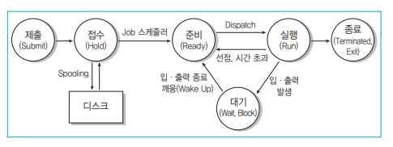

##  프로그래밍 언어 활용
### 1. 배치 프로그램
<div style={{marginLeft:'2.5rem'}}>
```bash
▣ 배치(Batch) 프로그램은 사용자의 개입 없이 일정한 주기 또는 조건에 따라 대량의 데이터를 처리하는 프로그램을 의미
```
</div>
<div style={{marginLeft:'3.5rem'}}>스케줄링(Scheduling)</div>
<div style={{marginLeft:'3.5rem'}}>
```bash
▣ 대용량 Data : 대량의 데이터를 가져오거나, 전달하거나, 계산하는 등의 처리가 가능해야 함
▣ 자동화      : 심각한 오류가 발생하는 상황을 제외하고는 사용자의 개입 없이 수행
▣ 견고성      : 잘못된 데이터나, 데이터의 중복 등의 상황으로 중단되는 일 없이 수행되어야 함
▣ 안정성      : 오류가 발생하면 오류의 발생 위치, 시간 등을 추적할 수 있어야 함
▣ 성능        : 다른 응용 프로그램의 수행을 방해하지 않아야 하고, 지정된 시간 내에 처리 완료되어야 함
```
</div>

### 2. Python의 시퀀스 자료형

<div style={{marginLeft:'2.5rem'}}>
```bash
▣ 리스트(List), 튜플(Tuple), Range 등 문자열처럼 값이 연속적으로 이어진 자료형
```
</div>
<div style={{marginLeft:'2.5rem'}}>
```bash
▣ List  : 다양한 자료형의 값을 연속적으로 저장하며, 필요에 따라 개수를 늘리거나 줄일 수 있음
▣ Tuple : 리스트처럼 요소를 연속적으로 저장하지만, 요소의 추가, 삭제, 변경 불가능 -> 변수 선언 시 () 소괄호 사용
▣ Range : 연속된 숫자를 생성하는 것으로, 리스트, 반복문 등에서 많이 사용 -> range(start, stop, step) 형태로 사용
```
</div>

### 3. 가비지 콜렉터(Garbage Collector, GC)
<div style={{marginLeft:'2.5rem'}}>
```bash
▣ 더 이상 사용되지 않는 객체(메모리)를 자동으로 정리하는 기능
▣ 프로그래머가 직접 메모리를 해제하지 않아도 메모리 누수를 방지하고 최적화된 메모리 관리 수행
▣ 선언만 하고 사용하지 않는 변수들이 점유한 메모리 공간을 강제로 해제하여 다른 프로그램들이 사용할 수 있도록 함
```
</div>

### 4. 비트 연산자
<div style={{marginLeft:'2.5rem'}}>
```bash
▣ & (and) : 모든 비트가 1일 때만 1
▣ ^ (xor) : 모든 비트가 같으면 0, 하나라도 다르면 1
▣ | (or)  : 모든 비트 중 한 비트라도 1이면 1
▣ ~ (not) : 각 비트의 부정, 0이면 1, 1이면 0
▣ <<      : 비트를 왼쪽으로 이동
▣ >>      : 비트를 오른쪽으로 이동
```
</div>

### 4. 조건 연산자 
<div style={{marginLeft:'2.5rem'}}>
```bash
▣ 조건에 따라 서로 다른 수식을 수행
▣ 조건 ? 수식1 : 수식2; -> 조건의 수식이 참이면 수식1을, 거짓이면 수식2를 실행
```
</div>

### 5. 연산자 우선순위
<div style={{marginLeft:'2.5rem'}}>
```bash
▣ 결합규칙에 따라 ←는 오른쪽에 있는 연산 자부터, →는 왼쪽에 있는 연산자부터 차례로 계산
```
</div>
<div style={{marginLeft:'2.5rem'}}></div>

### 6. scanf( ) 함수
<div style={{marginLeft:'2.5rem'}}>
```bash
▣ C 언어에서 입력을 받을 때 사용하는 표준 함수
```
</div>
<div style={{marginLeft:'2.5rem'}}>
```bash
▣ 입력받을 데이터의 자료형, 자릿수 등을 지정 가능
▣ 한 번에 여러 개의 데이터를 입력 받을 수 있다
▣ scanf("%d %f", &i, &j); → ‘%d’와 i, “%f”와 j는 자료형이 일치해야 한다.
▣ scanf("%3d", &a);
```
</div>
<div style={{marginLeft:'2.5rem'}}>
```bash
▣ %  : 서식 문자임을 지정
▣ 3  : 입력 자릿수를 3자리로 지정
▣ d  : 10진수로 입력
▣ &a : 입력받은 데이터를 변수 a의 주소에 저장
```
</div>

### 7. 서식 문자열
<div style={{marginLeft:'2.5rem'}}>
```bash
▣ %d   : 정수형 10진수를 입/출력하기 위해 지정 -> num = 123, print(f"{num:d}") → 123
▣ %u   : 부호없는 정수형 10진수를 입/출력하기 위해 지정 -> num = 123, print(f"{num:u}") → 123
▣ %o   : 정수형 8진수 출력 -> num = 16, print(f"{num:o}") → 20
▣ %x   : 정수형 16진수 출력 (소문자) -> num = 255, print(f"{num:x}") → ff
▣ %X   : 정수형 16진수 출력 (대문자) -> num = 255, print(f"{num:X}") → FF
▣ %c   : 문자 출력 -> ch = 'A', print(f"{ch:c}") → A
▣ %s   : 문자열 출력 -> str = "Hello", print(f"{str:s}") → Hello
▣ %f   : 실수 출력 (소수점 포함) -> num = 3.14159, print(f"{num:f}") → 3.141590
▣ %.nf : 실수 출력 (소수점 n자리까지) -> num = 3.14159, print(f"{num:.2f}") → 3.14
▣ %e   : 지수형 실수 (소문자 e) -> num = 3.14159, print(f"{num:e}") → 3.141590e+00
▣ %E   : 지수형 실수 (대문자 E) -> num = 3.14159, print(f"{num:E}") → 3.141590E+00
▣ %ld  : long형 10진수 출력	-> num = 123456789, print(f"{num:ld}") → 123456789
```
</div>

### 8. 주요 제어문자
<div style={{marginLeft:'2.5rem'}}>
```bash
▣ \n : 커서를 다음 줄 앞으로 이동
▣ \b : 커서를 왼쪽으로 한 칸 이동
▣ \t : 커서를 이리정 간격으로 띄움
▣ \r : 커서를 현재 주르이 처음으로 이동
▣ \O : 널 문자를 출력
▣ \' : 작은따옴표를 출력
▣ \" : 큰 따옴표를 출력
▣ \a : 스피커로 벨 소리를 출력
▣ \\ : 역 슬래시를 출력
▣ \f : 한 페이지를 넘김
```
</div>

### 9. do~while문
<div style={{marginLeft:'2.5rem'}}>
```bash
▣ 조건이 참인 동안 정해진 문장을 반복 수행하다가 조건이 거짓이면 반복문을 벗어나는 While 문과 같은 동작
▣ do ~ while 문은 실행할 문장을 무조건 한 번 실행한 후 다음 조건을 판단하여 탈출 여부를 결정
```
</div>
<div style={{marginLeft:'2.5rem'}}></div>

### 10. 배열 형태의 문자열 변수
<div style={{marginLeft:'2.5rem'}}>
```bash
▣ C언어에서는 큰 따옴표로 묶인 글자를 글자 수에 관계 없이 문자열로 처리
▣ C언어에는 문자열을 저장하는 자료형이 없기 때문에 배열, 또는 포인터를 이용하여 처리
▣ C언어에서 배열에 문자열을 저장하면 문자열의 끝을 알리기 위한 널 문지 (\O)가 문자열 끝에 자동으로 삽입
```
</div>
<div style={{marginLeft:'2.5rem'}}></div>

### 11. 포인터와 포인터 변수
<div style={{marginLeft:'2.5rem'}}>
```bash
▣ 포인터는 변수의 주소를 말하며, C언어에서는 주소를 제어할 수 있는 기능을 제공
▣ C언어에서는 변수의 주소를 저장할 때 사용하는 변수를 포인터 변수라고 함
```
</div>
<div style={{marginLeft:'2.5rem'}}>
    <div ></div>
    <div ></div>
</div>

### 11. 포인터와 배열
<div style={{marginLeft:'2.5rem'}}>
```bash
▣ 배열을 포인터 변수에 저장한 후 포인터를 이용해 배열의 요소에 접근 
▣ 배열의 위치를 나타내는 첨자를 생략하고, 배열의 대표명만 지정하면, 배열의 첫 번째 요소의 주소를 지정한 것과 같음
▣ 배열 요소에 대한 주소를 지정할 때는 일반 변수와 동일하게 & 연산자를 사용
```
</div>
<div style={{marginLeft:'2.5rem'}}></div>
<div style={{marginLeft:'2.5rem'}}></div>
<div style={{marginLeft:'2.5rem'}}></div>

### 11. 절차적 프로그래밍 언어
<div style={{marginLeft:'2.5rem'}}>
```bash
▣ 프로그램을 순차적인 흐름(절차)에 따라 실행하는 프로그래밍 언어를 의미
▣ 구조적 프로그래밍(순차, 선택, 반복 구조)를 따르며, 프로그램의 흐름을 명확하게 표현
```
</div>
<div style={{marginLeft:'2.5rem'}}>
```bash
▣ C       : 포인터, 구조체 등을 활용한 메모리 관리 기능 제공, 운영체제, 시스템 프로그래밍, 임베디드 개발에 많이 사용
▣ Pascal  : 교육용 목적으로 개발된 언어
▣ Fortran : 과학 및 공학 계산을 위한 언어
▣ COBOL   : 기업 비즈니스 및 금융 시스템 개발에 특화된 언어, 메인프레임 환경에서 널리 사용
▣ BASIC   : 초보자를 위한 교육용 언어로 개발
▣ Ada     : 군사, 항공 우주, 안전 시스템 개발에 사용
```
</div>

### 12. 객체지향 프로그래밍(OOP) 언어
<div style={{marginLeft:'2.5rem'}}>
```bash
▣ 객체지향 프로그래밍(Object-Oriented Programming)은 개념을 중심으로 프로그램을 설계하고 개발하는 프로그래밍 패러다임
▣ 객체는 데이터(속성, 필드) 와 행동(메서드, 함수)를 포함하는 독립적인 단위로, 현실 세계의 객체를 모델링
```
</div>
<div style={{marginLeft:'2.5rem'}}>
```bash
▣ Encapsulation(캡슐화) : 데이터와 메서드를 하나의 객체로 묶고, 외부에서 직접 접근하지 못하도록 보호 (private, getter, setter)
▣ Inheritance(상속)     : 기존 클래스의 속성과 메서드를 새로운 클래스에 상속받아 재사용 (extends, super)
▣ Polymorphism(다형성)  : 동일한 메서드나 연산자가 객체에 따라 다르게 동작하도록 구현 (@Override)
▣ Abstraction(추상화)   : 불필요한 세부 사항을 숨기고 필요한 부분만 노출하여 단순화 (abstract, interface)
```
</div>
<div style={{marginLeft:'3.5rem'}}>Java</div>
<div style={{marginLeft:'3.5rem'}}>
```bash
▣ 완전한 객체지향 언어로, 기본 데이터 타입을 제외한 모든 것이 객체로 구성
▣ 플랫폼 독립성을 제공하는 JVM(Java Virtual Machine) 기반 실행 방식
▣ 강력한 캡슐화와 추상화 지원, 인터페이스를 통한 다형성 구현
▣ 대규모 엔터프라이즈 애플리케이션, 모바일, 웹 개발 등에 널리 사용
```
</div>

<div style={{marginLeft:'3.5rem'}}>C++</div>
<div style={{marginLeft:'3.5rem'}}>
```bash
▣ C언어 기반으로 절차적 프로그래밍과 객체지향 프로그래밍을 모두 지원
▣ 포인터, 메모리 관리 등 저수준 프로그래밍 기능 제공, 성능 최적화 가능
▣ 다중 상속과 연산자 오버로딩 등의 강력한 기능 제공
▣ 게임 개발, 임베디드 시스템, 고성능 애플리케이션에 많이 사용
```
</div>

<div style={{marginLeft:'3.5rem'}}>Python</div>
<div style={{marginLeft:'3.5rem'}}>
```bash
▣ 동적 타이핑과 객체지향 프로그래밍을 결합한 펄티패러다임 언어
▣ 모든 것이 객체로 구성되어 있으며, 메타클래스를 활용한 동적 객체 생성 가능
▣ 데이터 분석, 인공지능(AI), 웹 개발(Django, Flask) 등에 사용
```
</div>

### 13. 스크립트 언어의 종류
<div style={{marginLeft:'2.5rem'}}>
```bash
▣ HTML 문서 안에 직접 프로그래밍 언어를 삽입하여 사용하는 언어
▣ 기계어로 컴파일되지 않고, 별도의 변역기가 소스를 분석하고 동작
▣ 서버용 스크립트 언어       : 서버에서 해석하여 결과만 클라이언트로 전송 (ASP/JSP/PHP/파이썬) 등
▣ 클라이언트용 스크립트 언어 : 웹 브라우저에서 해석되어 실행, (JavaScript/VB Script) 등
```
</div>
<div style={{marginLeft:'3.5rem'}}>JavaScript</div>
<div style={{marginLeft:'3.5rem'}}>
```bash
▣ 웹 페이지의 동작을 제어하는 대표적인 클라이언트 스크립트 언어
▣ 웹 브라우저에서 실행되며, HTML 및 CSS와 함께 사용
▣ 비동기 처리(AJAX, Fetch API) 지원
▣ 함수형, 객체지향 프로그래밍 지원
▣ 최신 버전 (ES6+)에서는 class, let, const 등 문법이 추가
▣ Node.js를 통해 서버 측에서도 사용
```
</div>

<div style={{marginLeft:'3.5rem'}}>VBScript(Visual Basic Scripting Edition)</div>
<div style={{marginLeft:'3.5rem'}}>
```bash
▣ 마이크로소프트가 개발한 스크립트 언어로, 주로 Windows 환경에서 사용
▣ ActiveX 기술과 결합하여 Windows 기반 애플리케이션 자동화 가능
▣ 보안 문제로 인해 최신 브라우저에서는 지원되지 않음
▣ 주로 내부 네트워크 환경에서 사용됨
```
</div>

<div style={{marginLeft:'3.5rem'}}>ASP (Active Server Pages)</div>
<div style={{marginLeft:'3.5rem'}}>
```bash
▣ 주로 VBScript 또는 JavaScript로 작성됨
▣ Windows Server + IIS(Internet Information Services) 환경에서 실행
▣ 데이터베이스 연동을 위한 ADO(ActiveX Data Objects) 지원
▣ .NET 기술 등장 이후 ASP.NET으로 대체됨
```
</div>

<div style={{marginLeft:'3.5rem'}}> JSP (Java Server Pages)</div>
<div style={{marginLeft:'3.5rem'}}>
```bash
▣ Java 기반의 서버 측 스크립트 언어로, 동적 웹 애플리케이션을 개발하는 데 사용
▣ Java 코드가 HTML 내에 포함될 수 있음 (<% %> 구문 사용)
▣ Servlet과 함께 사용되며, Java EE 기술 스택의 일부
▣ 다양한 운영체제(Windows, Linux, macOS)에서 실행 가능
▣ JDBC, JPA 등을 통해 데이터베이스 연동 가능
▣ Spring Framework과 결합하여 많이 사용됨
```
</div>

<div style={{marginLeft:'3.5rem'}}> PHP (Hypertext Preprocessor)</div>
<div style={{marginLeft:'3.5rem'}}>
```bash
▣ 웹 개발을 위해 설계된 대표적인 서버 측 스크립트 언어
▣ 플랫폼 독립적으로 Linux, Windows, macOS 등에서 사용 가능
▣ MySQL, PostgreSQL, MariaDB 등의 데이터베이스와 연동 용이
▣ 웹 서버(Apache, Nginx 등)에서 동작하며, HTML과 쉽게 결합
```
</div>

<div style={{marginLeft:'3.5rem'}}>Python</div>
<div style={{marginLeft:'3.5rem'}}>
```bash
▣ 쉽고 직관적인 문법을 제공하는 범용 스크립트 언어
▣ 객체지향 프로그래밍(OOP) 및 함수형 프로그래밍 지원
▣ 플랫폼 독립적이며, 다양한 운영체제에서 실행
▣ 데이터 분석, 인공지능, 웹 개발(Flask, Django) 등 다양한 분야에서 사용됨
```
</div>

<div style={{marginLeft:'3.5rem'}}>Shell Script</div>
<div style={{marginLeft:'3.5rem'}}>
```bash
▣ 유닉스/리눅스 환경에서 사용되는 스크립트 언어
▣ Bash, Zsh, Csh 등 다양한 종류의 쉘에서 사용됨
▣ 파일 및 프로세스 관리, 시스템 관리 작업 자동화
▣ 간단한 반복문 및 조건문을 이용한 스크립팅 가능
```
</div>

### 14. 선언형 프로그래밍 언어 종류
<div style={{marginLeft:'2.5rem'}}>
```bash
▣ 선언형 프로그래밍 언어는 "어떻게(How)"가 아니라 "무엇을(What)" 수행할지를 기술하는 방식의 언어
```
</div>
<div style={{marginLeft:'3.5rem'}}>HTML (HyperText Markup Language)</div>
<div style={{marginLeft:'3.5rem'}}>
```bash
▣ 웹 페이지의 구조를 정의하는 마크업(tag 이용) 언어
▣ 문서의 텍스트, 이미지, 링크, 표 등의 요소를 구성
▣ 데이터 타입 없이 단순한 텍스트 기반이라 호환성이 뛰어남
▣ 웹 브라우저에서 해석되어 화면을 렌더링함
```
</div>
<div style={{marginLeft:'3.5rem'}}>LISP (LISt Processing)</div>
<div style={{marginLeft:'3.5rem'}}>
```bash
▣ 함수형 프로그래밍 패러다임을 따르는 인공지능(AI) 분야의 대표적인 언어
▣ 기본 자료구조가 연결 리스트이며, 리스트 조작이 용이함
▣ 재귀(Recursion) 호출을 많이 사용 -> 함수가 자기 자신을 다시 호출하는 방식으로, 프로그램에 주어진 문제를 해결하는 방법
```
</div>
<div style={{marginLeft:'3.5rem'}}>PROLOG (PROgramming in LOGic)</div>
<div style={{marginLeft:'3.5rem'}}>
```bash
▣ 논리 프로그래밍을 기반으로 한 언어로, 인공지능 및 전문가 시스템에서 사용
▣ 논리적 추론을 수행하며, 규칙과 사실을 기반으로 프로그램을 작성
▣ 리스트(List) 및 패턴 매칭 기능이 강력함
▣ 자연어 처리, 자동 증명 시스템, 데이터베이스 검색 등에 활용
```
</div>
<div style={{marginLeft:'3.5rem'}}>XML (eXtensible Markup Language)</div>
<div style={{marginLeft:'3.5rem'}}>
```bash
▣ 데이터를 저장하고 교환하기 위한 마크업 언어
▣ HTML의 단점을 보완하여 구조화된 데이터를 표현 가능
```
</div>
<div style={{marginLeft:'3.5rem'}}>Haskell</div>
<div style={{marginLeft:'3.5rem'}}>
```bash
▣ 순수 함수형 프로그래밍 언어로, 부작용(Side Effect)이 없는 프로그램 작성
▣ 높은 추상화 수준과 강력한 타입 시스템 제공
▣ 불변성(Immutable Data)을 기반으로 하여 병렬 처리 및 동시성 프로그래밍에 유리
▣ 금융, 데이터 분석, 연구 분야에서 활용됨
```
</div>

### 15. 운영체제(OS: Operating System)의 정의 및 목적
<div style={{marginLeft:'2.5rem'}}>
```bash
▣ 컴퓨터 하드웨어와 소프트웨어를 관리
▣ 사용자와 하드웨어 간의 인터페이스를 제공하는 시스템 소프트웨어
▣ 컴퓨터 시스템의 자원(CPU, 메모리, 저장장치, 입출력 장치 등)을 효율적으로 관리
▣ 사용자가 응용 프로그램을 실행할 수 있는 환경을 제공
```
</div>
<div style={{marginLeft:'3.5rem'}}>처리 능력(Throughput) 향상</div>
<div style={{marginLeft:'3.5rem'}}>
```bash
▣ 일정 시간 내에 운영체제가 처리할 수 있는 작업(프로세스)의 양을 증가시키는 것이 목표
▣ 멀티태스킹, 멀티프로세싱, 스케줄링 기법 등을 통해 처리 능력을 향상
```
</div>
<div style={{marginLeft:'3.5rem'}}>반환 시간(Turnaround Time) 단축</div>
<div style={{marginLeft:'3.5rem'}}>
```bash
▣ 사용자가 작업을 요청한 순간부터 처리가 완료될 때까지 걸리는 시간을 최소화
▣ CPU 스케줄링 기법, 입출력 장치의 최적화 등을 통해 반환 시간을 최소화
```
</div>
<div style={{marginLeft:'3.5rem'}}>사용 가능도(Availability) 향상</div>
<div style={{marginLeft:'3.5rem'}}>
```bash
▣ 사용자가 시스템을 필요로 할 때 즉시 사용 가능한 정도
▣ 장애 복구 시스템, 다중 사용자 지원, 백업 및 복구 기능 등을 통해 사용 가능도를 향상
```
</div>
<div style={{marginLeft:'3.5rem'}}>신뢰도(Reliability) 향상</div>
<div style={{marginLeft:'3.5rem'}}>
```bash
▣ 운영체제가 오류 없이 주어진 작업을 정확하게 수행하는 능력
▣ 오류 감지 및 복구 시스템, 보안 관리, 접근 제어 등을 통해 신뢰도를 향상
```
</div>

### 16. 운영체제의 구성
<div style={{marginLeft:'2.5rem'}}>
```bash
▣ 제어 프로그램(Control Program)**과 **처리 프로그램(Processing Program)**으로 구성
```
</div>
<div style={{marginLeft:'2.5rem'}}>제어 프로그램(Control Program)</div>
<div style={{marginLeft:'2.5rem'}}>
```bash
▣ 컴퓨터 시스템의 전체적인 작동을 감시하고 관리하는 역할
▣ 주요 기능으로는 작업 관리, 데이터 관리, 시스템 자원 할당 등
```
</div>
<div style={{marginLeft:'3.5rem'}}>감시 프로그램(Supervisor Program)</div>
<div style={{marginLeft:'3.5rem'}}>
```bash
▣ 제어 프로그램 중 가장 핵심적인 역할을 수행
▣ CPU, 메모리, 입출력 장치 등의 자원 할당 및 시스템 전체의 상태 감시
▣ 프로세스 간 충돌 방지 및 정상적인 작업 수행 보장
```
</div>
<div style={{marginLeft:'3.5rem'}}>작업 관리 프로그램(Job Management Program)</div>
<div style={{marginLeft:'3.5rem'}}>
```bash
▣ 여러 작업이 효율적으로 처리될 수 있도록 작업의 순서 및 방법을 관리
▣ 작업 스케줄링을 담당하며, 작업 대기열 관리 및 우선순위 결정
▣ 배치 작업(batch processing) 및 멀티태스킹 환경에서 중요
```
</div>
<div style={{marginLeft:'3.5rem'}}>데이터 관리 프로그램(Data Management Program)</div>
<div style={{marginLeft:'3.5rem'}}>
```bash
▣ 작업에서 사용하는 데이터 및 파일의 표준적인 처리와 전송을 관리
▣ 파일 저장, 검색, 삭제 등의 기능 제공
▣ 파일 시스템과 연계하여 데이터 접근 및 보호 수행
```
</div>
<div style={{marginLeft:'2.5rem'}}>처리 프로그램(Processing Program)</div>
<div style={{marginLeft:'2.5rem'}}>
```bash
▣ 제어 프로그램의 지시에 따라 사용자가 요구한 작업을 수행하는 프로그램
```
</div>
<div style={{marginLeft:'3.5rem'}}>언어 번역 프로그램(Language Translator Program)</div>
<div style={{marginLeft:'3.5rem'}}>
```bash
▣ 사용자가 작성한 고급 프로그래밍 언어(예: C, Java)를 기계어로 변환하는 프로그램
▣ 컴파일러(Compiler)      : 전체 코드를 한 번에 번역 후 실행 (예: C, Java)
▣ 인터프리터(Interpreter) : 한 줄씩 번역하면서 실행 (예: Python, JavaScript)
▣ 어셈블러(Assembler)     : 어셈블리어를 기계어로 변환
```
</div>
<div style={{marginLeft:'3.5rem'}}>서비스 프로그램(Service Program)</div>
<div style={{marginLeft:'3.5rem'}}>
```bash
▣ 사용자가 컴퓨터를 보다 효율적으로 사용할 수 있도록 제공되는 프로그램
▣ 대표적인 기능으로는 데이터의 정렬 및 병합, 디스크 정리 ,백업, 복구, 성능 최적화 등
```
</div>

### 17. 운영체제(OS, Operating System)의 기능 
<div style={{marginLeft:'2.5rem'}}>
```bash
▣ 컴퓨터 하드웨어와 소프트웨어를 관리하고, 사용자와 컴퓨터 간의 인터페이스를 제공하는 시스템 소프트웨어
```
</div>
<div style={{marginLeft:'3.5rem'}}>프로세스 관리</div>
<div style={{marginLeft:'3.5rem'}}>
```bash
▣ 프로그램 실행을 위한 프로세스를 생성하고 제거
▣ CPU 스케줄링을 통해 프로세스 간 CPU 자원 배분
▣ 프로세스 간 동기화 및 통신 관리
```
</div>
<div style={{marginLeft:'3.5rem'}}>메모리 관리</div>
<div style={{marginLeft:'3.5rem'}}>
```bash
▣ 실행 중인 프로세스에 메모리 공간 할당 및 해제
▣ 가상 메모리 관리(페이징, 세그멘테이션 등)
▣ 캐시 메모리, 스왑 공간 활용
```
</div>
<div style={{marginLeft:'3.5rem'}}>파일 시스템 관리</div>
<div style={{marginLeft:'3.5rem'}}>
```bash
▣ 파일 생성, 수정, 삭제 및 접근 제어
▣ 디렉터리 구조 관리
```
</div>
<div style={{marginLeft:'3.5rem'}}>입출력(I/O) 관리</div>
<div style={{marginLeft:'3.5rem'}}>
```bash
▣ 키보드, 마우스, 디스크, 네트워크 등 다양한 장치 제어
▣ 입출력 장치 드라이버 및 버퍼링 관리
```
</div>
<div style={{marginLeft:'3.5rem'}}>사용자 인터페이스 제공</div>
<div style={{marginLeft:'3.5rem'}}>
```bash
▣ CLI(Command Line Interface, 명령어 기반)
▣ GUI(Graphical User Interface, 그래픽 기반)
```
</div>
<div style={{marginLeft:'3.5rem'}}>네트워크 관리</div>
<div style={{marginLeft:'3.5rem'}}>
```bash
▣ 인터넷 및 로컬 네트워크 연결 관리
▣ 데이터 전송 및 보안 기능 제공
```
</div>
<div style={{marginLeft:'3.5rem'}}>보안 및 접근 제어</div>
<div style={{marginLeft:'3.5rem'}}>
```bash
▣ 사용자 인증 및 권한 관리
▣ 암호화 및 방화벽을 통한 보안 강화
```
</div>

### 18. Windows 운영체제
<div style={{marginLeft:'2.5rem'}}>
```bash
▣ 마이크로소프트가 개발한 운영체제로, 현재까지 가장 많이 사용되는 테스크톱 운영체제 중 하나 
```
</div>
<div style={{marginLeft:'3.5rem'}}>그래픽 사용자 인터페이스(GUI; Graphic User Interface)</div>
<div style={{marginLeft:'3.5rem'}}>
```bash
▣ 키보드로 명령어를 직접 입력하는 방식(CLI)과 달리 마우스를 이용해 아이콘이나 메뉴를 선택하여 작업을 수행
▣ 사용자 친화적인 인터페이스 제공
```
</div>
<div style={{marginLeft:'3.5rem'}}>선점형 멀티태스킹(Preemptive Multi-Tasking)</div>
<div style={{marginLeft:'3.5rem'}}>
```bash
▣ 여러 개의 프로그램을 동시에 실행하는 멀티태스킹 지원
▣ 운영체제가 각 프로그램의 CPU 사용 시간을 제어하여 응용 프로그램 실행 중 오류가 발생하면 강제 종료하고 시스템 자원을 반환
```
</div>
<div style={{marginLeft:'3.5rem'}}> PnP(Plug and Play, 자동 감지 기능)</div>
<div style={{marginLeft:'3.5rem'}}>
```bash
▣ 새로운 하드웨어(프린터, 사운드 카드 등)를 연결하면 운영체제가 자동으로 인식하고, 필요한 설정을 자동으로 구성
▣ 사용자가 별도로 드라이버를 설정하지 않아도 대부분의 장치가 정상적으로 동작
```
</div>
<div style={{marginLeft:'3.5rem'}}>OLE(Object Linking and Embedding, 개체 연결 및 삽입)</div>
<div style={{marginLeft:'3.5rem'}}>
```bash
▣ 다른 응용 프로그램에서 작성된 텍스트, 이미지, 표 등의 
▣ 개체(Object)를 현재 문서에 삽입(Embedding)하거나 연결(Linking)하여 편집 가능
▣ Excel 데이터를 Word 문서에 삽입 후 변경하면 자동으로 업데이트됨
```
</div>
<div style={{marginLeft:'3.5rem'}}>255자의 긴 파일명 지원</div>
<div style={{marginLeft:'3.5rem'}}>
```bash
▣ VFAT(Virtual File Allocation Table) 파일 시스템을 이용해 최대 255자까지 파일명 지정 가능
▣ 파일 이름에 \ / : * ? “ < > | 를 제외한 모든 문자 및 공백 사용 가능
▣ 한글 파일명도 지원하며, 한글의 경우 최대 127자까지 사용 가능
```
</div>
<div style={{marginLeft:'3.5rem'}}> Single-User 시스템</div>
<div style={{marginLeft:'3.5rem'}}>
```bash
▣ 일반적으로 한 명의 사용자가 한 대의 컴퓨터를 독점적으로 사용
▣ 하지만 최신 Windows 버전에서는 다중 사용자 모드(Remote Desktop 등)를 지원
```
</div>

### 19. UNIX 운영체제 개요 및 특징
<div style={{marginLeft:'2.5rem'}}>
```bash
▣ 시분할 시스템(Time Sharing System)을 기반으로 설계된 대화식 운영체제 
▣ 소스 코드가 공개된 개방형 시스템(Open System)으로 다양한 변형(예: Linux, macOS 등)이 존재
▣ 대부분 C 언어로 작성되어 있어 이식성이 높고, 다양한 장치 및 프로세스 간의 호환성이 뛰어남
▣ 여러 사용자가 동시에 하나의 시스템을 공유하여 사용 가능
▣ 여러 개의 프로그램을 동시에 실행 가능
▣ 네트워크 통신을 위한 다양한 기능을 기본적으로 제공,서버 환경에서 많이 사용되며, 인터넷 기반 서비스 운영에 적합 
▣ 루트 디렉터리(/)를 최상위로 하는 계층적인 트리 구조를 사용
▣ 전문적인 소프트웨어 개발에 최적화된 환경 제공, Shell Script, C 언어, 다양한 컴파일러 및 개발 도구 지원
▣ 시스템 관리 및 프로그래밍에 필요한 다양한 유틸리티 명령어 제공
```
</div>

### 20. UNIX 시스템의 구성 요소
<div style={{marginLeft:'2.5rem'}}>
```bash
▣ UNIX 시스템은 커널(Kernel), 쉘(Shell), 유틸리티 프로그램(Utility Program)으로 구성
```
</div>
<div style={{marginLeft:'3.5rem'}}>커널(Kernel) – UNIX의 핵심</div>
<div style={{marginLeft:'3.5rem'}}>
```bash
▣ 커널은 운영체제의 핵심 부분으로, 시스템이 부팅될 때 주기억장치(RAM)에 적재된 후 상주하면서 실행
▣ 하드웨어와 소프트웨어 간의 인터페이스 역할 수행, 장치 드라이버를 통해 입출력 장치를 제어
▣ CPU 스케줄링을 수행하여 여러 프로세스를 효율적으로 실행, 멀티태스킹 지원
▣ 실행 중인 프로세스가 사용할 메모리를 동적으로 할당 및 해제,  가상 메모리 및 스왑 공간 관리
▣ 트리(Tree) 구조의 파일 시스템 유지, 파일 읽기, 쓰기, 삭제 등의 작업 수행
▣ 키보드, 마우스, 프린터 등의 입출력 장치 제어, 네트워크 및 데이터 전송 관리
▣ 여러 프로세스 간 데이터 공유 및 통신 기능 제공
```
</div>
<div style={{marginLeft:'3.5rem'}}>쉘(Shell) – 사용자 인터페이스</div>
<div style={{marginLeft:'3.5rem'}}>
```bash
▣ 사용자가 입력한 명령을 커널에게 전달하여 실행
▣ 주기억장치에 상주하지 않으며, 보조기억장치(디스크)에서 실행됨, 여러 종류의 쉘을 선택하여 사용할 수 있음
▣ 입출력 재지정 및 파이프라인 기능 지원
▣ Bourne Shell (sh), C Shell (csh), Korn Shell (ksh), Bash Shell (bash) (리눅스 기본 쉘) 등 다양한 쉘 환경 제공
```
</div>
<div style={{marginLeft:'3.5rem'}}>유틸리티 프로그램(Utility Program)</div>
<div style={{marginLeft:'3.5rem'}}>
```bash
▣ 파일 및 디렉터리 관리 명령어
▣ 텍스트 편집기
▣ 컴파일러 및 개발 도구
▣ 네트워크 관리 도구
▣ 프로세스 관리 도구
```
</div>

### 21. 파일 디스크립터(File Descriptor)
<div style={{marginLeft:'2.5rem'}}>
```bash
▣ 운영체제가 파일을 관리하기 위해 유지하는 정보 블록으로, 파일 제어 블록(FCB; File Control Block)이라고도 함
▣ 파일의 속성, 위치, 접근 권한 등의 정보를 저장하며, 운영체제가 파일을 열고 닫을 때 활용
▣ 각 파일은 고유한 파일 디스크립터를 가지며, 운영체제가 이를 이용해 파일을 추적하고 관리
▣ UNIX/Linux, Windows 등 운영체제마다 파일 디스크립터의 구조와 구현 방식이 다름
▣ 하지만 기본적으로 파일의 메타데이터(이름, 크기, 위치, 접근 권한 등)를 포함
▣ 파일 디스크립터는 기본적으로 보조기억장치(HDD, SSD)에 저장
▣ 파일이 Open(열림) 되면 주기억장치(RAM)로 복사되어 빠르게 접근 가능
▣ 파일 시스템이 직접 관리하기 때문에, 사용자는 파일 디스크립터를 직접 수정하거나 접근할 수 없음
```
</div>

### 22. 기억장치 관리 - 배치(Placement) 전략
<div style={{marginLeft:'2.5rem'}}>
```bash
▣ 새로운 프로그램이나 데이터를 주기억장치(RAM)에 배치할 위치를 결정하는 방법
▣ 메모리 관리에서 효율적인 공간 활용과 단편화(메모리 조각화) 최소화가 중요한 목표
▣ 최초 적합(First Fit), 최적 적합(Best Fit), 최악 적합(Worst Fit)
```
</div>
<div style={{marginLeft:'3.5rem'}}>최초 적합(First Fit)</div>
<div style={{marginLeft:'3.5rem'}}>
```bash
▣ 메모리의 처음부터 검색하여, 프로그램이 들어갈 수 있는 첫 번째 빈 공간에 배치
▣ 검색 속도가 빠름 (첫 번째 적절한 공간을 찾으면 즉시 배치), 비교적 간단한 알고리즘
▣ ex) 메모리 공간: [20KB] [50KB] [30KB] [70KB], 새 프로그램: 25KB, 50KB 공간이 가장 먼저 발견되므로 여기에 배치됨
```
</div>
<div style={{marginLeft:'3.5rem'}}>최적 적합(Best Fit)</div>
<div style={{marginLeft:'3.5rem'}}>
```bash
▣ 가장 적합한(최소한의 여유 공간을 남기는) 빈 공간에 배치
▣ 메모리 공간을 효율적으로 사용
▣ 최적의 공간을 찾기 위해 전체 메모리를 검색해야 하므로 속도가 느릴 수 있음
▣ ex) 메모리 공간: [20KB] [50KB] [30KB] [70KB], 새 프로그램: 25KB, 30KB 공간이 가장 적절하므로 여기에 배치됨
```
</div>
<div style={{marginLeft:'3.5rem'}}>최악 적합(Worst Fit)</div>
<div style={{marginLeft:'3.5rem'}}>
```bash
▣ 가장 큰 빈 공간을 찾아 배치
▣ 큰 블록을 유지하여 대형 프로그램을 배치할 가능성 증가
▣ 검색 시간이 오래 걸릴 수 있음
▣ ex) 메모리 공간: [20KB] [50KB] [30KB] [70KB], 새 프로그램: 25KB, 가장 큰 70KB 공간에 배치됨
``` 현재 문서에 삽입(Embedding)하거나 연결 현재 문서에 삽입(Embedding)하거나 연결
</div>

### 23. 페이징(Paging) 기법
<div style={{marginLeft:'2.5rem'}}>
```bash
▣ 가상 기억장치(Virtual Memory)와 주기억장치(RAM)를 동일한 크기의 블록으로 나누어 사용하는 메모리 관리 기법
```
</div>
<div style={{marginLeft:'3.5rem'}}>페이징 기법의 핵심 개념</div>
<div style={{marginLeft:'3.5rem'}}>
```bash
▣ 페이지(Page) : 프로그램을 일정한 크기로 나눈 블록, 가상 메모리(디스크)에 저장됨
▣ 페이지 프레임(Page Frame) : 페이지 크기와 동일하게 나눈 주기억장치의 블록, RAM에서 프로그램을 실행하는 공간
▣ 검색 시간이 오래 걸릴 수 있음 : 페이지 번호와 해당 페이지가 적재된 페이지 프레임의 주소를 저장하는 테이블, 
▣ CPU가 가상 주소를 실제 메모리 주소로 변환할 때 사용됨
```
</div>
<div style={{marginLeft:'3.5rem'}}>페이징 기법의 동작 방식</div>
<div style={{marginLeft:'3.5rem'}}>
```bash
▣ 프로그램 실행 요청 → 필요한 페이지만 주기억장치에 로드
▣ 페이지 번호(Page Number)를 이용해 페이지 프레임(Page Frame) 찾기
▣ 주소 변환(Address Translation), 가상 주소(Virtual Address) → 
▣ 실제 주소(Physical Address) 변환, 페이지 맵 테이블(PMT)을 이용하여 매핑
▣ CPU가 해당 페이지 프레임의 데이터를 가져와 실행
```
</div>

### 24. 세그먼테이션(Segmentation) 기법
<div style={{marginLeft:'2.5rem'}}>
```bash
▣ 프로그램을 논리적인 단위(세그먼트)로 나누어 메모리를 관리하는 기법
▣ 세그먼트(Segment) : 프로그램을 기능적, 논리적 단위로 나눈 블록, 코드(Code), 데이터(Data), 스택(Stack) 등의 세그먼트로 나뉠 수 있음
▣ 세그먼트 테이블(Segment Table, ST) : 세그먼트의 시작 주소(Base)와 크기(Limit)를 저장하는 테이블
▣ CPU가 가상 주소를 실제 메모리 주소로 변환할 때 사용됨
```
</div>
<div style={{marginLeft:'3.5rem'}}>세그먼테이션 기법의 동작 방식</div>
<div style={{marginLeft:'3.5rem'}}>
```bash
▣ 프로그램을 논리적 단위(세그먼트)로 나누어 저장
▣ 세그먼트 테이블을 이용해 가상 주소 → 실제 주소 변환
▣ CPU가 해당 세그먼트의 데이터를 가져와 실행
▣ 가상 주소 = (세그먼트 번호, 오프셋)
▣ 세그먼트 번호(Segment Number) → 세그먼트 테이블에서 Base 주소 조회
▣ 오프셋(Offset) → Base 주소 + Offset으로 실제 메모리 주소 계산
```
</div>

### 25. 페이지 교체 알고리즘
<div style={{marginLeft:'2.5rem'}}>
```bash
▣ 운영체제에서 페이지 부재(Page Fault)가 발생했을 때 어떤 페이지를 제거하고 새 페이지를 적재할지 결정하는 방법
▣ 페이지 -> 운영체제가 메모리를 관리하는 최소 단위
```
</div>
<div style={{marginLeft:'3.5rem'}}>OPT (OPTimal Replacement, 최적 교체)</div>
<div style={{marginLeft:'3.5rem'}}>
```bash
▣ 앞으로 가장 오랫동안 사용하지 않을 페이지를 교체하는 방식
▣ 이론적으로 가장 적은 페이지 부재(Page Fault)를 발생시킴
▣ 실제 구현 불가능 → 미래의 메모리 접근 패턴을 알 수 없기 때문
```
</div>
<div style={{marginLeft:'3.5rem'}}>FIFO (First In First Out, 선입선출)</div>
<div style={{marginLeft:'3.5rem'}}>
```bash
▣ 가장 먼저 메모리에 올라온 페이지를 교체하는 기법
```
</div>
<div style={{marginLeft:'3.5rem'}}>LRU (Least Recently Used, 최근에 가장 오랫동안 사용되지 않은 페이지 교체)</div>
<div style={{marginLeft:'3.5rem'}}>
```bash
▣ 최근 사용 기록이 적은 페이지를 교체
▣ 실제 사용 패턴과 유사하여 성능이 좋음
▣ 추적 비용이 큼 (각 페이지의 최근 사용 시점을 저장해야 함)
```
</div>
<div style={{marginLeft:'3.5rem'}}>LFU (Least Frequently Used, 사용 빈도가 가장 적은 페이지 교체)</div>
<div style={{marginLeft:'3.5rem'}}>
```bash
▣ 사용 횟수가 가장 적은 페이지를 제거
▣ 오래된 페이지라도 한 번이라도 많이 사용되면 계속 유지되는 문제 발생
```
</div>
<div style={{marginLeft:'3.5rem'}}>SCR (Second Chance Replacement, 2차 기회 교체)</div>
<div style={{marginLeft:'3.5rem'}}>
```bash
▣ FIFO 방식에서 자주 사용되는 페이지는 교체하지 않도록 보완한 기법
▣ 페이지마다 참조 비트(Reference Bit) 사용
▣ 참조 비트가 1이면 0으로 바꾸고 다음 페이지 확인, 0이면 교체
```
</div>
<div style={{marginLeft:'3.5rem'}}>NUR (Not Used Recently, 최근 사용되지 않은 페이지 교체)</div>
<div style={{marginLeft:'3.5rem'}}>
```bash
▣ LRU보다 간단한 방식으로 최근 사용 기록이 없는 페이지를 교체
▣ 페이지마다 참조 비트(Reference Bit)와 변형 비트(Dirty Bit) 사용
▣ 최근 사용되지 않은 페이지를 제거하여 LRU보다 오버헤드 적음
```
</div>

### 26. Locality(국부성, 지역성)
<div style={{marginLeft:'2.5rem'}}>
```bash
▣ 프로세스가 실행되는 동안 특정 메모리 영역(페이지, 데이터 등)을 집중적으로 참조하는 성질
▣ 운영체제가 캐시(Cache) 메모리, 페이지 교체, 가상 메모리 관리 등에서 Locality 개념을 활용하여 성능을 최적화
▣ 국부성 -> 한자로 일정한 부분을 의미
```
</div>
<div style={{marginLeft:'3.5rem'}}>시간 지역성(Temporal Locality)</div>
<div style={{marginLeft:'3.5rem'}}>
```bash
▣ 최근에 사용한 데이터나 명령어는 가까운 시간 내에 다시 사용될 가능성이 높다는 성질
▣ CPU 캐시, 반복문(loop), 변수 재사용 등에서 활용
▣ ex) 프로그램에서 반복문(loop) 실행 → 같은 코드가 계속 실행됨, 
▣ 스택(Stack) 연산 → 최근에 사용한 데이터(함수 호출, 변수 등)를 계속 참조
```
</div>
<div style={{marginLeft:'3.5rem'}}>공간 지역성(Spatial Locality)</div>
<div style={{marginLeft:'3.5rem'}}>
```bash
▣ 한 번 참조한 데이터 근처의 데이터도 곧 참조될 가능성이 높다는 성질
▣ 배열(Array) 접근, 순차적 코드 실행, 연속적인 메모리 접근에서 활용
▣ ex) 배열(Array) 순회 → 연속된 메모리 위치에 저장된 데이터 접근
▣ 순차적 코드 실행 → 프로그램 실행 시, 메모리에 적재된 연속된 명령어 실행
```
</div>
<div style={{marginLeft:'3.5rem'}}>Locality(국부성, 지역성)의 활용</div>
<div style={{marginLeft:'3.5rem'}}>
```bash
▣ CPU 캐시 → Locality를 활용하여 캐시 히트율 증가
▣ 가상 메모리 & 페이지 교체 → LRU(Least Recently Used) 등 최적화된 교체 방식 사용
▣ 디스크 캐싱 & 프리페칭 → 연속된 데이터 블록을 미리 가져와 접근 속도 향상
```
</div>

### 27. 워킹 셋(Working Set
<div style={{marginLeft:'2.5rem'}}>
```bash
▣ 프로세스가 일정 시간 동안 자주 참조하는 페이지들의 집합을 의미
▣ 프로그램이 실행될 때 자주 사용하는 메모리 페이지들의 모음
```
</div>
<div style={{marginLeft:'3.5rem'}}>워킹 셋 개념과 특징</div>
<div style={{marginLeft:'3.5rem'}}>
```bash
▣ Locality(지역성) 개념을 활용 → 프로세스가 자주 참조하는 페이지를 주기억장치(RAM)에 유지하여 성능 향상
▣ 페이지 부재(Page Fault) 최소화 → 워킹 셋을 유지하면 불필요한 페이지 교체가 줄어듦
▣ 시간에 따라 변화 → 프로세스가 다른 코드나 데이터를 실행하면 워킹 셋도 변함
```
</div>
<div style={{marginLeft:'3.5rem'}}>워킹 셋의 활용</div>
<div style={{marginLeft:'3.5rem'}}>
```bash
▣ 페이지 교체 알고리즘 최적화, 필요한 페이지가 메모리에 남아 있어 성능 향상, 
▣ 자주 사용되지 않는 페이지만 교체하여 스래싱(Thrashing) 방지
▣ 메모리 관리 효율 향상, 프로세스별 워킹 셋을 추적하여 메모리를 적절히 할당, 불필요한 페이지를 제거하여 메모리 낭비 방지
```
</div>
<div style={{marginLeft:'3.5rem'}}>워킹 셋과 스래싱(Thrashing)</div>
<div style={{marginLeft:'3.5rem'}}>
```bash
▣ 스래싱(Thrashing): 페이지 부재가 너무 자주 발생하여 CPU가 계속 페이지 교체 작업만 수행하는 현상
▣ 워킹 셋 유지 → 필요한 페이지를 메모리에 보관하여 스래싱 방지
```
</div>

### 28. 스래싱(Thrashing)
<div style={{marginLeft:'2.5rem'}}>
```bash
▣ 프로세스의 실제 처리 시간보다 페이지 교체에 소요되는 시간이 더 많아지는 현상
▣ CPU가 유용한 작업을 수행하지 못하고, 페이지 교체(Page Fault Handling)만 반복하는 상황
```
</div>
<div style={{marginLeft:'3.5rem'}}>스래싱이 발생하는 원인</div>
<div style={{marginLeft:'3.5rem'}}>
```bash
▣ 다중 프로그래밍의 정도 증가 → 너무 많은 프로세스를 동시에 실행하면 메모리 부족
▣ 자주 발생하는 페이지 부재(Page Fault) → 필요한 페이지가 메모리에 없어서 계속 디스크에서 불러옴
▣ 워킹 셋 부족 → 프로세스가 자주 사용하는 페이지를 메모리에 유지하지 못함
```
</div>
<div style={{marginLeft:'3.5rem'}}>스래싱 방지 방법</div>
<div style={{marginLeft:'3.5rem'}}>
```bash
▣ 다중 프로그래밍의 정도를 적정 수준으로 유지 → 너무 많은 프로세스를 동시에 실행하지 않음
▣ 페이지 부재 빈도(Page Fault Frequency) 조절 → 페이지 교체가 너무 자주 발생하지 않도록 설정
▣ 워킹 셋(Working Set) 유지 → 자주 사용하는 페이지를 메모리에 유지하여 성능 향상
▣ 자원 증설 → RAM을 추가하여 메모리 부족 문제 해결
▣ 프로세스 관리 → 일부 프로세스를 중단하거나 재배치하여 메모리 사용 조절
```
</div>

### 29. 프로세스(Process)
<div style={{marginLeft:'2.5rem'}}>
```bash
▣ 실행 중인 프로그램을 의미하며, CPU에 의해 처리되는 사용자 프로그램 또는 시스템 프로그램
▣ Job(작업), Task(태스크) 라고도 함
```
</div>
<div style={{marginLeft:'3.5rem'}}>프로세스의 다양한 정의</div>
<div style={{marginLeft:'3.5rem'}}>
```bash
▣ PCB(Process Control Block)를 가진 프로그램
▣ 실제 메모리(RAM)에 적재되어 실행 중인 프로그램
▣ CPU가 할당되는 실행 단위 (디스패치 가능한 단위)
▣ 프로시저(Procedure)가 활동 중인 상태
▣ 비동기적 행위를 일으키는 주체
▣ 지정된 결과를 얻기 위한 일련의 동작 과정
▣ 운영체제가 관리하는 실행 단위
```
</div>

<div style={{marginLeft:'3.5rem'}}>PCB (Process Control Block, 프로세스 제어 블록)</div>
<div style={{marginLeft:'3.5rem'}}>
```bash
▣ 프로세스는 실행 중인 프로그램
▣ 프로그램(Program): 저장된 정적인 코드
▣ 프로세스(Process): 실행 중인 동적인 개체
▣ ex) 프로그램: .exe 파일, .jar 파일, .sh 스크립트 등
▣ ex) 프로세스: 프로그램이 실행되어 CPU와 메모리를 할당받고 동작하는 상태
```
</div>

### 30. PCB (Process Control Block, 프로세스 제어 블록)
<div style={{marginLeft:'2.5rem'}}>
```bash
▣ PCB는 운영체제가 각 프로세스의 중요한 정보를 저장하는 데이터 구조
▣ Task Control Block(TCB) 또는 Job Control Block(JCB) 라고도 함
```
</div>
<div style={{marginLeft:'3.5rem'}}>PCB의 특징</div>
<div style={{marginLeft:'3.5rem'}}>
```bash
▣ 프로세스가 생성될 때마다 고유한 PCB가 생성됨
▣ 프로세스가 종료되면 해당 PCB는 제거됨
▣ 운영체제가 프로세스를 관리하는 핵심 정보 포함
```
</div>
<div style={{marginLeft:'3.5rem'}}>PCB에 저장되는 주요 정보</div>
<div style={{marginLeft:'3.5rem'}}>
```bash
▣ 프로세스의 현재 상태 (Process State), 실행(Running), 준비(Ready), 대기(Waiting) 등의 상태
▣ 포인터 (Pointers), 부모 프로세스, 자식 프로세스에 대한 포인터,프로세스가 위치한 메모리 주소 등
▣ 프로세스 고유 식별자 (Process ID, PID), 프로세스를 식별하는 고유한 번호
▣ 스케줄링 정보 및 우선순위 (Scheduling & Priority), 프로세스의 우선순위(Priority)
▣ CPU 레지스터 정보 (CPU Register Information), 프로세스의 명령어 카운터(PC, Program Counter)
▣ 주기억장치 관리 정보 (Memory Management Info), Page Table, Segment Table 등 메모리 주소 정보
▣ 입·출력 상태 정보 (I/O Status Information), 프로세스가 사용하는 입출력 장치 및 파일 정보
▣ 계정 정보 (Accounting Information), CPU 사용 시간, 실행 시간 등의 통계 정보
```
</div>
<div style={{marginLeft:'3.5rem'}}>PCB의 역할</div>
<div style={{marginLeft:'3.5rem'}}>
```bash
▣ 프로세스 상태 관리 → 프로세스가 어느 상태인지 추적
▣ 문맥 교환(Context Switching) → 프로세스 실행 정보를 저장하고 복원
▣ 운영체제가 프로세스를 효율적으로 관리할 수 있도록 함
▣ 즉, PCB는 프로세스의 "신분증"과 같은 역할 수행
```
</div>

### 31. 프로세스 상태 전이(Process State Transition)
<div style={{marginLeft:'2.5rem'}}>
```bash
▣ 프로세스가 실행되는 동안 상태가 변하는 과정을 의미
▣ 운영체제(OS) 는 각 프로세스의 상태를 관리하며, 필요에 따라 상태를 전환
```
</div>
<div style={{marginLeft:'3.5rem'}}>프로세스의 주요 상태</div>
<div style={{marginLeft:'3.5rem'}}>
```bash
▣ 제출(Submit)           : 사용자가 작업을 시스템에 제출한 상태
▣ 접수(Hold)             : 제출된 작업이 디스크의 스풀 공간에 저장된 상태, Batch 시스템에서 사용
▣ 준비(Ready)            : CPU를 할당받기 위해 대기하는 상태, CPU 스케줄러(Short-Term Scheduler)에 의해 선택될 수 있음
▣ 실행(Run)              : 프로세스가 CPU를 할당받아 실행 중인 상태
▣ 대기(Wait, Block)      : 입·출력(I/O) 요청, 자원 할당 대기 등으로 중단된 상태
▣ 종료(Terminated, Exit) : 프로세스 실행이 끝나고 시스템에서 제거된 상태
```
</div>
<div style={{marginLeft:'3.5rem'}}></div>
<div style={{marginLeft:'3.5rem'}}>프로세스 상태 전이 과정</div>
<div style={{marginLeft:'3.5rem'}}>
```bash
▣ [제출] → [접수] : 사용자가 작업을 제출하면 디스크에 저장됨
▣ [접수] → [준비] : Job 스케줄러(Long-Term Scheduler)에 의해 메모리에 적재됨
▣ [준비] → [실행] : CPU를 할당받으면 실행 상태로 전이됨
▣ [실행] → [준비] : 선점(Preemption) 또는 시간 초과(Time Quantum Expired) 로 다른 프로세스에게 CPU 양보
▣ [실행] → [대기] : 입·출력(I/O) 요청, 자원 할당 대기 등으로 실행 중단
▣ [대기] → [준비] : 입·출력 작업이 완료되면 다시 준비 상태로 이동
▣ [실행] → [종료] : 프로세스 실행이 끝나거나 강제 종료됨
```
</div>

### 32. 프로세스 상태 전이 관련 용어
<div style={{marginLeft:'2.5rem'}}>
```bash
▣ Dispatch : 준비 상태에서 실행 상태로 전이하는 과정, CPU 스케줄러가 준비 상태에서 하나의 프로세스를 선택하여 CPU를 할당
▣ Wake Up  : 대기 상태에서 준비 상태로 전이하는 과정, 입·출력(I/O) 작업이 완료되면 다시 실행될 준비를 함
▣ Spooling : 입·출력 데이터를 직접 장치로 보내지 않고 디스크에 저장 후 한꺼번에 처리, 프린터, 카드 리더기 등의 입·출력에 주로 사용
▣ Traffic Controller : 프로세스의 상태를 조사하고, 상태 변경을 통보하는 역할
```
</div>

### 33. 스레드(Thread)
<div style={{marginLeft:'2.5rem'}}>
```bash
▣ 프로세스 내에서 실행되는 작업의 단위
▣ CPU 스케줄링의 최소 단위
▣ 경량 프로세스(Light Weight Process, LWP)라고도 함
▣ 하나의 프로세스가 여러 개의 스레드를 가질 수 있음(멀티 스레드)
```
</div>
<div style={{marginLeft:'3.5rem'}}>스레드의 종류</div>
<div style={{marginLeft:'3.5rem'}}>
```bash
▣ User-Level Thread   : 용자가 만든 라이브러리 기반으로 스레드를 생성 및 관리, 커널의 개입 없이 사용자 영역에서 실행
▣ Kernel-Level Thread : 운영체제의 커널이 직접 관리하는 스레드, 구현이 쉬우나, 커널이 직접 관리하므로 속도가 느릴 수 있음
```
</div>
<div style={{marginLeft:'3.5rem'}}>스레드의 장점</div>
<div style={{marginLeft:'3.5rem'}}>
```bash
▣ 병렬 처리(Concurrency) 가능 → 하나의 프로세스를 여러 스레드로 나눠 동시 실행
▣ 응용 프로그램의 성능 향상 → CPU, OS, 하드웨어 성능 최적화 가능
▣ 응답 시간(Response Time) 단축 → 빠른 실행 속도로 사용자 경험 향상
▣ 메모리 공유 → 같은 프로세스 내에서 스레드 간 메모리 공유로 자원 낭비 감소
▣ 프로세스 간 통신 향상 → 공유 메모리를 통해 효율적인 데이터 전달 가능
```
</div>

### 34. 주요 스케줄링 알고리즘
<div style={{marginLeft:'3.5rem'}}>FCFS (First Come First Serve, 선입선출)</div>
<div style={{marginLeft:'3.5rem'}}>
```bash
▣ FIFO(First In First Out) 방식으로 먼저 도착한 프로세스가 먼저 실행됨
▣ 짧은 작업이 긴 작업을 기다려야 함 (Convoy Effect, 호위 효과 발생)
▣ 긴 프로세스가 있으면 전체 대기 시간이 증가
```
</div>
<div style={{marginLeft:'3.5rem'}}>SJF (Shortest Job First, 단기 작업 우선)</div>
<div style={{marginLeft:'3.5rem'}}>
```bash
▣ 준비 큐에서 실행 시간이 가장 짧은 프로세스를 먼저 실행하는 기법
▣ 평균 대기 시간이 가장 짧아지는 최적의 알고리즘
▣ 긴 프로세스는 계속 대기해야 하는 단점 발생 (Starvation, 기아 현상)
```
</div>
<div style={{marginLeft:'3.5rem'}}>HRN (Highest Response-ratio Next, 응답률 우선)</div>
<div style={{marginLeft:'3.5rem'}}>
```bash
▣ SJF의 단점을 보완하여 대기 시간과 실행 시간을 고려하여 우선순위 결
▣ 대기 시간이 길거나 실행 시간이 짧으면 우선순위가 높아짐
▣ SJF보다 기아 현상이 줄어듦
▣ 긴 작업도 일정 시간이 지나면 실행될 기회가 생김
```
</div>

### 35. IP 주소(Internet Protocol Address)
<div style={{marginLeft:'2.5rem'}}>
```bash
▣ 인터넷에 연결된 모든 컴퓨터를 구분하기 위한 고유한 주소
▣ 32비트(IPv4 기준)로 구성, 8비트씩 4부분 (ex. 192.168.0.1)
▣ 네트워크 부분과 호스트 부분으로 나뉨
```
</div>
<div style={{marginLeft:'3.5rem'}}>IP 주소 클래스(Class) 분류</div>
<div style={{marginLeft:'3.5rem'}}>
    <table>
        <tr>
            <th>클래스</th>
            <th>용도</th>
            <th>첫 번째 옥텟 범위</th>
            <th>사용 가능한 호스트 수</th>
        </tr>
        <tr>
            <td>A 클래스</td>
            <td>대형 통신망, 국가급 네트워크</td>
            <td>0~127</td>
            <td>16,777,216개 (224)</td>
        </tr>
        <tr>
            <td>B 클래스</td>
            <td>중대형 네트워크	</td>
            <td>128~191	</td>
            <td>65,536개 (216)</td>
        </tr>
        <tr>
            <td>C 클래스</td>
            <td>소규모 네트워크</td>
            <td>192~223</td>
            <td>256개 (28)</td>
        </tr>
        <tr>
            <td>D 클래스</td>
            <td>멀티캐스트 전용</td>
            <td>224~239</td>
            <td>특정 그룹 통신용</td>
        </tr>
        <tr>
            <td>E 클래스</td>
            <td>실험적 주소, 사용 안 함</td>
            <td>240~255</td>
            <td>연구용</td>
        </tr>
    </table>
</div>

### 36. 서브네팅(Subnetting)
<div style={{marginLeft:'2.5rem'}}>
```bash
▣ 할당된 네트워크 주소를 여러 개의 작은 네트워크로 나누는 기술
▣ IP 주소를 보다 효율적으로 활용하고 네트워크 트래픽을 분산하기 위해 사용
▣ 서브넷 마스크(Subnet Mask)를 활용하여 네트워크와 호스트를 구분
```
</div>
<div style={{marginLeft:'3.5rem'}}>서브넷 마스크란?</div>
<div style={{marginLeft:'3.5rem'}}>
```bash
▣ IP 주소에서 네트워크 부분과 호스트 부분을 구분하는 비트 값
▣ 기본적으로 클래스마다 정해진 서브넷 마스크가 존재
```
</div>
<div style={{marginLeft:'3.5rem'}}>
    <table>
        <tr>
            <th>클래스</th>
            <th>기본 서브넷 마스크</th>
            <th>비트 표현</th>
        </tr>
        <tr>
            <td>A 클래스</td>
            <td>255.0.0.0</td>
            <td>11111111.00000000.00000000.00000000</td>
        </tr>
        <tr>
            <td>B 클래스</td>
            <td>255.255.0.0</td>
            <td>11111111.11111111.00000000.00000000</td>
        </tr>
        <tr>
            <td>C 클래스</td>
            <td>255.255.255.0</td>
            <td>11111111.11111111.11111111.00000000</td>
        </tr>
    </table>
</div>
<div style={{marginLeft:'3.5rem'}}>서브네팅의 장점</div>
<div style={{marginLeft:'3.5rem'}}>
```bash
▣ IP 주소의 낭비 방지, 네트워크 관리 용이
▣ 브로드캐스트 도메인 분리 → 네트워크 성능 향상,  보안 강화 (각 서브넷 간 접근 제어 가능)
```
</div>

### 37. IPv6 (Internet Protocol version 6)
<div style={{marginLeft:'2.5rem'}}>
```bash
▣ IPv6는 기존 IPv4의 주소 부족 문제를 해결하기 위해 128비트 주소 체계를 사용하는 차세대 인터넷 프로토콜
▣ IPv4의 단점을 개선하고 더 많은 기능을 추가
```
</div>
<div style={{marginLeft:'3.5rem'}}>IPv6의 특징</div>
<div style={{marginLeft:'3.5rem'}}>
```bash
▣ 더 긴 주소 체계 (128비트), IPv4(32비트)보다 훨씬 많은 주소 제공
▣ 속도 & 보안 강화, 인증성, 기밀성, 데이터 무결성 지원, 패킷 헤더 구조 단순화 → 전송 속도 향상
▣ 주소 자동 할당 기능 (Auto-configuration), DHCP 없이 자동으로 IP 설정 가능
▣ 멀티캐스트 지원, 브로드캐스트(IPv4) 대신 멀티캐스트 방식 사용 → 네트워크 부하 감소
▣ 패킷 크기 확장 가능, IPv4보다 더 큰 데이터 전송 가능
▣ IPv4와의 호환성, 이중 스택(dual stack) 사용 가능 → IPv4와 IPv6 동시 지원
```
</div>

<div style={{marginLeft:'3.5rem'}}> IPv6 주소 종류</div>
<div style={{marginLeft:'3.5rem'}}>
```bash
▣ 유니캐스트 (Unicast) → 특정 1대의 장치에 전송
▣ 멀티캐스트 (Multicast) → 특정 그룹에 전송
▣ 애니캐스트 (Anycast) → 가장 가까운 노드에 전송
```
</div>

### 38. OSI 참조 모델
<div style={{marginLeft:'2.5rem'}}>
```bash
▣ 네트워크 통신을 위한 표준화된 규약을 정의한 모델로, ISO (International Organization for Standardization)에서 제안
▣ 7개의 계층으로 나누어지며, 각 계층은 특정한 역할과 기능을 담당
```
</div>
<div style={{marginLeft:'3.5rem'}}> 하위 계층 (Physical, Data Link, Network) - 물리 계층 (Physical Layer) </div>
<div style={{marginLeft:'3.5rem'}}>
```bash
▣ 실제 데이터 전송에 필요한 기계적, 전기적, 기능적, 절차적 특성을 규명
▣ 데이터가 실제 전송 매체를 통해 전송되는 과정입니다. 비트 전송 및 전송 방식, 전기적 신호, 광 신호 등
▣ 케이블, 리피터, 허브 등
```
</div>
<div style={{marginLeft:'3.5rem'}}> 하위 계층 (Physical, Data Link, Network) - 데이터 링크 계층 (Data Link Layer)</div>
<div style={{marginLeft:'3.5rem'}}>
```bash
▣ 두 장치 간 신뢰성 있는 데이터 전송을 제공하고, 연결 설정, 유지, 해제를 담당
▣ 데이터 전송 중 오류 검출 및 수정, 프레임의 동기화 및 흐름 제어
▣ Ethernet, MAC 주소, 스위치
```
</div>
<div style={{marginLeft:'3.5rem'}}> 하위 계층 (Physical, Data Link, Network) - 네트워크 계층 (Network Layer)</div>
<div style={{marginLeft:'3.5rem'}}>
```bash
▣ 네트워크 간 연결 설정, 데이터 전송, 경로 설정(Routing), 트래픽 제어 등을 담당
▣ 패킷을 목적지까지 전송하기 위한 경로 설정 및 트래픽 관리
▣ IP, 라우터, ICMP, ARP
```
</div>

<div style={{marginLeft:'3.5rem'}}> 상위 계층 (Transport, Session, Presentation, Application) - 전송 계층 (Transport Layer)</div>
<div style={{marginLeft:'3.5rem'}}>
```bash
▣ 데이터의 논리적 안정성을 보장하고, 종단 시스템 간 데이터 전송을 담당
▣ 데이터 분할 및 재조립, 흐름 제어, 오류 검출 및 수정
▣ TCP, UDP
```
</div>
<div style={{marginLeft:'3.5rem'}}> 상위 계층 (Transport, Session, Presentation, Application) - 세션 계층 (Session Layer)</div>
<div style={{marginLeft:'3.5rem'}}>
```bash
▣ 송수신 간 대화(세션) 설정과 관리를 담당
▣ 대화 흐름 제어, 동기화 및 데이터 교환 관리
▣ RPC, NetBIOS
```
</div>
<div style={{marginLeft:'3.5rem'}}> 상위 계층 (Transport, Session, Presentation, Application) - 표현 계층 (Presentation Layer)</div>
<div style={{marginLeft:'3.5rem'}}>
```bash
▣ 데이터의 형식 변환, 암호화, 압축을 담당하여 상위 계층들이 데이터를 이해할 수 있도록 지원
▣ 다른 시스템 간의 데이터 표현 형식 차이를 해결
▣ JPEG, SSL, ASCII.
```
</div>
<div style={{marginLeft:'3.5rem'}}> 상위 계층 (Transport, Session, Presentation, Application) - 응용 계층 (Application Layer)</div>
<div style={{marginLeft:'3.5rem'}}>
```bash
▣ 사용자(응용 프로그램)가 네트워크를 사용할 수 있도록 서비스를 제공
▣ 사용자가 직접 접근하는 계층으로, 애플리케이션과 관련된 네트워크 서비스를 제공
▣ HTTP, FTP, DNS, 이메일
```
</div>

<div style={{marginLeft:'3.5rem'}}> OSI 모델의 흐름</div>
<div style={{marginLeft:'3.5rem'}}>
```bash
▣ 하위 계층은 실제 데이터 전송을 담당
▣ 상위 계층은 데이터를 사람이나 애플리케이션이 이해할 수 있도록 적절하게 가공하고 관리
▣ 하위 계층에서 데이터가 물리적 신호로 변환
▣ 상위 계층에서는 이 신호를 다시 적절한 형태로 가공하여 사용자에게 제공
```
</div>

### 39. 네트워크 관련 장비
<div style={{marginLeft:'2.5rem'}}>
```bash
▣ 네트워크에서 데이터를 전송하고 관리하는 데 중요한 역할
▣ 각 장비는 특정 기능을 수행하여, 네트워크 성능, 보안, 효율성 등을 향상
```
</div>
<div style={{marginLeft:'3.5rem'}}> 네트워크 인터페이스 카드 (NIC; Network Interface Card)</div>
<div style={{marginLeft:'3.5rem'}}>
```bash
▣ 컴퓨터와 네트워크를 연결하는 장치로, 데이터를 네트워크에 적합한 형태로 변환하여 전송
▣ 컴퓨터와 다른 장치 간의 유선 또는 무선 네트워크 연결을 위한 기본 하드웨어
▣ NIC는 이더넷, Wi-Fi와 같은 네트워크 표준을 통해 데이터를 주고 받음
▣ 데이터가 네트워크 케이블을 통해 전송될 수 있도록, 데이터의 형태를 전기적 신호나 무선 신호로 변환
```
</div>
<div style={{marginLeft:'3.5rem'}}> 허브 (Hub)</div>
<div style={{marginLeft:'3.5rem'}}>
```bash
▣ 여러 컴퓨터나 네트워크 장치를 하나의 네트워크에 연결하는 장치로, 신호 증폭 및 재전송 기능
▣ 간단한 네트워크에서 다수의 장치를 연결하여 정보를 전송하는 역할
▣ 허브는 네트워크 트래픽을 단순하게 분배, 
▣ 모든 입력된 신호를 모든 포트로 전송하며, 충돌 도메인을 확장시킬 수 있어 효율성이 떨어질 수 있음
▣ 더미 허브   : 기본적인 신호 전달 역할만 함
▣ 스위칭 허브 : 각 장치에 신호를 전송하며, 트래픽 분배가 더 효율적입니다.
```
</div>

<div style={{marginLeft:'3.5rem'}}> 리피터 (Repeater)</div>
<div style={{marginLeft:'3.5rem'}}>
```bash
▣ 신호가 네트워크 전송 중에 약해지거나 왜곡되면, 이를 재생하여 원래 신호를 복원하고 다시 전송
▣ 신호의 거리가 길어질 때, 신호를 강화하여 더 긴 거리까지 전송할 수 있게 지원
▣ 리피터는 주로 네트워크의 범위 확장을 위한 장비로, 
▣ 신호가 약해지거나 손상될 때 중간에서 신호를 재생하여 더 멀리 전송할 수 있게 함
```
</div>

<div style={{marginLeft:'3.5rem'}}> 브리지 (Bridge)</div>
<div style={{marginLeft:'3.5rem'}}>
```bash
▣ LAN과 LAN을 연결하거나, 하나의 LAN 내에서 **세그먼트(부분 네트워크)**를 연결하여 네트워크 트래픽을 관리
▣ 네트워크 분할을 통해 트래픽을 분산시키고, 보안성을 향상
▣ 브리지는 네트워크 세그먼트 간의 통신을 중재
▣ 네트워크 성능을 개선하고 충돌 도메인을 감소
```
</div>

<div style={{marginLeft:'3.5rem'}}> 스위치 (Switch)</div>
<div style={{marginLeft:'3.5rem'}}>
```bash
▣ LAN 내에서 여러 장치를 연결하여 네트워크 성능을 향상
▣ 네트워크에서 효율적인 트래픽 전달을 위해 사용
▣ 스위치는 하드웨어 기반으로 작동하여, 데이터를 필요한 포트로만 전송
▣ 충돌을 줄이고, 네트워크 효율성을 높이는 데 기여
```
</div>

<div style={{marginLeft:'3.5rem'}}> 라우터 (Router)</div>
<div style={{marginLeft:'3.5rem'}}>
```bash
▣ 여러 네트워크를 연결하며, 데이터가 목적지까지 가는 최적 경로를 선택하는 기능
▣ 서로 다른 네트워크나 LAN과 WAN을 연결하는 장치
▣ 라우터는 경로 설정(Routing)을 통해 패킷을 전달하며, IP 주소를 기준으로 최적 경로를 선택하여 데이터를 전달
```
</div>

<div style={{marginLeft:'3.5rem'}}> 게이트웨이 (Gateway)</div>
<div style={{marginLeft:'3.5rem'}}>
```bash
▣ 다른 프로토콜을 사용하는 네트워크 간의 연결을 담당
▣ 모든 OSI 계층에서 작동하며, 다양한 프로토콜을 번역하는 역할
▣ 서로 다른 네트워크 간의 데이터를 변환하여 통신을 가능하게 함
▣ LAN과 다른 네트워크(예: 인터넷) 간의 데이터 포맷을 변환, 상호 호환되지 않는 네트워크를 연결하는 중요한 역할
```
</div>

### 40. 응용 계층의 주요 프로토콜
<div style={{marginLeft:'2.5rem'}}>
```bash
▣ 네트워크에서 다양한 서비스를 제공하는 데 사용
▣ OSI 모델에서 사용자와 직접 상호작용하는 계층으로, 네트워크 서비스를 제공하는 여러 프로토콜들이 여기에서 작동
▣ 각 프로토콜은 특정 기능을 수행하여 사용자에게 필요한 서비스를 제공
```
</div>

<div style={{marginLeft:'3.5rem'}}> FTP (File Transfer Protocol)</div>
<div style={{marginLeft:'3.5rem'}}>
```bash
▣ 컴퓨터와 컴퓨터 간, 또는 컴퓨터와 인터넷 간에 파일을 주고받을 수 있도록 하는 원격 파일 전송 프로토콜
▣ 용량 파일 전송, 웹 서버와 클라이언트 간의 파일 교환 등을 위해 사용
▣ 클라이언트와 서버가 파일을 업로드하거나 다운로드하는 데 사용
▣ 명령 모드와 전송 모드로 파일을 관리
▣ FTP는 명시적인 인증을 요구하며, 보안성 향상을 위해 FTPS나 SFTP로 사용되기도 함
```
</div>
<div style={{marginLeft:'3.5rem'}}> SMTP (Simple Mail Transfer Protocol)</div>
<div style={{marginLeft:'3.5rem'}}>
```bash
▣ 전자 우편을 교환하는 서비스로, 메일 서버 간에 이메일을 전송하는 데 사용되는 프로토콜
▣ 이메일 전송 및 라우팅을 위해 사용
▣ 서버 간 이메일 전송을 담당, 이메일 클라이언트에서 서버로 메일을 보내고, 서버 간 메일을 전달하는 데 사용
▣ SMTP는 기본적으로 단방향 통신만 지원하므로, 이메일을 받기 위해서는 POP3나 IMAP 프로토콜을 함께 사용
```
</div>
<div style={{marginLeft:'3.5rem'}}> TELNET</div>
<div style={{marginLeft:'3.5rem'}}>
```bash
▣ 원격 시스템에 접속하여 가상의 터미널처럼 사용할 수 있는 서비스
▣ 원격 서버나 컴퓨터에 접속하여 프로그램 실행, 시스템 관리 등의 작업 수행
▣ 텍스트 기반의 원격 접속을 통해 네트워크를 통해 원격지에 있는 컴퓨터와 상호작용 가능
▣ 보안성이 낮아 SSH로 대체되는 경우가 많음
```
</div>

<div style={{marginLeft:'3.5rem'}}> SNMP (Simple Network Management Protocol)</div>
<div style={{marginLeft:'3.5rem'}}>
```bash
▣ 네트워크 관리 프로토콜로, 라우터, 허브, 스위치 등의 네트워크 기기에서 정보를 수집하여 네트워크 관리 시스템에 전달
▣ 네트워크 장비의 상태 모니터링 및 관리, 네트워크 문제 해결을 위한 정보 수집에 사용
▣ 네트워크 기기의 성능 모니터링 및 문제 해결을 위한 표준 프로토콜로, 기기 상태 정보, 에러 메시지 등을 수집
▣ 트워크 관리자가 네트워크 상태를 효율적으로 관리할 수 있도록 지원
```
</div>

<div style={{marginLeft:'3.5rem'}}> DNS (Domain Name System)</div>
<div style={{marginLeft:'3.5rem'}}>
```bash
▣ 도메인 네임을 IP 주소로 변환하는 시스템
▣ 웹사이트 주소(도메인)를 IP 주소로 변환하여 사용자가 웹사이트에 접근할 수 있도록 지원
▣ 인터넷상의 도메인 이름을 IP 주소로 매핑하여, 사용자가 도메인 이름만으로 웹사이트에 접속할 수 있도록 지원
▣ 트워크 관리자가 네트워크 상태를 효율적으로 관리할 수 있도록 지원
```
</div>

<div style={{marginLeft:'3.5rem'}}> HTTP (HyperText Transfer Protocol)</div>
<div style={{marginLeft:'3.5rem'}}>
```bash
▣ 월드 와이드 웹(WWW)에서 HTML 문서를 송수신하는 데 사용되는 표준 프로토콜
▣ 웹 브라우저와 웹 서버 간의 데이터 전송에 사용
▣ 웹 페이지를 요청하고 응답받는 프로토콜로, 웹 페이지, 이미지, 동영상 등 다양한 컨텐츠를 인터넷을 통해 상호작용
▣ 최신 HTTP 프로토콜인 HTTP/2나 HTTP/3는 성능 향상과 보안 강화 기능을 제공
```
</div>

### 41. 전송 계층의 주요 프로토콜
<div style={{marginLeft:'2.5rem'}}>
```bash
▣ 데이터 전송의 신뢰성과 흐름을 관리하며, 통신 양방향 연결을 설정하고, 데이터 전송을 효율적으로 수행
```
</div>
<div style={{marginLeft:'3.5rem'}}> TCP (Transmission Control Protocol)</div>
<div style={{marginLeft:'3.5rem'}}>
```bash
▣ TCP는 양방향 연결(Full Duplex Connection)을 통해 신뢰성 있는 데이터 전송을 제공
▣ 연결 지향적 프로토콜로, 데이터 전송 전에 연결을 설정
▣ 순서 제어, 오류 제어, 흐름 제어 등을 통해 전송 중 발생할 수 있는 오류를 복구하고 데이터를 정확한 순서대로 전달
▣ 신뢰성 있는 경로를 확립하여 메시지 전송을 감독하며, 손실된 패킷을 재전송
▣ 헤더 크기는 20Byte에서 60Byte까지 확장 가능하고, 선택적으로 40Byte를 더 추가하여 최대 100Byte까지 사용 가능
▣ 웹 브라우징, 파일 전송, 이메일 등 신뢰성이 중요한 서비스에서 사용
```
</div>

<div style={{marginLeft:'3.5rem'}}> UDP (User Datagram Protocol)</div>
<div style={{marginLeft:'3.5rem'}}>
```bash
▣ 비연결형 서비스를 제공하며, 연결을 설정하지 않고 데이터를 전송
▣ 순서 제어나 흐름 제어가 없기 때문에, 데이터 전송 속도가 빠르고 효율적
▣ 단순한 헤더 구조로, 상대적으로 오버헤드가 적음
▣ 신뢰성은 보장하지 않지만, 실시간 데이터 전송에서 속도가 중요한 경우 유리
▣  실시간 서비스 (예: VoIP, 스트리밍, 온라인 게임 등)에서 주로 사용
```
</div>

<div style={{marginLeft:'3.5rem'}}> RTCP (Real-Time Control Protocol)</div>
<div style={{marginLeft:'3.5rem'}}>
```bash
▣ RTP(Real-Time Transport Protocol) 패킷의 품질을 제어하기 위한 프로토콜
▣ RTP와 함께 사용되어, 세션 참여자들에게 주기적으로 제어 정보를 전송하여 전송 품질을 관리
▣ 전송 품질 모니터링 및 세션의 동기화를 지원
▣ 실시간 통신에서 데이터 품질을 유지하고, 패킷 손실을 줄이며, 실시간 스트리밍 품질을 향상시키기 위해 사용
```
</div>

### 42. 인터넷 계층의 주요 프로토콜
<div style={{marginLeft:'2.5rem'}}>
```bash
▣ 데이터 전송과 관련된 주소 지정, 경로 설정, 오류 처리 등을 담당하는 중요한 프로토콜
```
</div>

<div style={{marginLeft:'3.5rem'}}> IP (Internet Protocol)</div>
<div style={{marginLeft:'3.5rem'}}>
```bash
▣ 데이터를 전송할 때 주소를 지정하고, 경로를 설정하는 기능을 수행
▣ 비연결형(connectionless) 데이터그램 방식으로 작동하며, 신뢰성을 보장하지 않음
▣ 각 패킷에 출발지와 목적지 주소를 포함시켜, 네트워크 상에서 올바른 경로로 패킷을 전달
▣ 패킷의 전송 중에 손실되거나 오류가 발생할 수 있지만, TCP와 같은 상위 프로토콜이 이를 처리
▣ 데이터 패킷을 네트워크 상에서 전송하기 위한 기본적인 주소 지정과 라우팅 기능을 제공
```
</div>
<div style={{marginLeft:'3.5rem'}}>  ICMP (Internet Control Message Protocol)</div>
<div style={{marginLeft:'3.5rem'}}>
```bash
▣ IP와 함께 작동하여 통신 중 발생하는 오류 처리와 전송 경로 변경 등을 위한 제어 메시지를 관리
▣ 오류 메시지나 진단 메시지를 호스트 또는 라우터에 전달하여 네트워크 상태를 모니터링
▣ Ping과 Traceroute와 같은 네트워크 진단 도구가 ICMP를 사용
▣ 헤더 크기를 8Byte로 간단하고 빠르게 오류 정보를 전송 가능
▣ 네트워크 오류를 감지하고, 경로 상태를 추적하는 데 사용
```
</div>

<div style={{marginLeft:'3.5rem'}}>  IGMP (Internet Group Management Protocol)</div>
<div style={{marginLeft:'3.5rem'}}>
```bash
▣ 멀티캐스트를 지원하는 호스트와 라우터 간에 멀티캐스트 그룹을 관리하는 프로토콜
▣ 멀티캐스트 그룹에 참여하는 호스트를 관리하고, 멀티캐스트 트래픽을 해당 그룹에 전달하는 역할
▣ 주로 IP 멀티캐스트에서 사용되며, 네트워크에서 특정 그룹에 멀티미디어 데이터를 전송할 때 활용
▣ 멀티캐스트 그룹을 유지하고 관리하는 데 사용
```
</div>
<div style={{marginLeft:'3.5rem'}}>  ARP (Address Resolution Protocol)</div>
<div style={{marginLeft:'3.5rem'}}>
```bash
▣ ARP는 호스트의 IP 주소를 MAC 주소(물리적 주소)로 변환하는 프로토콜
▣ IP 주소가 주어지면, ARP는 해당 주소에 대응하는 MAC 주소를 찾아 네트워크에서 데이터를 올바르게 전달할 수 있도록 지원
▣ 로컬 네트워크 내에서 패킷이 올바른 장치로 전달될 수 있게 지원
▣ IP 주소를 MAC 주소로 변환하여 데이터 링크 계층에서 전송할 수 있게 지원
```
</div>

<div style={{marginLeft:'3.5rem'}}>  RARP (Reverse Address Resolution Protocol)</div>
<div style={{marginLeft:'3.5rem'}}>
```bash
▣ ARP의 반대 기능을 수행하며, MAC 주소를 IP 주소로 변환하는 프로토콜
▣ 네트워크 장치가 MAC 주소만 알고 있을 때, 그에 해당하는 IP 주소를 찾는 데 사용
▣ 주로 하드 디스크가 없는 클라이언트가 네트워크 상에서 IP 주소를 할당받기 위해 사용
▣ MAC 주소로부터 IP 주소를 알아내는 데 사용
```
</div>

### 43. 네트워크 액세스 계층(Network Access Layer)
<div style={{marginLeft:'2.5rem'}}>
```bash
▣ 주요 프로토콜은 데이터 링크 계층과 물리 계층에서 데이터를 전송하는 방식을 정의하고, 네트워크에 접근하는 방법을 규명하는 프로토콜
```
</div>

<div style={{marginLeft:'3.5rem'}}>  Ethernet (IEEE 802.3)</div>
<div style={{marginLeft:'3.5rem'}}>
```bash
▣ LAN(Local Area Network)에서 데이터를 전송하는 표준 프로토콜로, 
▣ CSMA/CD(Carrier Sense Multiple Access with Collision Detection) 방식을 사용하여 데이터를 전송
▣ CSMA/CD는 여러 장치가 동일한 네트워크 매체를 공유하는 환경에서 데이터 충돌을 감지하고 처리하는 방식
▣ 프레임 단위로 데이터를 전송하며, 가장 널리 사용되는 네트워크 액세스 방식
▣ IEEE 802.3 표준은 이더넷의 기술 사양을 정의하고, 10Mbps에서 100Gbps 이상까지 다양한 속도를 지원
```
</div>

<div style={{marginLeft:'3.5rem'}}>  HDLC (High-Level Data Link Control)</div>
<div style={{marginLeft:'3.5rem'}}>
```bash
▣ 비트 위주의 데이터 링크 제어 프로토콜로, 안정적인 데이터 전송을 위한 흐름 제어 및 오류 제어 기능을 제공
▣ HDLC는 점 대 점 또는 점 대 다수 방식의 통신에서 데이터를 전송할 때 오류 검출 및 수정 기능을 포함
▣ 프레임을 사용하여 데이터를 캡슐화하고, 전송을 위한 구성 요소인 헤더, 데이터, FCS(Frame Check Sequence)를 포함
▣ HDLC는 비동기식과 동기식 방식 모두를 지원하며, 슬라이딩 윈도우 방식을 통한 흐름 제어를 수행
▣ 주로 직렬 통신(시리얼 통신)을 사용하는 WAN 연결에서 사용
```
</div>

<div style={{marginLeft:'3.5rem'}}>  X.25</div>
<div style={{marginLeft:'3.5rem'}}>
```bash
▣ 패킷 교환망을 통해 DTE(Data Terminal Equipment)**와 DCE(Data Circuit-Terminating Equipment) 간의 인터페이스를 제공하는 프로토콜
▣ 패킷 교환 기술을 사용하여 데이터를 패킷 단위로 전송하며, 네트워크의 오류를 처리하고 안정적인 전송을 보장
▣ 전송 제어와 오류 제어를 통해 통신 품질을 유지
▣ WAN(Wide Area Network)에서 오류 처리와 신뢰성을 요구하는 연결에 사용
```
</div>

<div style={{marginLeft:'3.5rem'}}> RS-232C</div>
<div style={{marginLeft:'3.5rem'}}>
```bash
▣ 공중 전화 교환망(PSTN)**을 통한 **DT(Data Terminal)와 DCE(Data Circuit-Terminating Equipment) 간의 직렬 통신 프로토콜
▣ 직렬 통신을 통해 컴퓨터와 모뎀 또는 프린터와 같은 주변 장치 간의 연결을 지원
▣ 데이터 전송 속도와 전압의 규격을 정의하며, 포트(예: COM 포트) 또는 시리얼 포트를 통해 연결
▣ 수동/비트 레벨의 신호 처리를 하며, 물리적인 전기적 특성도 규명
▣ 모뎀을 통한 데이터 통신이나 직렬 포트를 사용하는 장비 간 연결에 사
```
</div>