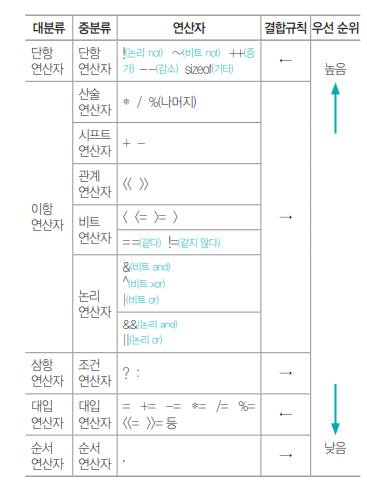
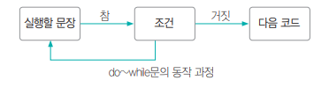
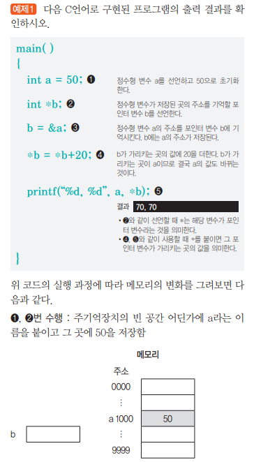
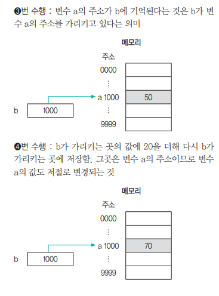
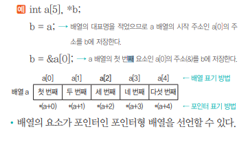
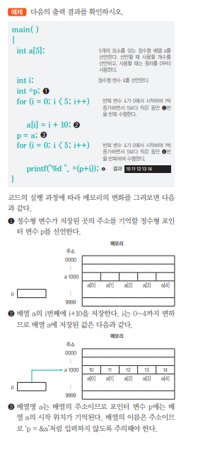
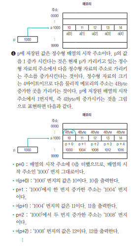

##  프로그래밍 언어 활용
### 1. 배치 프로그램
<div style={{marginLeft:'2.5rem'}}>
```bash
▣ 배치(Batch) 프로그램은 사용자의 개입 없이 일정한 주기 또는 조건에 따라 대량의 데이터를 처리하는 프로그램을 의미
▣ 
```
</div>
<div style={{marginLeft:'3.5rem'}}>스케줄링(Scheduling)</div>
<div style={{marginLeft:'3.5rem'}}>
```bash
▣ 대용량 Data : 대량의 데이터를 가져오거나, 전달하거나, 계산하는 등의 처리가 가능해야 함
▣ 자동화      : 심각한 오류가 발생하는 상황을 제외하고는 사용자의 개입 없이 수행
▣ 견고성      : 잘못된 데이터나, 데이터의 중복 등의 상황으로 중단되는 일 없이 수행되어야 함
▣ 안정성      : 오류가 발생하면 오류의 발생 위치, 시간 등을 추적할 수 있어야 함
▣ 성능        : 다른 응용 프로그램의 수행을 방해하지 않아야 하고, 지정된 시간 내에 처리 완료되어야 함
```
</div>

### 2. Python의 시퀀스 자료형
<div style={{marginLeft:'2.5rem'}}>
```bash
▣ 리스트(List), 튜플(Tuple), Range, 문자열처럼 값이 연속적으로 이어진 자료형
```
</div>
<div style={{marginLeft:'2.5rem'}}>
```bash
▣ List  : 다양한 자료형의 값을 연속적으로 저장하며, 필요에 따라 개수를 늘리거나 줄일 수 있음
▣ Tuple : 리스트처럼 요소를 연속적으로 저장하지만, 요소의 추가, 삭제, 변경 불가능 -> 변수 선언 시 () 소괄호 사용
▣ Range : 연속된 숫자를 생성하는 것으로, 리스트, 반복문 등에서 많이 사용 -> range(start, stop, step) 형태로 사용
```
</div>

### 3. 가비지 콜렉터(Garbage Collector, GC)
<div style={{marginLeft:'2.5rem'}}>
```bash
▣ 더 이상 사용되지 않는 객체(메모리)를 자동으로 정리하느 기능
▣ 프로그래머가 직접 메모리를 해제하지 않아도 메모리 누수를 방지하고 최적화된 메모리 관리 수행
▣ 선언만 하고 사용하지 않는 변수들이 점유한 메모리 공간을 강제로 해제하여 다른 프로그램들이 사용할 수 있도록 함
```
</div>

### 4. 비트 연산자
<div style={{marginLeft:'2.5rem'}}>
```bash
▣ & (and) : 모든 비트가 1일 때만 1
▣ ^ (xor) : 모든 비트가 같으면 0, 하나라도 다르면 1
▣ | (or)  : 모든 비트 중 한 비트라도 1이면 1
▣ ~ (not) : 각 비트의 부정, 0이면 1, 1이면 0
▣ <<      : 비트를 왼쪽으로 이동
▣ >>      : 비트를 오른쪽으로 이동
```
</div>

### 4. 조건 연산자 
<div style={{marginLeft:'2.5rem'}}>
```bash
▣ 조건에 따라 서로 다른 수식을 수행
▣ 조건 ? 수식1 : 수식2; -> 조건의 수식이 참이면 수식1을, 거짓이면 수식2를 실행
```
</div>

### 5. 연산자 우선순위
<div style={{marginLeft:'2.5rem'}}>
```bash
▣ 결합규칙에 따라 ←는 오른쪽에 있는 연산 자부터, →는 왼쪽에 있는 연산자부터 차례로 계산
```
</div>
<div style={{marginLeft:'2.5rem'}}></div>

### 6. scanf( ) 함수
<div style={{marginLeft:'2.5rem'}}>
```bash
▣ C 언어에서 입력을 받을 때 사용하는 표준 함수
```
</div>
<div style={{marginLeft:'2.5rem'}}>
```bash
▣ 입력받을 데이터의 자료형, 자릿수 등을 지정 가능
▣ 한 번에 여러 개의 데이터를 입력 받을 수 있다
▣ scanf("%d %f", &i, &j); → ‘%d’와 i, “%f”와 j는 자료형이 일치해야 한다.
▣ scanf("%3d", &a);
```
</div>
<div style={{marginLeft:'2.5rem'}}>
```bash
▣ %  : 서식 문자임을 지정
▣ 3  : 입력 자릿수를 3자리로 지정
▣ d  : 10진수로 입력
▣ &a : 입력받은 데이터를 변수 a의 주소에 저장
```
</div>

### 7. 서식 문자열
<div style={{marginLeft:'2.5rem'}}>
```bash
▣ %d   : 정수형 10진수를 입/출력하기 위해 지정 -> num = 123, print(f"{num:d}") → 123
▣ %u   : 부호없는 정수형 10진수를 입/출력하기 위해 지정 -> num = 123, print(f"{num:u}") → 123
▣ %o   : 정수형 8진수 출력 -> num = 16, print(f"{num:o}") → 20
▣ %x   : 정수형 16진수 출력 (소문자) -> num = 255, print(f"{num:x}") → ff
▣ %X   : 정수형 16진수 출력 (대문자) -> num = 255, print(f"{num:X}") → FF
▣ %c   : 문자 출력 -> ch = 'A', print(f"{ch:c}") → A
▣ %s   : 문자열 출력 -> str = "Hello", print(f"{str:s}") → Hello
▣ %f   : 실수 출력 (소수점 포함) -> num = 3.14159, print(f"{num:f}") → 3.141590
▣ %.nf : 실수 출력 (소수점 n자리까지) -> num = 3.14159, print(f"{num:.2f}") → 3.14
▣ %e   : 지수형 실수 (소문자 e) -> num = 3.14159, print(f"{num:e}") → 3.141590e+00
▣ %E   : 지수형 실수 (대문자 E) -> num = 3.14159, print(f"{num:E}") → 3.141590E+00
▣ %ld  : long형 10진수 출력	-> num = 123456789, print(f"{num:ld}") → 123456789
```
</div>

### 8. 주요 제어문자
<div style={{marginLeft:'2.5rem'}}>
```bash
▣ \n : 커서를 다음 줄 앞으로 이동
▣ \b : 커서를 왼쪽으로 한 칸 이동
▣ \t : 커서를 이리정 간격으로 띄움
▣ \r : 커서를 현재 주르이 처음으로 이동
▣ \O : 널 문자를 출력
▣ \' : 작은따옴표를 출력
▣ \" : 큰 따옴표를 출력
▣ \a : 스피커로 벨 소리를 출력
▣ \\ : 역 슬래시를 출력
▣ \f : 한 페이지를 넘김
```
</div>

### 9. do~while문
<div style={{marginLeft:'2.5rem'}}>
```bash
▣ 조건이 참인 동안 정해진 문장을 반복 수행하다가 조건이 거짓이면 반복문을 벗어나는 While 문과 같은 동작
▣ do ~ while 문은 실행할 문장을 무조건 한 번 실행한 후 다음 조건을 판단하여 탈출 여부를 결정
```
</div>
<div style={{marginLeft:'2.5rem'}}></div>

### 10. 배열 형태의 문자열 변수
<div style={{marginLeft:'2.5rem'}}>
```bash
▣ C언어에서는 큰 따옴표로 묶인 글자를 글자 수에 관계 없이 문자열로 처리
▣ C언어에는 문자열을 저장하는 자료형이 없기 때문에 배열, 또는 포인터를 이용하여 처리
▣ C언어에서 배열에 문자열을 저장하면 문자열의 끝을 알리기 위한 널 문지 (\O)가 문자열 끝에 자동으로 삽입
```
</div>
<div style={{marginLeft:'2.5rem'}}></div>

### 11. 포인터와 포인터 변수
<div style={{marginLeft:'2.5rem'}}>
```bash
▣ 포인터는 변수의 주소를 말하며, C언어에서는 주소를 제어할 수 있는 기능을 제공
▣ C언어에서는 변수의 주소를 저장할 때 사용하는 변수를 포인터 변수라고 함
```
</div>
<div style={{marginLeft:'2.5rem'}}>
    <div ></div>
    <div ></div>
</div>

### 11. 포인터와 배열
<div style={{marginLeft:'2.5rem'}}>
```bash
▣ 배열을 포인터 변수에 저장한 후 포인터를 이용해 배열의 요소에 접근 
▣ 배열의 위치를 나타내는 첨자를 생략하고, 배열의 대표명만 지정하면, 배열의 첫 번째 요소의 주소를 지정한 것과 같음
▣ 배열 요소에 대한 주소를 지정할 때는 일반 변수와 동일하게 & 연산자를 사용
```
</div>
<div style={{marginLeft:'2.5rem'}}></div>
<div style={{marginLeft:'2.5rem'}}></div>
<div style={{marginLeft:'2.5rem'}}></div>

### 11. 절차적 프로그래밍 언어
<div style={{marginLeft:'2.5rem'}}>
```bash
▣ 프로그램을 순차적인 흐름(절차)에 따라 실행하는 프로그래밍 언어를 의미
▣ 절차적 프로그래밍 언어는 구조적 프로그래밍(순차, 선택, 반복 구조)를 따르며, 프로그램의 흐름을 명확하게 표현
```
</div>
<div style={{marginLeft:'2.5rem'}}>
```bash
▣ C       : 포인터, 구조체 등을 활용한 메모리 관리 기능 제공, 운영체제, 시스템 프로그래밍, 임베디드 개발에 많이 사용
▣ Pascal  : 교육용 목적으로 개발된 언어
▣ Fortran : 과학 및 공학 계산을 위한 언어
▣ COBOL   : 기업 비즈니스 및 금융 시스템 개발에 특화된 언어, 메인프레임 환경에서 널리 사용
▣ BASIC   : 초보자를 위한 교육용 언어로 개발
▣ Ada     : 군사, 항공 우주, 안전 시스템 개발에 사용
```
</div>
