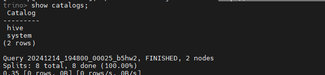
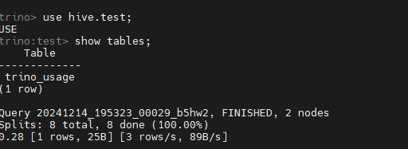

## Trino Hive Catalog 연동

### 1. 카탈로그 폴더 및 파일 생성
<ul style={{marginLeft:'3rem'}}>
    <li>mast01 이 설치되어 있는 경로로 이동</li>
    <li>cd catalog</li>
    <li>vi hive.properties</li>
     <div style={{marginLeft:'-1rem'}}>
        ```bash
        # mast01에 hive가 존재합니다.
        # 제 환경에서는 trino가 설치된 서버에 hadoop도 설치되어있어 아래와 같이 지정해주었습니다.
        # 만약 trino가 설치된 서버에 hadoop이 설치되어있지않다면, core-site.xml, hdfs-site.xml을
        # hadoop이 설치된 서버에서 가져와 적절한 경로에 위치시키고, 아래 설정을 수정해주시면 됩니다.
        connector.name=hive
        hive.metastore.uri=thrift://mast01:9083
        # core-site.xml, hdfs-site.xml이 필요합니다.
        hive.config.resources=/usr/local/hadoop/hadoop-3.3.4/etc/hadoop/core-site.xml,/usr/local/hadoop/hadoop-3.3.4/etc/hadoop/hdfs-site.xml
        ```
    </div>
</ul>

### 2. Trino cli 파일준비
<ul style={{marginLeft:'3rem'}}>
    <li>cd /usr/local/hadoop/trino/bin</li>
     <div style={{marginLeft:'-1rem'}}>
        ```bash
        wget https://repo1.maven.org/maven2/io/trino/trino-cli/410/trino-cli-410.jar
        ```
    </div>
    <div style={{marginLeft:'-1rem'}}>
        ```bash
       chown -R haddop:hadoop trino-cli-410.jar
        ```
    </div>
    <div style={{marginLeft:'-1rem'}}>
        ```bash
        chmod 755 trino-cli-410.jar
        ```
    </div>
</ul>

### 3. Trino 재기동 
<ul style={{marginLeft:'3rem'}}>
    <li>cd /usr/local/hadoop/trino/bin</li>
    <div style={{marginLeft:'-1rem'}}>
       ```
       ./launcher start
        ```
    </div>
</ul>

### 4. Trino cli 확인

<ul style={{marginLeft:'3rem'}}>
    <li>Trino 접속</li>
    <div style={{marginLeft:'-1rem'}}>
    ```
    ./trino-cli-410.jar --server http:// {코디네이터 서버 IP} :18081
    ```
    </div>  
    <li></li>
    <li> schema 생성</li>
     <div style={{marginLeft:'-1rem'}}>
    ```
    create schema hive.test;
    ```
    </div> 
    <li>table 확인</li>
    <div style={{marginLeft:'-1rem'}}>
        ```
        show tables;
        ```
    </div> 
    <li></li>
</ul>