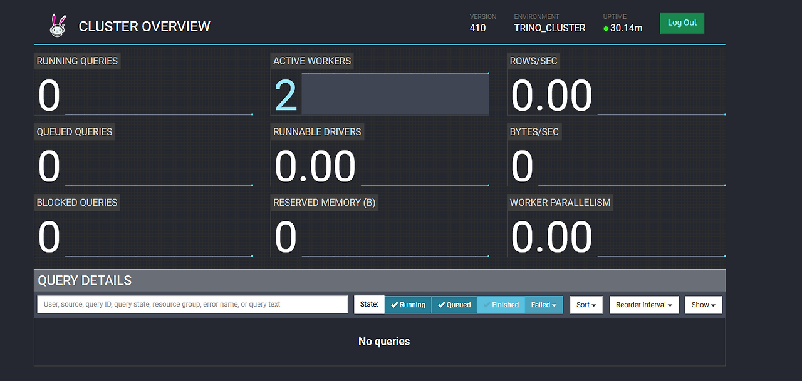

## Trino 설치 및 셋팅

### 1. openJDK17 설치
<div style={{marginLeft:'3.5rem'}}>
```bash
https://download.oracle.com/java/17/archive/jdk-17.0.3_linux-x64_bin.tar.gz
```
</div>
<div style={{marginLeft:'3.5rem'}}>
```bash
tar xzvf jdk-17.0.3_linux-x64_bin.tar.gz
```
</div>

### 2. 설치 확인
<div style={{marginLeft:'3.5rem'}}>
```bash
/usr/jdk-17.0.3/bin/java -version
```
</div>

### 3 동시 접근 파일, 프로세스 설정
<div style={{marginLeft:'3.5rem'}}>
```bash
vi /etc/security/limits.conf
```
</div>
<div style={{marginLeft:'3.5rem'}}>
```bash
hadoop soft nofile 131072
hadoop hard nofile 131072
hadoop soft nproc 128000
hadoop hard nproc 128000
```
</div>

### 4. Trino 다운로드 및 압축 해제 ( action server: mast01, work01, work02, work03 ) 
<div style={{marginLeft:'3.5rem'}}>
```bash
https://repo1.maven.org/maven2/io/trino/trino-server/410/trino-server-410.tar.gz
```
</div>
<div style={{marginLeft:'3.5rem'}}>
```bash
tar xzvf trino-server-410.tar.gz
```
</div>

### 5. 폴더명 변경 및 권한 부여

<div style={{marginLeft:'3.5rem'}}>
```bash
mv trino-server-410 trino-410
```
</div>
<div style={{marginLeft:'3.5rem'}}>
```bash
chown -R hadoop:hadoop trino-410
```
</div>

### 6. 트리노 실행파일 수정
<ul style={{marginLeft:'3rem'}}>
    <li>vi launcher</li>
    <div style={{marginLeft:'-1rem'}}>
    ```bash
    export JAVA_HOME=/opt/apps/jdk17
    export PATH=$JAVA_HOME/bin:$PATH
    ```
    </div>
    <li>/o.server_log 로 검색 (441번째 줄)</li>
    <li>기존에 설정된, o.pid_file, o.launcher_log, o.server_log 주석 후 아래 코드 추가</li>
    <div style={{marginLeft:'-1rem'}}>
    ```bash
    o.pid_file = '/data/trino/pids/launcher.pid'
    o.launcher_log = '/data/trino/log/launcher.log'
    o.server_log = '/data/trino/log/server.log'
    ```
    </div>
    <li>vi hive-site.xml </li>
</ul>

### 7. 경로 생성 및 권한 부여
<ul style={{marginLeft:'3rem'}}>
    <li>디렉토리 생성</li>
     <div style={{marginLeft:'-1rem'}}>
        ```bash
        mkdir data, cd data, mkdir trino, cd trino , mkdir pids, mkdir log
        ```
    </div>
    <li>권한 부여</li>
     <div style={{marginLeft:'-1rem'}}>
        ```bash
        chown -R hadoop:hadoop /data/trino
        ```
    </div>
</ul>

### 8. mast 서버 설정 파일 수정
<ul style={{marginLeft:'3rem'}}>
    <li>cd /usr/local/hadoop/trino-410/etc</li>
    <li>vi config.properties</li>
     <div style={{marginLeft:'-1rem'}}>
        ```bash
        query.max-memory-per-node=1GB
        http-server.http.port=18081
        # 코디네이터 서버 지정
        coordinator=true
        # 코디네이터 서버임과 동시에 워커 서버로도 활용한다는 config
        node-scheduler.include-coordinator=true
        # 코디네이터 서버 url.
        discovery.uri=http://{코디네이터 서버 IP}:18081
        query.max-memory=2GB
        ```
    </div>
    <li>vi jvm.config</li>
      <div style={{marginLeft:'-1rem'}}>
        ```bash
        -server
        -Xmx2G
        -XX:InitialRAMPercentage=80
        -XX:MaxRAMPercentage=80
        -XX:+ExplicitGCInvokesConcurrent
        -XX:+ExitOnOutOfMemoryError
        -XX:+HeapDumpOnOutOfMemoryError
        -XX:-OmitStackTraceInFastThrow
        -XX:ReservedCodeCacheSize=512M
        -XX:PerMethodRecompilationCutoff=10000
        -XX:PerBytecodeRecompilationCutoff=10000
        -Djdk.attach.allowAttachSelf=true
        -Djdk.nio.maxCachedBufferSize=2000000
        -XX:+UnlockDiagnosticVMOptions
        -XX:+UseAESCTRIntrinsics
        -XX:-G1UsePreventiveGC
        ```
    </div>
    <li>vi node.properties</li>
    <div style={{marginLeft:'-1rem'}}>
        ```bash
        node.environment=trino_cluster
        # 해당 부분 각 서버별로 다르게 설정.
        # 꼭 서버 호스트명일 필요는 없지만, trino cluster 내 유일한 값이어야 한다.
        node.id=mast01
        node.data-dir=/data/trino
        ```
    </div>
     <li>vi log.properties</li>
      <div style={{marginLeft:'-1rem'}}>
        ```bash
        io.trino=INFO
        ```
    </div>
</ul>

### 9 work 서버 설정 파일 (다른 Linux 서버에 구성)
<ul style={{marginLeft:'3rem'}}>
    <li>cd /usr/local/hadoop/trino-410/etc</li>
    <li>vi config.properties</li>
     <div style={{marginLeft:'-1rem'}}>
        ```bash
        query.max-memory-per-node=1GB
        http-server.http.port=18081
        # 코디네이터 서버 지정입니다.
        # 워커 서버이기 때문에 false로 지정합니다
        coordinator=false
        # 코디네이터 서버임과 동시에 워커 서버로도 활용한다는 config입니다.
        # 워커 서버이기 때문에 false로 지정합니다
        node-scheduler.include-coordinator=false
        # 코디네이터 서버 url입니다.
        discovery.uri=http:// {코디네이터 서버 IP} :18081
        query.max-memory=2GB
        ```
    </div>
    <li>vi jvm.config</li>
      <div style={{marginLeft:'-1rem'}}>
        ```bash
        -server
        -Xmx2G
        -XX:InitialRAMPercentage=80
        -XX:MaxRAMPercentage=80
        -XX:+ExplicitGCInvokesConcurrent
        -XX:+ExitOnOutOfMemoryError
        -XX:+HeapDumpOnOutOfMemoryError
        -XX:-OmitStackTraceInFastThrow
        -XX:ReservedCodeCacheSize=512M
        -XX:PerMethodRecompilationCutoff=10000
        -XX:PerBytecodeRecompilationCutoff=10000
        -Djdk.attach.allowAttachSelf=true
        -Djdk.nio.maxCachedBufferSize=2000000
        -XX:+UnlockDiagnosticVMOptions
        -XX:+UseAESCTRIntrinsics
        ```
    </div>
    <li>vi node.properties</li>
    <div style={{marginLeft:'-1rem'}}>
        ```bash
        node.environment=trino_cluster
        # 해당 부분 각 서버별로 다르게 설정해야합니다.
        # 꼭 서버 호스트명일 필요는 없지만, trino cluster 내 유일한 값이어야합니다.
        # (work02, work03 각각 설정)
        node.id=work01 
        node.data-dir=/data/trino
        ```
    </div>
     <li>vi log.properties</li>
      <div style={{marginLeft:'-1rem'}}>
        ```bash
        io.trino=INFO
        ```
    </div>
</ul>

### 10. trino 실행
<div style={{marginLeft:'3.5rem'}}>
    ```bash
    ./launcher start 
    ```
</div>

### 11 결과 확인
<div style={{marginLeft:'3.5rem'}}>
    
</div>


