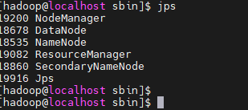

## hadoop 설치 및 셋팅

### 1. root 계정으로 접속 후 hadoop 계정 생성
### 2. su hadoop -> 생성 계정을 스위치

### 3. 패스워드 없이 로컬 호스트에 로그인하기 위한 셋팅:
<div style={{marginLeft:'3.5rem'}}>
```bash
ssh-keygen -t rsa -P '' -f ~/.ssh/id_rsa
```
</div>
<ul style={{marginLeft:'3rem'}}>
    <li>'ssh-keygen': - SSH키 생성 명령어</li>
    <li>`-t rsa` - 성할 키의 타입을 RSA (공개키 암호화 알고리즘)로 지정 </li>
    <li>`-P` - 키의 패스워드 설정, 비어있는 문자열 = 패스워드 사용 X </li>
    <li>`-f ~/.ssh/id_rsa` - ~/.ssh/id_rsa 경로에 id_rsa라는 이름의 키 파일 생성></li>
</ul>
<div style={{marginLeft:'3.5rem'}}>
```bash
bashcat ~/.ssh/id_rsa.pub >> ~/.ssh/authorized_keys 
```
</div>
<ul style={{marginLeft:'3rem'}}>
    <li>`cat` -  텍스트 파일의 내용을 화면에 출력 </li>
    <li>`-t rsa` - 성할 키의 타입을 RSA (공개키 암호화 알고리즘)로 지정 </li>
    <li> `>> ` - 대상 파일이 없을 때는 생성하고, 있다면 대상 파일에 내용을 추가 </li>
</ul>
<div style={{marginLeft:'3.5rem'}}>
```bash
chmod 0600 ~/.ssh/authorized_keys
```
</div>
<ul style={{marginLeft:'3rem'}}>
    <li>authorized key를 읽기 전용으로 설정</li>
</ul>

### 4. Hadoop 설치
<div style={{marginLeft:'3.5rem'}}>
```bash
https://archive.apache.org/dist/hadoop/core/hadoop-3.3.4/hadoop-3.3.4.tar.gz
```
</div>
<div style={{marginLeft:'3.5rem'}}>
```bash
tar -xvzf hadoop-3.3.4.tar.gz
```
</div>

### 5. haddop을 관리하기 위한 디렉토리 생성

<ul style={{marginLeft:'3rem'}}>
    <li> cd /usr/local</li>
    <li> mkdir hadoop</li>
    <li> cd hadoop</li>
    <li> mkdir dfsdata , mkdir node, mkdir tmpdata </li>
    <li> cd node </li>
    <li> mkdir datanode, mkdir namenode</li>
</ul>

### 6. hadoop 설치 경로로 이동 후
<ul style={{marginLeft:'3rem'}}>
    <li> mv hadoop-3.3.4 /usr/local/hadoop</li>
    <li> cd /usr/local </li>
    <li> chown -R hadoop:hadoop hadoop</li>
    <li> vi /etc/profile </li>
</ul>
<div style={{marginLeft:'3.5rem'}}>
```bash
export BASE_HOME=/usr/local/hadoop/
export HADOOP_HOME=$BASE_HOME/hadoop-3.3.4
export HADOOP_INSTALL=$HADOOP_HOME
export HADOOP_MAPRED_HOME=$HADOOP_HOME
export HADOOP_COMMON_HOME=$HADOOP_HOME
export HADOOP_HDFS_HOME=$HADOOP_HOME
export YARN_HOME=$HADOOP_HOME
export HADOOP_COMMON_LIB_NATIVE_DIR=$HADOOP_HOME/lib/native
export PATH=$PATH:$HADOOP_HOME/sbin:$HADOOP_HOME/bin

export HADOOP_OPTS="-Djava.library.path=$HADOOP_HOME/lib/native"
```
</div>
<ul style={{marginLeft:'3rem'}}>
    <li> source ~/.bashrc</li>
</ul>

### 7. 설정파일 수정
<ul style={{marginLeft:'3rem'}}>
    <li> hadoop-env.sh : 자바 홈디렉토리와 hadoop 홈디렉토리가 어딘지 지정한다.</li>
        <div style={{marginLeft:'-1rem'}}>
        ```bash
        vi $HADOOP_HOME/etc/hadoop/hadoop-env.sh
        ```
        ```bash
        export JAVA_HOME=/usr/local/jdk1.8.0_292 
        ```
        </div>
    <li> core-site.xml : 하둡의 네임노드가 어느 서버인지를 지정한다. </li>
        <div style={{marginLeft:'-1rem'}}>
            ```bash
            vi $HADOOP_HOME/etc/hadoop/core-site.xml
            ```
            ```bash
            <configuration>
                <property>
                    <name>hadoop.tmp.dir</name>
                    <value>/usr/local/hadoop/tmpdata</value>
                </property>
                <property>
                    <name>fs.default.name</name>
                    <value>hdfs://127.0.0.1:9000</value> 
                </property>
            </configuration>
            ```
        </div>
    <li> mapred-site.xml : java 로 만들어진 mapreduce 프레임워크와 관련된 정보를 지정하는 파일</li>
        <div style={{marginLeft:'-1rem'}}>
            ```bash
            vi $HADOOP_HOME/etc/hadoop/hdfs-site.xml
            ```
            ```bash
            <configuration>
                <property>
                    <name>dfs.data.dir</name>
                    <value>/usr/local/hadoop/node/namenode</value>
                </property>
                <property>
                    <name>dfs.data.dir</name>
                    <value>/usr/local/hadoop/node/datanode</value> 
                </property>
                <property>
                    <name>dfs.replication</name>
                    <value>1</value>
                </property>
            </configuration>
            ```
        </div>
    <li> hdfs-site.xml : 하둡 파일 시스템인 HDFS(Hadoop Distributed File System) 와 관련된 정보를 저장하는 파일 </li>
        <div style={{marginLeft:'-1rem'}}>
            ```bash
            vi $HADOOP_HOME/etc/hadoop/mapred-site.xml
            ```
            ```bash
            <configuration>
                <property>
                    <name>mapreduce.framework.name</name>
                    <value>yarn</value>
                </property>
            </configuration>
            ```
        </div>
</ul>
### 8. yarn-site.xml 설정
<ul style={{marginLeft:'3rem'}}>
    <li> 리소스 매니저 web-ui 주소, 노드매니저에서 중간단계 파일 및 로그를 저장할 경로 정의를 위해 수정</li>
    <div style={{marginLeft:'-1rem'}}>
        ```bash
         vi $HADOOP_HOME/etc/hadoop/yarn-site.xml
         ```
        ```bash
        <configuration>
            <property>
                <name>yarn.nodemanager.aux-services</name>
                <value>mapreduce_shuffle</value>
            </property>
            <property>
                <name>yarn.nodemanager.aux-services.mapreduce.shuffle.class</name>
                <value>org.apache.hadoop.mapred.ShuffleHandler</value>
            </property>
            <property>
                <name>yarn.resourcemanager.hostname</name>
                <value>localhost</value>
            </property>
            <property>
                <name>yarn.acl.enable</name>
                <value>0</value>
            </property>
            <property>
                <name>yarn.nodemanager.env-whitelist</name>
                <value>
                    JAVA_HOME,HADOOP_COMMON_HOME,HADOOP_HDFS,HADOOP_CONF_DIR,
                    CLASSPATH_PERPEND_DISTCACHE,HADOOP_YARN_HOME
                    HADOOP_MAPRED_HOME
                </value>
            </property>
        </configuration>
        ```
    </div>
</ul>
### 9. HDFS를 포맷해준다
<div style={{marginLeft:'4.7rem'}}>
    ```bash
    hdfs namenode -format
    ```
</div>
### 10. hadoop 와 yarn 실행
<ul style={{marginLeft:'3rem'}}>
    <li>cd $HADOOP_HOME/sbin</li>
</ul>
<div style={{marginLeft:'4.7rem'}}>
```bash
./start-all.sh
```
</div>

### 11  실행 확인 
<ul style={{marginLeft:'3rem'}}>
    <li>jps</li>
    <li> cd /usr/local </li>
    <li> chown -R hadoop:hadoop hadoop</li>
    <li> vi /etc/profile </li>
</ul>

<div style={{marginLeft:'4.7rem'}}>

</div>

### 12. java 8 이상 사용 시 아래의 설정 추가
<div style={{marginLeft:'4.7rem'}}>
```bash
vi $HADOOP_HOME/etc/hadoop/hadoop-env.sh 
```
</div>
<div style={{marginLeft:'4.7rem'}}>
```bash
export HADOOP_OPTS="$HADOOP_OPTS --add-opens java.base/java.lang=ALL-UNNAMED --add-opens java.base/java.lang.reflect=ALL-UNNAMED --add-opens java.base/java.io=ALL-UNNAMED --add-opens java.base/sun.nio.ch=ALL-UNNAMED"
```
</div>

