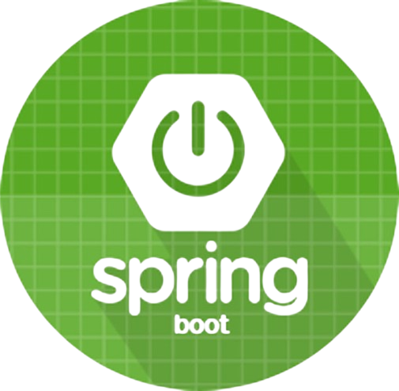

### My Info

    

        

            

                
            

            

                이름
                최일광
            

            

                주소
                서울 송파구
            

            

                이메일
                ig95@dgu.ac.kr
            

            

                핸드폰
                010-3043-8987
            

             

                학교
                동국대학교
            

            

                학과
                경찰행정학과
            

        

        

        

            

                

                    
                

                

                    
Github

                    
https://example.com

                

            

            

              

                  
              

              

                  
Blog

                  
https://example.com

              

           

           

            

              

                

                

                  
꾸준한 학습

                  
1일 1잔디

                

              

              

                

                

                  
꾸준한 운동

                  
주 1회 풋살 경기

                

              

            

            

              

                

                

                  
꾸준한 기록

                  
테크 블로그 작성

                

              

              

                

                

                  
계획적 개발

                  
노션을 통한 일정 관리

                

              

            

          

        

    

### History

    

        

            

                동국대학교 경찰행정학과 입학
            

            2016
        

        

            

                <ul>
                    <li>동국대학교 경찰행정학과 졸업</li>
                    <li>WEB 개발 국비지원 과정 수료</li>
                </ul>
            

            2021
        

        

           

                <ul>
                    <li>1월 (주)엠제이아이티 입사</li>
                </ul>
            

            2022
        

        

            

                <ul>
                    <li>4월 (주)엠제이아이티 퇴사</li>
                    <li>5월 (주)넥스트코어 테크놀러지 입사</li>
                </ul>
            

            2023
        

        

            

                <ul>
                    <li>1월 (주)넥스트코어 테크놀러지 퇴사</li>
                    <li>2월 (주)아키스 입사 ~ </li>
                </ul>
            

            2024
        

    

    

       

            
            

                <h4>몸으로 익히가 마음으로 이해하는 개발자 최일광입니다.</h4>
            

       

        

           

                새로운 기술과 도전에 대한 드려움 없이,  항상 배우고 성장하는 웹 개발자 로서. 
                다양한 기술 스택을 적극적으로 탐구하며,  실무 경험을 통해 깊이 있는 지식을 쌓아가고 있습니다.
           

        

    

### Work Experience

    

        

            

                <h4 class="headFont">EXPERIENCE 총 3년 1개월</h4>
            

            

                <h5 class="historyDateColor">2024.02 ~ </h5>
            

            

                <h5 class="historyDateColor">2023.06 ~ 2024.01 </h5>
            

            

                <h4 class="historyDateColor">2022.01 ~ 2023.05 </h4>
            

        

         

         

            

                

                    <ul class="skillPosition">
                        <li>SKB Flow NMS 시스템의 안정적인 운영을 위해 유지보수 작업 수행</li>
                        <li>Billing 시스템의 QoS 기능을 개발</li>
                        <li>KETI 신원정보 관리 WEB 시스템의 기능 고도화 작업을 통해 사용자 경험을 개선</li>
                        <li>파라과이 축산 분야의 데이터 허브 플랫폼 구축 프로젝트에 참여, 데이터 통합 및 분석 작업 진행</li>
                        <li class="skillSet3">Skill Keywords</li>
                        
                        
                        
                        
                    </ul>
                

                

                    <ul class="ulPosition">
                        <li>SKT Flow NMS WEB 시스템의 성능과 안정성을 향상시키기 위한 고도화 작업을 수행</li>
                        <li>NMS WEB 시스템의 안정적인 서비스 제공을 위해 유지보수 및 최적화 작업을 지속적으로 수행</li>
                        <li>현대커머셜의 지게차 렌탈 WEB 시스템 구축 프로젝트에 참여</li>
                        <li>강남구청의 반지하 주택 침수 방지를 위한 WEB 모니터링 시스템 구축</li>
                        <li class="skillSet2">Skill Keywords</li>
                        
                        
                        
                    </ul>
                

                

                    <ul class="ulPosition2">
                        <li class="liPosition">포니정 장학재단 관리자 포털 기능 개선 및 사용자 경험과 효율성을  위한 고도화 작업을 성공적으로 수행</li>
                        <li class="liPosition">KT AICC API Gateway에서 제공하는 다양한 API의 검증과 연동 작업을 수행</li>
                        <li class="liPosition">KT AICC 관리자 포털의 기능 개선 및 운영상의 효율성을 극대화하기 위한 유지보수 업무 수행</li>
                        <li class="liPosition">KT AICC 관리자 포털의 통계 UI/UX로 재구성하여 데이터 분석과 시각화를 통해 사용자 편의성을 향상</li>
                        <li class="skillSet4">Skill Keywords</li>
                        
                        
                        
                    </ul>
                

            

         

    

### Skills

    

        <h3 class="skillStyle">Skills</h3>
    

    

        

            <h3>Badges</h3>
        

        

             
             
             
             
             
             
             
             
             
             
        

        

            <h3>Keywords</h3> 
        

         

            Java
            Spring
            Spring Boot
            NodeJs
            Hadoop
            Hive
        

         

            Trino
            Linux
            MySqL
            MariaDB
        

    

<!-- ### Cloud and Networking -->

<!-- ### Programming

|     | Topic                        | Date Last Updated |
| --- | ---------------------------- | ----------------- |
| 1   | [C](c-cheatsheet)            | December 23, 2020 |
| 2   | [Javascript](js-cheatsheet)  | August 1, 2021    |
| 3   | [Ruby](ruby-dependency-management) | October 23, 2021  |

### Tooling and OS

|     | Topic                          | Date Last Updated |
| --- | ------------------------------ | ----------------- |
| 1   | [Git](git-cheatsheet)          | December 23, 2020 |
| 2   | [iTerm2](iterm2-cheatsheet)    | January 23, 2021  |
| 3   | [Ubuntu](os-ubuntu-cheatsheet) | December 23, 2020 |

### Web Development

|     | Topic                        | Date Last Updated |
| --- | ---------------------------- | ----------------- |
| 1   | [MongoDB](mongodb-setup)     | December 23, 2020 |
| 2   | [NodeJS](nodejs-auto-reload) | December 23, 2020 |

 -->
